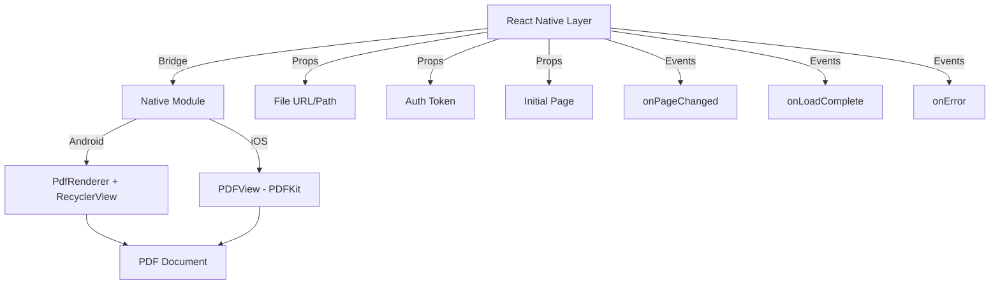
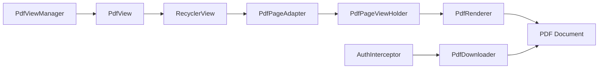
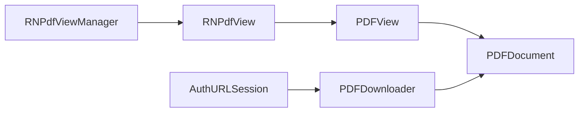

# Native PDF Viewer Bridge Design

## Tổng quan

Tài liệu này mô tả thiết kế chi tiết cho việc triển khai một giải pháp native bridge để hiển thị PDF trong React Native, thay thế cho thư viện `react-native-pdf` hiện tại.

### Lý do chuyển sang Native Bridge

1. **Hiệu năng tốt hơn**: Native rendering sử dụng API gốc của platform
2. **Tối ưu bộ nhớ**: RecyclerView (Android) và PDFView (iOS) có cơ chế tái sử dụng view hiệu quả
3. **Trải nghiệm người dùng mượt mà hơn**: Scroll, zoom, và rendering được tối ưu bởi platform
4. **Tùy chỉnh linh hoạt**: Kiểm soát hoàn toàn UI/UX và các tính năng

### Kiến trúc tổng quan



---

## Android Implementation

### 1. Kiến trúc Android



### 2. Core Components

#### 2.1 PdfViewManager (React Native Bridge)

```kotlin
// android/app/src/main/java/com/yourapp/pdf/PdfViewManager.kt

package com.yourapp.pdf

import android.graphics.Color
import com.facebook.react.bridge.ReadableArray
import com.facebook.react.common.MapBuilder
import com.facebook.react.uimanager.SimpleViewManager
import com.facebook.react.uimanager.ThemedReactContext
import com.facebook.react.uimanager.annotations.ReactProp

class PdfViewManager : SimpleViewManager<PdfView>() {

    companion object {
        const val REACT_CLASS = "RNPdfView"

        // Event names
        const val EVENT_LOAD_COMPLETE = "onLoadComplete"
        const val EVENT_PAGE_CHANGED = "onPageChanged"
        const val EVENT_ERROR = "onError"
        const val EVENT_SCALE_CHANGED = "onScaleChanged"
    }

    override fun getName(): String = REACT_CLASS

    override fun createViewInstance(reactContext: ThemedReactContext): PdfView {
        return PdfView(reactContext)
    }

    @ReactProp(name = "source")
    fun setSource(view: PdfView, source: String?) {
        source?.let { view.loadPdf(it) }
    }

    @ReactProp(name = "authToken")
    fun setAuthToken(view: PdfView, token: String?) {
        view.setAuthToken(token)
    }

    @ReactProp(name = "page")
    fun setPage(view: PdfView, page: Int) {
        view.scrollToPage(page)
    }

    @ReactProp(name = "scale")
    fun setScale(view: PdfView, scale: Float) {
        view.setScale(scale)
    }

    @ReactProp(name = "spacing")
    fun setSpacing(view: PdfView, spacing: Int) {
        view.setPageSpacing(spacing)
    }

    @ReactProp(name = "backgroundColor")
    fun setBackgroundColor(view: PdfView, color: String?) {
        color?.let {
            view.setBackgroundColor(Color.parseColor(it))
        }
    }

    @ReactProp(name = "enablePaging")
    fun setEnablePaging(view: PdfView, enabled: Boolean) {
        view.setEnablePaging(enabled)
    }

    override fun getExportedCustomDirectEventTypeConstants(): Map<String, Any> {
        return MapBuilder.of(
            EVENT_LOAD_COMPLETE,
            MapBuilder.of("registrationName", EVENT_LOAD_COMPLETE),
            EVENT_PAGE_CHANGED,
            MapBuilder.of("registrationName", EVENT_PAGE_CHANGED),
            EVENT_ERROR,
            MapBuilder.of("registrationName", EVENT_ERROR),
            EVENT_SCALE_CHANGED,
            MapBuilder.of("registrationName", EVENT_SCALE_CHANGED)
        )
    }

    override fun getCommandsMap(): Map<String, Int> {
        return MapBuilder.of(
            "scrollToPage", 1,
            "setScale", 2
        )
    }

    override fun receiveCommand(view: PdfView, commandId: Int, args: ReadableArray?) {
        when (commandId) {
            1 -> args?.getInt(0)?.let { view.scrollToPage(it) }
            2 -> args?.getDouble(0)?.toFloat()?.let { view.setScale(it) }
        }
    }
}
```

#### 2.2 PdfView (Custom View)

```kotlin
// android/app/src/main/java/com/yourapp/pdf/PdfView.kt

package com.yourapp.pdf

import android.content.Context
import android.graphics.Bitmap
import android.graphics.pdf.PdfRenderer
import android.os.ParcelFileDescriptor
import android.util.AttributeSet
import android.widget.FrameLayout
import androidx.recyclerview.widget.LinearLayoutManager
import androidx.recyclerview.widget.PagerSnapHelper
import androidx.recyclerview.widget.RecyclerView
import com.facebook.react.bridge.Arguments
import com.facebook.react.bridge.WritableMap
import com.facebook.react.uimanager.ThemedReactContext
import com.facebook.react.uimanager.events.RCTEventEmitter
import kotlinx.coroutines.*
import java.io.File

class PdfView @JvmOverloads constructor(
    context: Context,
    attrs: AttributeSet? = null,
    defStyleAttr: Int = 0
) : FrameLayout(context, attrs, defStyleAttr) {

    private val reactContext: ThemedReactContext = context as ThemedReactContext
    private val recyclerView: RecyclerView
    private val layoutManager: LinearLayoutManager
    private var adapter: PdfPageAdapter? = null
    private var pdfRenderer: PdfRenderer? = null
    private var currentPage = 0
    private var authToken: String? = null
    private val scope = CoroutineScope(Dispatchers.Main + SupervisorJob())

    init {
        recyclerView = RecyclerView(context).apply {
            layoutParams = LayoutParams(
                LayoutParams.MATCH_PARENT,
                LayoutParams.MATCH_PARENT
            )
        }

        layoutManager = LinearLayoutManager(context, LinearLayoutManager.VERTICAL, false)
        recyclerView.layoutManager = layoutManager

        // Add scroll listener for page tracking
        recyclerView.addOnScrollListener(object : RecyclerView.OnScrollListener() {
            override fun onScrolled(recyclerView: RecyclerView, dx: Int, dy: Int) {
                super.onScrolled(recyclerView, dx, dy)
                val position = layoutManager.findFirstVisibleItemPosition()
                if (position != currentPage && position >= 0) {
                    currentPage = position
                    sendPageChangedEvent(position)
                }
            }
        })

        addView(recyclerView)
    }

    fun setAuthToken(token: String?) {
        this.authToken = token
    }

    fun loadPdf(source: String) {
        scope.launch {
            try {
                val file = if (source.startsWith("http")) {
                    // Download PDF with auth token
                    downloadPdf(source, authToken)
                } else {
                    // Local file
                    File(source)
                }

                openPdfFile(file)
            } catch (e: Exception) {
                sendErrorEvent(e.message ?: "Failed to load PDF")
            }
        }
    }

    private suspend fun downloadPdf(url: String, token: String?): File = withContext(Dispatchers.IO) {
        val downloader = PdfDownloader(context)
        downloader.download(url, token)
    }

    private fun openPdfFile(file: File) {
        try {
            val fileDescriptor = ParcelFileDescriptor.open(
                file,
                ParcelFileDescriptor.MODE_READ_ONLY
            )

            pdfRenderer?.close()
            pdfRenderer = PdfRenderer(fileDescriptor)

            adapter = PdfPageAdapter(pdfRenderer!!)
            recyclerView.adapter = adapter

            sendLoadCompleteEvent(pdfRenderer!!.pageCount)
        } catch (e: Exception) {
            sendErrorEvent(e.message ?: "Failed to open PDF")
        }
    }

    fun scrollToPage(page: Int) {
        if (page >= 0 && page < (pdfRenderer?.pageCount ?: 0)) {
            recyclerView.scrollToPosition(page)
            currentPage = page
        }
    }

    fun setScale(scale: Float) {
        adapter?.setScale(scale)
    }

    fun setPageSpacing(spacing: Int) {
        // Add ItemDecoration for spacing
        recyclerView.addItemDecoration(object : RecyclerView.ItemDecoration() {
            override fun getItemOffsets(
                outRect: android.graphics.Rect,
                view: android.view.View,
                parent: RecyclerView,
                state: RecyclerView.State
            ) {
                outRect.bottom = spacing
            }
        })
    }

    fun setEnablePaging(enabled: Boolean) {
        if (enabled) {
            PagerSnapHelper().attachToRecyclerView(recyclerView)
        }
    }

    private fun sendLoadCompleteEvent(pageCount: Int) {
        val event = Arguments.createMap().apply {
            putInt("numberOfPages", pageCount)
        }
        sendEvent(PdfViewManager.EVENT_LOAD_COMPLETE, event)
    }

    private fun sendPageChangedEvent(page: Int) {
        val event = Arguments.createMap().apply {
            putInt("page", page + 1) // 1-indexed for React Native
            putInt("numberOfPages", pdfRenderer?.pageCount ?: 0)
        }
        sendEvent(PdfViewManager.EVENT_PAGE_CHANGED, event)
    }

    private fun sendErrorEvent(message: String) {
        val event = Arguments.createMap().apply {
            putString("message", message)
        }
        sendEvent(PdfViewManager.EVENT_ERROR, event)
    }

    private fun sendEvent(eventName: String, params: WritableMap) {
        reactContext
            .getJSModule(RCTEventEmitter::class.java)
            .receiveEvent(id, eventName, params)
    }

    override fun onDetachedFromWindow() {
        super.onDetachedFromWindow()
        scope.cancel()
        pdfRenderer?.close()
    }
}
```

#### 2.3 PdfPageAdapter (RecyclerView Adapter)

```kotlin
// android/app/src/main/java/com/yourapp/pdf/PdfPageAdapter.kt

package com.yourapp.pdf

import android.graphics.Bitmap
import android.graphics.pdf.PdfRenderer
import android.view.LayoutInflater
import android.view.View
import android.view.ViewGroup
import android.widget.ImageView
import androidx.recyclerview.widget.RecyclerView
import kotlinx.coroutines.*

class PdfPageAdapter(
    private val pdfRenderer: PdfRenderer
) : RecyclerView.Adapter<PdfPageAdapter.PageViewHolder>() {

    private var scale: Float = 1.0f
    private val scope = CoroutineScope(Dispatchers.Main + SupervisorJob())

    class PageViewHolder(view: View) : RecyclerView.ViewHolder(view) {
        val imageView: ImageView = view.findViewById(android.R.id.icon)
        var renderJob: Job? = null
    }

    override fun onCreateViewHolder(parent: ViewGroup, viewType: Int): PageViewHolder {
        val imageView = ImageView(parent.context).apply {
            id = android.R.id.icon
            layoutParams = ViewGroup.LayoutParams(
                ViewGroup.LayoutParams.MATCH_PARENT,
                ViewGroup.LayoutParams.WRAP_CONTENT
            )
            adjustViewBounds = true
            scaleType = ImageView.ScaleType.FIT_CENTER
        }

        val container = FrameLayout(parent.context).apply {
            layoutParams = ViewGroup.LayoutParams(
                ViewGroup.LayoutParams.MATCH_PARENT,
                ViewGroup.LayoutParams.WRAP_CONTENT
            )
            addView(imageView)
        }

        return PageViewHolder(container)
    }

    override fun onBindViewHolder(holder: PageViewHolder, position: Int) {
        // Cancel previous render job
        holder.renderJob?.cancel()

        // Render page asynchronously
        holder.renderJob = scope.launch {
            val bitmap = withContext(Dispatchers.IO) {
                renderPage(position)
            }
            holder.imageView.setImageBitmap(bitmap)
        }
    }

    override fun onViewRecycled(holder: PageViewHolder) {
        super.onViewRecycled(holder)
        holder.renderJob?.cancel()
        holder.imageView.setImageBitmap(null)
    }

    private fun renderPage(pageIndex: Int): Bitmap {
        val page = pdfRenderer.openPage(pageIndex)

        val width = (page.width * scale).toInt()
        val height = (page.height * scale).toInt()

        val bitmap = Bitmap.createBitmap(width, height, Bitmap.Config.ARGB_8888)
        page.render(bitmap, null, null, PdfRenderer.Page.RENDER_MODE_FOR_DISPLAY)
        page.close()

        return bitmap
    }

    override fun getItemCount(): Int = pdfRenderer.pageCount

    fun setScale(newScale: Float) {
        scale = newScale
        notifyDataSetChanged()
    }
}
```

#### 2.4 PdfDownloader (Network Layer)

```kotlin
// android/app/src/main/java/com/yourapp/pdf/PdfDownloader.kt

package com.yourapp.pdf

import android.content.Context
import okhttp3.OkHttpClient
import okhttp3.Request
import java.io.File
import java.io.FileOutputStream

class PdfDownloader(private val context: Context) {

    private val client = OkHttpClient.Builder()
        .addInterceptor { chain ->
            val request = chain.request()
            val response = chain.proceed(request)
            response
        }
        .build()

    suspend fun download(url: String, authToken: String?): File {
        val request = Request.Builder()
            .url(url)
            .apply {
                authToken?.let {
                    addHeader("Authorization", "Bearer $it")
                }
            }
            .build()

        val response = client.newCall(request).execute()

        if (!response.isSuccessful) {
            throw Exception("Failed to download PDF: ${response.code}")
        }

        val cacheDir = File(context.cacheDir, "pdfs")
        if (!cacheDir.exists()) {
            cacheDir.mkdirs()
        }

        val fileName = url.hashCode().toString() + ".pdf"
        val file = File(cacheDir, fileName)

        FileOutputStream(file).use { output ->
            response.body?.byteStream()?.copyTo(output)
        }

        return file
    }
}
```

#### 2.5 Package Registration

```kotlin
// android/app/src/main/java/com/yourapp/pdf/PdfPackage.kt

package com.yourapp.pdf

import com.facebook.react.ReactPackage
import com.facebook.react.bridge.NativeModule
import com.facebook.react.bridge.ReactApplicationContext
import com.facebook.react.uimanager.ViewManager

class PdfPackage : ReactPackage {
    override fun createNativeModules(reactContext: ReactApplicationContext): List<NativeModule> {
        return emptyList()
    }

    override fun createViewManagers(reactContext: ReactApplicationContext): List<ViewManager<*, *>> {
        return listOf(PdfViewManager())
    }
}
```

```kotlin
// android/app/src/main/java/com/yourapp/MainApplication.kt

// Add to packages list
override fun getPackages(): List<ReactPackage> {
    return PackageList(this).packages.apply {
        add(PdfPackage())
    }
}
```

---

## iOS Implementation

### 1. Kiến trúc iOS



### 2. Core Components

#### 2.1 RNPdfViewManager (React Native Bridge)

```swift
// ios/YourApp/Pdf/RNPdfViewManager.swift

import Foundation
import PDFKit

@objc(RNPdfViewManager)
class RNPdfViewManager: RCTViewManager {

    override func view() -> UIView! {
        return RNPdfView()
    }

    override static func requiresMainQueueSetup() -> Bool {
        return true
    }

    @objc func scrollToPage(_ node: NSNumber, page: NSNumber) {
        DispatchQueue.main.async {
            if let view = self.bridge.uiManager.view(forReactTag: node) as? RNPdfView {
                view.scrollToPage(page.intValue)
            }
        }
    }

    @objc func setScale(_ node: NSNumber, scale: NSNumber) {
        DispatchQueue.main.async {
            if let view = self.bridge.uiManager.view(forReactTag: node) as? RNPdfView {
                view.setScale(scale.floatValue)
            }
        }
    }
}
```

```objective-c
// ios/YourApp/Pdf/RNPdfViewManager.m

#import <React/RCTViewManager.h>

@interface RCT_EXTERN_MODULE(RNPdfViewManager, RCTViewManager)

RCT_EXPORT_VIEW_PROPERTY(source, NSString)
RCT_EXPORT_VIEW_PROPERTY(authToken, NSString)
RCT_EXPORT_VIEW_PROPERTY(page, NSInteger)
RCT_EXPORT_VIEW_PROPERTY(scale, CGFloat)
RCT_EXPORT_VIEW_PROPERTY(spacing, CGFloat)
RCT_EXPORT_VIEW_PROPERTY(backgroundColor, UIColor)
RCT_EXPORT_VIEW_PROPERTY(enablePaging, BOOL)

RCT_EXPORT_VIEW_PROPERTY(onLoadComplete, RCTDirectEventBlock)
RCT_EXPORT_VIEW_PROPERTY(onPageChanged, RCTDirectEventBlock)
RCT_EXPORT_VIEW_PROPERTY(onError, RCTDirectEventBlock)
RCT_EXPORT_VIEW_PROPERTY(onScaleChanged, RCTDirectEventBlock)

RCT_EXTERN_METHOD(scrollToPage:(nonnull NSNumber *)node page:(nonnull NSNumber *)page)
RCT_EXTERN_METHOD(setScale:(nonnull NSNumber *)node scale:(nonnull NSNumber *)scale)

@end
```

#### 2.2 RNPdfView (Custom View)

```swift
// ios/YourApp/Pdf/RNPdfView.swift

import UIKit
import PDFKit

class RNPdfView: UIView {

    // MARK: - Properties
    private var pdfView: PDFView!
    private var authToken: String?
    private var currentPage: Int = 0

    // MARK: - Events
    @objc var onLoadComplete: RCTDirectEventBlock?
    @objc var onPageChanged: RCTDirectEventBlock?
    @objc var onError: RCTDirectEventBlock?
    @objc var onScaleChanged: RCTDirectEventBlock?

    // MARK: - Props
    @objc var source: NSString = "" {
        didSet {
            loadPdf(source: source as String)
        }
    }

    @objc var authToken: NSString? {
        didSet {
            self.authToken = authToken as String?
        }
    }

    @objc var page: NSInteger = 0 {
        didSet {
            scrollToPage(page)
        }
    }

    @objc var scale: CGFloat = 1.0 {
        didSet {
            setScale(Float(scale))
        }
    }

    @objc var spacing: CGFloat = 8.0 {
        didSet {
            pdfView.pageBreakMargins = UIEdgeInsets(
                top: spacing,
                left: 0,
                bottom: spacing,
                right: 0
            )
        }
    }

    @objc var enablePaging: Bool = false {
        didSet {
            pdfView.displayMode = enablePaging ? .singlePage : .singlePageContinuous
        }
    }

    // MARK: - Initialization
    override init(frame: CGRect) {
        super.init(frame: frame)
        setupPdfView()
    }

    required init?(coder: NSCoder) {
        super.init(coder: coder)
        setupPdfView()
    }

    private func setupPdfView() {
        pdfView = PDFView(frame: bounds)
        pdfView.autoresizingMask = [.flexibleWidth, .flexibleHeight]
        pdfView.autoScales = true
        pdfView.displayMode = .singlePageContinuous
        pdfView.displayDirection = .vertical

        // Add page change notification
        NotificationCenter.default.addObserver(
            self,
            selector: #selector(pageChanged),
            name: .PDFViewPageChanged,
            object: pdfView
        )

        addSubview(pdfView)
    }

    // MARK: - PDF Loading
    private func loadPdf(source: String) {
        if source.hasPrefix("http") {
            downloadAndLoadPdf(url: source)
        } else {
            loadLocalPdf(path: source)
        }
    }

    private func downloadAndLoadPdf(url: String) {
        guard let url = URL(string: url) else {
            sendErrorEvent(message: "Invalid URL")
            return
        }

        let downloader = PDFDownloader()
        downloader.download(url: url, authToken: authToken) { [weak self] result in
            DispatchQueue.main.async {
                switch result {
                case .success(let localURL):
                    self?.loadLocalPdf(path: localURL.path)
                case .failure(let error):
                    self?.sendErrorEvent(message: error.localizedDescription)
                }
            }
        }
    }

    private func loadLocalPdf(path: String) {
        guard let document = PDFDocument(url: URL(fileURLWithPath: path)) else {
            sendErrorEvent(message: "Failed to load PDF document")
            return
        }

        pdfView.document = document
        sendLoadCompleteEvent(pageCount: document.pageCount)
    }

    // MARK: - Public Methods
    func scrollToPage(_ page: Int) {
        guard let document = pdfView.document,
              page >= 0 && page < document.pageCount,
              let pdfPage = document.page(at: page) else {
            return
        }

        pdfView.go(to: pdfPage)
        currentPage = page
    }

    func setScale(_ scale: Float) {
        pdfView.scaleFactor = CGFloat(scale)
    }

    // MARK: - Event Handlers
    @objc private func pageChanged() {
        guard let currentPDFPage = pdfView.currentPage,
              let document = pdfView.document,
              let pageIndex = document.index(for: currentPDFPage) else {
            return
        }

        if pageIndex != currentPage {
            currentPage = pageIndex
            sendPageChangedEvent(page: pageIndex, totalPages: document.pageCount)
        }
    }

    // MARK: - Event Emitters
    private func sendLoadCompleteEvent(pageCount: Int) {
        onLoadComplete?([
            "numberOfPages": pageCount
        ])
    }

    private func sendPageChangedEvent(page: Int, totalPages: Int) {
        onPageChanged?([
            "page": page + 1, // 1-indexed for React Native
            "numberOfPages": totalPages
        ])
    }

    private func sendErrorEvent(message: String) {
        onError?([
            "message": message
        ])
    }

    // MARK: - Cleanup
    deinit {
        NotificationCenter.default.removeObserver(self)
    }
}
```

#### 2.3 PDFDownloader (Network Layer)

```swift
// ios/YourApp/Pdf/PDFDownloader.swift

import Foundation

class PDFDownloader {

    func download(
        url: URL,
        authToken: String?,
        completion: @escaping (Result<URL, Error>) -> Void
    ) {
        var request = URLRequest(url: url)

        if let token = authToken {
            request.setValue("Bearer \(token)", forHTTPHeaderField: "Authorization")
        }

        let task = URLSession.shared.downloadTask(with: request) { localURL, response, error in
            if let error = error {
                completion(.failure(error))
                return
            }

            guard let httpResponse = response as? HTTPURLResponse,
                  (200...299).contains(httpResponse.statusCode) else {
                completion(.failure(NSError(
                    domain: "PDFDownloader",
                    code: -1,
                    userInfo: [NSLocalizedDescriptionKey: "Invalid response"]
                )))
                return
            }

            guard let localURL = localURL else {
                completion(.failure(NSError(
                    domain: "PDFDownloader",
                    code: -1,
                    userInfo: [NSLocalizedDescriptionKey: "No local URL"]
                )))
                return
            }

            // Move to cache directory
            let cacheDir = FileManager.default.urls(
                for: .cachesDirectory,
                in: .userDomainMask
            ).first!

            let pdfCacheDir = cacheDir.appendingPathComponent("pdfs", isDirectory: true)
            try? FileManager.default.createDirectory(
                at: pdfCacheDir,
                withIntermediateDirectories: true
            )

            let fileName = "\(url.hashValue).pdf"
            let destinationURL = pdfCacheDir.appendingPathComponent(fileName)

            // Remove existing file if any
            try? FileManager.default.removeItem(at: destinationURL)

            do {
                try FileManager.default.moveItem(at: localURL, to: destinationURL)
                completion(.success(destinationURL))
            } catch {
                completion(.failure(error))
            }
        }

        task.resume()
    }
}
```

#### 2.4 Bridging Header

```objective-c
// ios/YourApp/YourApp-Bridging-Header.h

#import <React/RCTBridgeModule.h>
#import <React/RCTViewManager.h>
#import <React/RCTEventEmitter.h>
```

---

## React Native Integration

### 1. TypeScript Component

```typescript
// mobile/components/pdf/NativePdfView.tsx

import React, { useRef, useImperativeHandle, forwardRef } from 'react';
import {
  requireNativeComponent,
  UIManager,
  findNodeHandle,
  ViewStyle,
  NativeSyntheticEvent,
  Platform,
} from 'react-native';

// Event types
interface LoadCompleteEvent {
  numberOfPages: number;
}

interface PageChangedEvent {
  page: number;
  numberOfPages: number;
}

interface ErrorEvent {
  message: string;
}

interface ScaleChangedEvent {
  scale: number;
}

// Props interface
export interface NativePdfViewProps {
  source: string;
  authToken?: string;
  page?: number;
  scale?: number;
  spacing?: number;
  backgroundColor?: string;
  enablePaging?: boolean;
  style?: ViewStyle;

  onLoadComplete?: (event: NativeSyntheticEvent<LoadCompleteEvent>) => void;
  onPageChanged?: (event: NativeSyntheticEvent<PageChangedEvent>) => void;
  onError?: (event: NativeSyntheticEvent<ErrorEvent>) => void;
  onScaleChanged?: (event: NativeSyntheticEvent<ScaleChangedEvent>) => void;
}

// Ref methods
export interface NativePdfViewRef {
  scrollToPage: (page: number) => void;
  setScale: (scale: number) => void;
}

const RNPdfView = requireNativeComponent<NativePdfViewProps>('RNPdfView');

const COMMANDS = {
  scrollToPage: 1,
  setScale: 2,
};

export const NativePdfView = forwardRef<NativePdfViewRef, NativePdfViewProps>(
  (props, ref) => {
    const nativeRef = useRef(null);

    useImperativeHandle(ref, () => ({
      scrollToPage: (page: number) => {
        const node = findNodeHandle(nativeRef.current);
        if (node) {
          UIManager.dispatchViewManagerCommand(
            node,
            COMMANDS.scrollToPage,
            [page]
          );
        }
      },
      setScale: (scale: number) => {
        const node = findNodeHandle(nativeRef.current);
        if (node) {
          UIManager.dispatchViewManagerCommand(
            node,
            COMMANDS.setScale,
            [scale]
          );
        }
      },
    }));

    return <RNPdfView ref={nativeRef} {...props} />;
  }
);

NativePdfView.displayName = 'NativePdfView';
```

### 2. Updated ChapterFileViewer Component

```typescript
// mobile/components/chapter/ChapterFileViewer.native.tsx

import React, { useState, useEffect, useRef, useMemo } from 'react';
import { View, StyleSheet, ActivityIndicator, Text, TouchableOpacity, Linking } from 'react-native';
import { NativePdfView, NativePdfViewRef } from '../pdf/NativePdfView';
import { useReadingProgress } from '../../hooks/useReadingProgress';
import { offlineCacheService } from '../../services/offline-cache/offline-cache.service';
import { storage } from '../../utils/storage';

const STORAGE_KEY_TOKEN = '@quiz_game:auth_token';

interface ChapterFileViewerProps {
  chapterId: number;
  fileUrl: string;
  fileName: string;
  fileId?: number;
  fileUpdatedAt?: Date;
}

export function ChapterFileViewer({
  chapterId,
  fileUrl,
  fileName,
  fileId,
  fileUpdatedAt
}: ChapterFileViewerProps) {
  const [authToken, setAuthToken] = useState<string | null>(null);
  const [loading, setLoading] = useState(true);
  const [error, setError] = useState<string | null>(null);
  const [cachedFilePath, setCachedFilePath] = useState<string | null>(null);
  const [totalPages, setTotalPages] = useState(0);
  const [currentPage, setCurrentPage] = useState(1);
  const [isInitialLoad, setIsInitialLoad] = useState(true);

  const pdfRef = useRef<NativePdfViewRef>(null);
  const saveTimeoutRef = useRef<NodeJS.Timeout | null>(null);
  const { progress, saveProgress } = useReadingProgress(chapterId);

  // Fetch token on mount
  useEffect(() => {
    const fetchToken = async () => {
      const token = await storage.getItem(STORAGE_KEY_TOKEN);
      setAuthToken(token);
    };
    fetchToken();
  }, []);

  // Load cached file
  useEffect(() => {
    loadFile();
  }, [fileUrl, fileId, fileUpdatedAt]);

  // Scroll to saved position after PDF loads
  useEffect(() => {
    if (totalPages > 0 && progress && progress.scrollPosition > 0 && isInitialLoad) {
      const savedPage = Math.max(1, Math.floor(progress.scrollPosition * totalPages));
      console.log('[ChapterFileViewer] Scrolling to saved page:', savedPage);
      pdfRef.current?.scrollToPage(savedPage - 1); // 0-indexed

      setTimeout(() => {
        setIsInitialLoad(false);
      }, 1000);
    }
  }, [totalPages, progress, isInitialLoad]);

  const loadFile = async () => {
    if (fileId && fileUpdatedAt) {
      try {
        const localPath = await offlineCacheService.getFile(
          fileUrl,
          fileId,
          fileName,
          fileUpdatedAt
        );
        if (localPath) {
          setCachedFilePath(localPath);
          console.log('[ChapterFileViewer] Using cached file:', localPath);
        }
      } catch (error) {
        console.error('[ChapterFileViewer] Failed to load cached file:', error);
      }
    }
  };

  const handleLoadComplete = (event: any) => {
    const { numberOfPages } = event.nativeEvent;
    console.log('[ChapterFileViewer] PDF loaded:', numberOfPages, 'pages');
    setLoading(false);
    setTotalPages(numberOfPages);
    setError(null);
  };

  const handlePageChanged = (event: any) => {
    const { page, numberOfPages } = event.nativeEvent;

    if (isInitialLoad) {
      console.log('[ChapterFileViewer] Skipping save during initial load');
      return;
    }

    setCurrentPage(page);

    // Debounce save
    if (saveTimeoutRef.current) {
      clearTimeout(saveTimeoutRef.current);
    }

    saveTimeoutRef.current = setTimeout(() => {
      const scrollPosition = page / numberOfPages;
      saveProgress({ scrollPosition });

      if (page === numberOfPages) {
        saveProgress({ scrollPosition: 1.0, completed: true });
      }
    }, 500);
  };

  const handleError = (event: any) => {
    const { message } = event.nativeEvent;
    console.error('[ChapterFileViewer] PDF error:', message);
    setLoading(false);
    setError(message);
  };

  const handleOpenExternal = () => {
    Linking.openURL(fileUrl);
  };

  const pdfSource = cachedFilePath || fileUrl;

  return (
    <View style={styles.container}>
      {loading && (
        <View style={styles.loadingContainer}>
          <ActivityIndicator size="large" color="#F59E0B" />
          <Text style={styles.loadingText}>Đang mở {fileName}...</Text>
        </View>
      )}

      {error && (
        <View style={styles.errorContainer}>
          <Text style={styles.errorText}>{error}</Text>
          <TouchableOpacity onPress={handleOpenExternal} style={styles.retryButton}>
            <Text style={styles.retryButtonText}>Mở bằng ứng dụng khác</Text>
          </TouchableOpacity>
        </View>
      )}

      {!error && authToken && (
        <NativePdfView
          ref={pdfRef}
          source={pdfSource}
          authToken={authToken}
          enablePaging={false}
          spacing={8}
          backgroundColor="#FFFFFF"
          onLoadComplete={handleLoadComplete}
          onPageChanged={handlePageChanged}
          onError={handleError}
          style={styles.pdf}
        />
      )}

      {/* Progress indicator */}
      {!loading && totalPages > 0 && (
        <View style={styles.progressIndicator}>
          <View style={[styles.progressBar, { width: `${(currentPage / totalPages) * 100}%` }]} />
        </View>
      )}

      {/* Page counter */}
      {!loading && totalPages > 0 && (
        <View style={styles.pageCounter}>
          <Text style={styles.pageCounterText}>
            {currentPage} / {totalPages}
          </Text>
        </View>
      )}

      {/* Cached badge */}
      {cachedFilePath && (
        <View style={styles.cachedBadge}>
          <Text style={styles.cachedBadgeText}>📥 Offline</Text>
        </View>
      )}
    </View>
  );
}

const styles = StyleSheet.create({
  container: {
    flex: 1,
    backgroundColor: '#1a1f3a',
  },
  pdf: {
    flex: 1,
  },
  loadingContainer: {
    position: 'absolute',
    top: 0,
    left: 0,
    right: 0,
    bottom: 0,
    justifyContent: 'center',
    alignItems: 'center',
    backgroundColor: '#1a1f3a',
    zIndex: 1,
  },
  loadingText: {
    color: '#fff',
    marginTop: 12,
    fontSize: 14,
  },
  errorContainer: {
    position: 'absolute',
    top: 0,
    left: 0,
    right: 0,
    bottom: 0,
    justifyContent: 'center',
    alignItems: 'center',
    backgroundColor: '#1a1f3a',
    padding: 20,
    zIndex: 1,
  },
  errorText: {
    color: '#EF4444',
    fontSize: 16,
    textAlign: 'center',
    marginBottom: 20,
  },
  retryButton: {
    paddingHorizontal: 20,
    paddingVertical: 12,
    backgroundColor: '#F59E0B',
    borderRadius: 8,
  },
  retryButtonText: {
    color: '#fff',
    fontSize: 14,
    fontWeight: '600',
  },
  progressIndicator: {
    position: 'absolute',
    top: 0,
    left: 0,
    right: 0,
    height: 3,
    backgroundColor: 'rgba(255, 255, 255, 0.2)',
  },
  progressBar: {
    height: '100%',
    backgroundColor: '#F59E0B',
  },
  pageCounter: {
    position: 'absolute',
    top: 20,
    right: 20,
    backgroundColor: 'rgba(0, 0, 0, 0.7)',
    paddingHorizontal: 12,
    paddingVertical: 6,
    borderRadius: 16,
  },
  pageCounterText: {
    color: '#fff',
    fontSize: 12,
    fontWeight: '600',
  },
  cachedBadge: {
    position: 'absolute',
    bottom: 20,
    right: 20,
    backgroundColor: 'rgba(34, 197, 94, 0.9)',
    paddingHorizontal: 12,
    paddingVertical: 6,
    borderRadius: 16,
  },
  cachedBadgeText: {
    color: '#fff',
    fontSize: 11,
    fontWeight: '600',
  },
});
```

---

## So sánh với react-native-pdf

| Tính năng       | react-native-pdf   | Native Bridge                 |
| --------------- | ------------------ | ----------------------------- |
| **Hiệu năng**   | Trung bình         | Cao (native rendering)        |
| **Bộ nhớ**      | Cao (load toàn bộ) | Tối ưu (RecyclerView/PDFView) |
| **Scroll mượt** | Có thể giật lag    | Rất mượt                      |
| **Zoom**        | Hỗ trợ cơ bản      | Native gestures               |
| **Tùy chỉnh**   | Hạn chế            | Linh hoạt cao                 |
| **Độ phức tạp** | Thấp (plug & play) | Cao (cần code native)         |
| **Bảo trì**     | Phụ thuộc thư viện | Tự kiểm soát                  |
| **File size**   | Lớn hơn            | Nhỏ hơn (dùng API native)     |

---

## Migration Plan

### Phase 1: Setup & Infrastructure

1. ✅ Tạo native modules cho Android và iOS
2. ✅ Implement download service với auth support
3. ✅ Test cơ bản với file PDF mẫu

### Phase 2: Feature Parity

1. ✅ Implement page tracking
2. ✅ Implement scroll position saving
3. ✅ Implement offline caching
4. ✅ Implement zoom controls

### Phase 3: Integration

1. ✅ Tạo React Native wrapper component
2. ✅ Update ChapterFileViewer để sử dụng native view
3. ✅ Migration testing

### Phase 4: Optimization

1. ✅ Performance profiling
2. ✅ Memory optimization
3. ✅ Battery usage optimization

### Phase 5: Deployment

1. ✅ A/B testing
2. ✅ Gradual rollout
3. ✅ Monitor metrics

---

## Performance Considerations

### Android

- **RecyclerView**: Chỉ render các trang visible + buffer
- **Bitmap Recycling**: Tái sử dụng bitmap để giảm GC
- **Background Rendering**: Render pages trên background thread
- **Cache Strategy**: LRU cache cho rendered bitmaps

### iOS

- **PDFView**: Tự động quản lý memory và rendering
- **Thumbnail Cache**: PDFKit tự động cache thumbnails
- **Lazy Loading**: Chỉ load pages khi cần
- **Metal Rendering**: Sử dụng GPU acceleration

---

## Testing Strategy

### Unit Tests

```kotlin
// Android
@Test
fun testPdfRendering() {
    val renderer = PdfRenderer(/* ... */)
    assertEquals(10, renderer.pageCount)
}
```

```swift
// iOS
func testPdfLoading() {
    let document = PDFDocument(url: testURL)
    XCTAssertNotNil(document)
    XCTAssertEqual(document?.pageCount, 10)
}
```

### Integration Tests

- Test download với auth token
- Test offline caching
- Test page navigation
- Test memory usage

### E2E Tests

```typescript
// React Native
describe('PDF Viewer', () => {
  it('should load PDF and track progress', async () => {
    // Test implementation
  });
});
```

---

## Conclusion

Giải pháp native bridge sử dụng **PdfRenderer + RecyclerView** (Android) và **PDFView (PDFKit)** (iOS) mang lại:

### ✅ Ưu điểm

- Hiệu năng vượt trội
- Tối ưu bộ nhớ
- Trải nghiệm người dùng mượt mà
- Kiểm soát hoàn toàn tính năng
- Giảm dependencies

### ⚠️ Nhược điểm

- Độ phức tạp cao hơn
- Cần maintain code native cho 2 platforms
- Thời gian development lâu hơn
- Cần kiến thức Android/iOS native

### 🎯 Khuyến nghị

Nên triển khai nếu:

- App có nhiều người dùng đọc PDF thường xuyên
- Cần tối ưu hiệu năng và trải nghiệm
- Team có resources để maintain native code
- Cần tính năng tùy chỉnh cao

Nên giữ react-native-pdf nếu:

- App đơn giản, ít người dùng
- Không có resources cho native development
- Tính năng hiện tại đã đủ dùng
