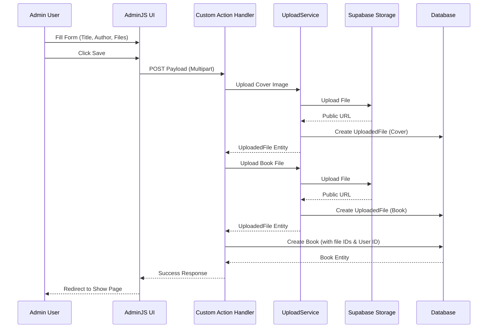

# Active Context: 02 - Book Management (Upload & Processing)

## ✔️ Status

- **Current Status**: In Progress
- **Last Updated**: 2025-11-30

## ✏️ Business Requirements

- Admin and Staff users can upload new books.
- Input fields: Title, Author, Cover Image, Book File.
- Supported file types:
  - Cover: JPG, PNG (max 5MB).
  - Book: PDF, DOCX, EPUB, TXT (max 20MB).
- System automatically uploads files to storage and links them to the book record.
- Default status for new books is DRAFT.
- Current user is assigned as the owner/uploader.

## TODO List

- ✅ Task 1: Design & Data Flow
- ✅ Task 2: Implement UploadService for Supabase
- ✅ Task 3: Configure AdminJS Book Resource
- ✅ Task 4: Implement Custom New Action Handler
- ❌ Task 5: Implement Book Processing (Parsing/Chunking) - _Future Scope_

## 📝 Active Decisions

- **AdminJS Custom Handler**: Used a custom `new` action handler in AdminJS instead of a custom component to simplify the implementation of file uploads and entity creation in a single transaction-like flow.
- **Supabase Storage**: Files are stored in Supabase Storage buckets (`books` bucket with `covers/` and `books/` paths).
- **Entity Separation**: `UploadedFile` entity is separate from `Book` entity to allow reuse and better file management.

## 🔍 Technical Solution / Design

### API / Interface

- **AdminJS**: The feature is exposed via the AdminJS interface.
- **Endpoint**: `POST /admin/api/resources/Book/actions/new` (handled internally by AdminJS).

### Components

- **UploadService**: Handles file validation and upload to Supabase.
- **AdminModule**: Configures the resource and action handler.

### ⇅ Data Flow (Mermaid chart)

### 🔏 Security Patterns

- **Role-Based Access Control (RBAC)**: Only Admin and Staff roles can access the Book resource and create new books.
- **File Validation**:
  - Mime-type checking (allowlist).
  - File size limits (5MB for covers, 20MB for books).
- **Authentication**: AdminJS authentication ensures only logged-in users can perform the action.

### ⌨️ Test Cases

- **TC1**: Upload valid book and cover -> Success.
- **TC2**: Upload invalid cover format -> Error message.
- **TC3**: Upload invalid book format -> Error message.
- **TC4**: Upload file exceeding size limit -> Error message.
- **TC5**: Submit without files -> Success (if files optional) or Error (if required). _Current impl: Optional_
