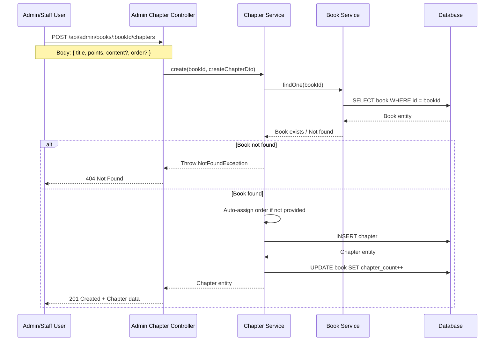

# Active Context: 03 - Chapter Management

## ✔️ Status

- **Current Status**: Planning
- **Last Updated**: 2025-12-03

## ✏️ Business Requirements

- Admin and Staff users can create chapters for existing books.
- Required input fields when creating a chapter:
  - **Book ID**: The parent book to which the chapter belongs.
  - **Short Title**: A concise title for the chapter.
  - **Points**: Reward points users receive when they complete the chapter.
- Chapters are ordered within a book (order field).
- Admin and Staff can manage (create, update, delete) chapters.
- Users can view chapters associated with published books only.

## TODO List

- ❌ Task 1: Design & Data Flow
- ❌ Task 2: Update Chapter Entity (add points field)
- ❌ Task 3: Create Chapter DTOs (Create/Update)
- ❌ Task 4: Create Chapter Service
- ❌ Task 5: Create Admin Chapter Controller
- ❌ Task 6: Create User Chapter Controller (read-only)
- ❌ Task 7: Update Book Module with Chapter endpoints

## 📝 Active Decisions

- **Chapter Points System**: Each chapter will have a `points` field representing the reward points users earn upon completion.
- **Auto-ordering**: Chapters should be automatically ordered when created (e.g., next available order number).
- **Access Control**:
  - Admin API: Full CRUD access to chapters for admin/staff roles.
  - User API: Read-only access to chapters of published books only.
- **Validation**: Book must exist before creating a chapter, and the chapter count on the book entity should be updated automatically.

## 🔍 Technical Solution / Design

### Database Schema Updates

**Chapter Entity** (`chapters` table):

- `id` (PK)
- `book_id` (FK to books)
- `title` (varchar) - Short title
- `content` (text) - Chapter content (can be empty initially)
- `order` (int) - Chapter sequence number
- `points` (int) - **NEW FIELD** - Reward points for completing the chapter
- `created_at`, `updated_at` (timestamps)

### API Endpoints

#### Admin API (Protected - Admin/Staff only)

```
POST   /api/admin/books/:bookId/chapters       - Create a new chapter
GET    /api/admin/books/:bookId/chapters       - List all chapters for a book
GET    /api/admin/books/:bookId/chapters/:id   - Get a specific chapter
PUT    /api/admin/books/:bookId/chapters/:id   - Update a chapter
DELETE /api/admin/books/:bookId/chapters/:id   - Delete a chapter
```

#### User API (Public - Published books only)

```
GET    /api/books/:bookId/chapters             - List chapters for a published book
GET    /api/books/:bookId/chapters/:id         - Get a specific chapter of a published book
```

### DTOs

**CreateChapterDto**:

```typescript
{
  title: string;           // Required - Short title
  points: number;          // Required - Reward points (must be >= 0)
  content?: string;        // Optional - Chapter content
  order?: number;          // Optional - Auto-assigned if not provided
}
```

**UpdateChapterDto**:

```typescript
{
  title?: string;
  points?: number;
  content?: string;
  order?: number;
}
```

### ⇅ Data Flow (Mermaid chart)



### Components

- **ChapterService**: Handles chapter CRUD operations, validates book existence, auto-assigns order.
- **AdminChapterController**: REST endpoints for admin/staff to manage chapters.
- **UserChapterController**: Read-only endpoints for users to view chapters of published books.
- **CreateChapterDto / UpdateChapterDto**: Data transfer objects for validation.

### 🔏 Security Patterns

- **Role-Based Access Control (RBAC)**:
  - Admin endpoints: Require `ADMIN` or `STAFF` role via `@Roles()` decorator.
  - User endpoints: Public but filtered to only show chapters from published books.
- **Authentication**: JWT-based authentication for admin endpoints using `JwtAuthGuard`.
- **Authorization**: `RolesGuard` ensures only authorized roles can create/update/delete chapters.
- **Input Validation**:
  - Validate `points` is a non-negative number.
  - Validate `title` is a non-empty string.
  - Validate `bookId` exists in the database.

### ⌨️ Test Cases

**TC1 - Create Chapter (Admin/Staff)**:

- Given: Valid book ID, title, and points
- When: POST to `/api/admin/books/:bookId/chapters`
- Then: Chapter created successfully, book chapter_count incremented

**TC2 - Create Chapter with Invalid Book ID**:

- Given: Non-existent book ID
- When: POST to `/api/admin/books/:bookId/chapters`
- Then: 404 Not Found error

**TC3 - Create Chapter with Negative Points**:

- Given: Valid book ID, title, but negative points
- When: POST to `/api/admin/books/:bookId/chapters`
- Then: 400 Bad Request (validation error)

**TC4 - Auto-assign Order**:

- Given: Valid data without order field
- When: POST to `/api/admin/books/:bookId/chapters`
- Then: Chapter created with order = max(existing orders) + 1

**TC5 - List Chapters (User)**:

- Given: Published book with chapters
- When: GET to `/api/books/:bookId/chapters`
- Then: Returns all chapters for that book

**TC6 - List Chapters of Draft Book (User)**:

- Given: Draft book with chapters
- When: GET to `/api/books/:bookId/chapters`
- Then: 404 Not Found (book not published)

**TC7 - Update Chapter (Admin/Staff)**:

- Given: Valid chapter ID and update data
- When: PUT to `/api/admin/books/:bookId/chapters/:id`
- Then: Chapter updated successfully

**TC8 - Delete Chapter (Admin/Staff)**:

- Given: Valid chapter ID
- When: DELETE to `/api/admin/books/:bookId/chapters/:id`
- Then: Chapter deleted, book chapter_count decremented

**TC9 - Unauthorized Access (User role)**:

- Given: User without admin/staff role
- When: POST to `/api/admin/books/:bookId/chapters`
- Then: 403 Forbidden
