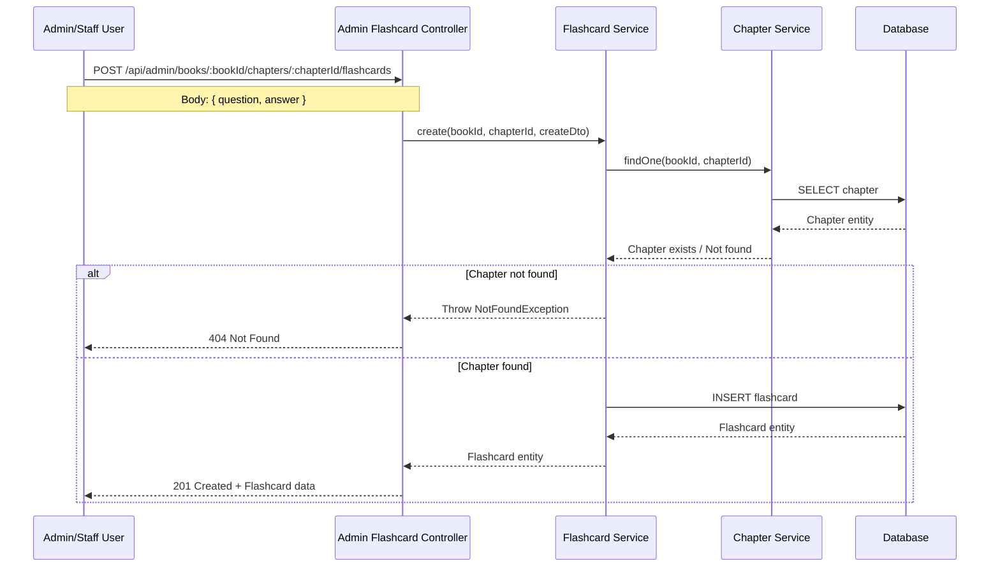
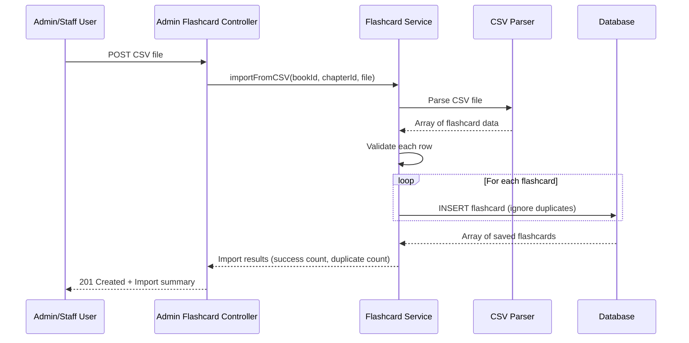
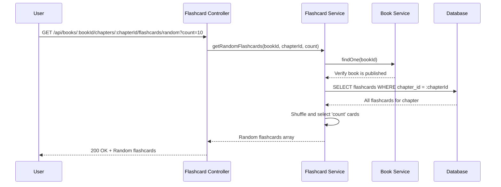

# Active Context: 04 - Flashcard Management

## ✔️ Status

- **Current Status**: Planning
- **Last Updated**: 2025-12-04

## ✏️ Business Requirements

- Flashcards are linked to specific book chapters for studying and reinforcement.
- Admin and Staff users can manage flashcards (create, update, delete).
- Admin and Staff can bulk import flashcards from CSV files.
- Users can view random flashcards from a specific chapter.
- Each flashcard has a question (front) and answer (back).
- Flashcards are ordered within chapters for systematic learning.
- Users can only access flashcards from published books.

## TODO List

- ❌ Task 1: Design & Data Flow
- ❌ Task 2: Create Flashcard Entity
- ❌ Task 3: Create Flashcard DTOs (Create/Update/Import)
- ❌ Task 4: Create Flashcard Service with CRUD operations
- ❌ Task 5: Implement CSV Import functionality
- ❌ Task 6: Create Admin Flashcard Controller
- ❌ Task 7: Create User Flashcard Controller with random endpoint
- ❌ Task 8: Update Books Module with Flashcard components

## 📝 Active Decisions

- **CSV Import Format**: CSV files should have columns: `question`, `answer`
- **Random Selection**: Random flashcards endpoint returns a configurable number of cards from a chapter
- **Duplicate Prevention**: Unique constraint on `(chapter_id, question, answer)` prevents duplicate flashcards within a chapter
- **Access Control**:
  - Admin API: Full CRUD access and CSV import for admin/staff roles
  - User API: Read-only access to flashcards from published books only
- **Validation**: Chapter must exist and belong to an existing book before creating flashcards

## 🔍 Technical Solution / Design

### Database Schema

**Flashcard Entity** (`flashcards` table):

- `id` (PK)
- `chapter_id` (FK to chapters)
- `question` (text) - Front of the flashcard
- `answer` (text) - Back of the flashcard / correct answer
- `created_at`, `updated_at` (timestamps)
- **Unique Constraint**: `(chapter_id, question, answer)` - Prevents duplicate flashcards within a chapter

### API Endpoints

#### Admin API (Protected - Admin/Staff only)

```
POST   /api/admin/books/:bookId/chapters/:chapterId/flashcards              - Create a flashcard
POST   /api/admin/books/:bookId/chapters/:chapterId/flashcards/import      - Import flashcards from CSV
GET    /api/admin/books/:bookId/chapters/:chapterId/flashcards              - List all flashcards for a chapter
GET    /api/admin/books/:bookId/chapters/:chapterId/flashcards/:id          - Get a specific flashcard
PUT    /api/admin/books/:bookId/chapters/:chapterId/flashcards/:id          - Update a flashcard
DELETE /api/admin/books/:bookId/chapters/:chapterId/flashcards/:id          - Delete a flashcard
```

#### User API (Public - Published books only)

```
GET    /api/books/:bookId/chapters/:chapterId/flashcards                    - List all flashcards in a chapter (published book)
GET    /api/books/:bookId/chapters/:chapterId/flashcards/random             - Get random flashcards from a chapter
GET    /api/books/:bookId/chapters/:chapterId/flashcards/:id                - Get a specific flashcard (published book)
```

### DTOs

**CreateFlashcardDto**:

```typescript
{
  question: string; // Required - Flashcard question
  answer: string; // Required - Flashcard answer
}
```

**UpdateFlashcardDto**:

```typescript
{
  question?: string;
  answer?: string;
}
```

**ImportFlashcardsDto**:

```typescript
{
  file: Express.Multer.File; // CSV file upload
}
```

**GetRandomFlashcardsDto** (Query params):

```typescript
{
  count?: number;          // Optional - Number of random cards (default: 5, max: 50)
}
```

### CSV Import Format

CSV file should follow this structure:

```csv
question,answer
"What is Feng Shui?","Ancient Chinese practice of harmonizing energy"
"What does 'Feng' mean?","Wind"
"What does 'Shui' mean?","Water"
```

- **Headers**: `question`, `answer`
- **Encoding**: UTF-8
- **Delimiter**: Comma (,)
- **Quotes**: Use double quotes for fields containing commas or newlines

### ⇅ Data Flow (Mermaid chart)

#### Creating a Flashcard



#### CSV Import Flow



#### Random Flashcards Flow



### Components

- **Flashcard Entity**: Database model for flashcards
- **FlashcardsService**: Handles flashcard CRUD, CSV import, random selection
- **AdminFlashcardsController**: REST endpoints for admin/staff to manage flashcards
- **UserFlashcardsController**: Read-only endpoints including random card selection
- **CSV Parser**: Utility to parse and validate CSV files

### 🔏 Security Patterns

- **Role-Based Access Control (RBAC)**:
  - Admin endpoints: Require `ADMIN` or `STAFF` role via `@Roles()` decorator
  - User endpoints: Public but filtered to only show flashcards from published books
- **Authentication**: JWT-based authentication for admin endpoints using `JwtAuthGuard`
- **Authorization**: `RolesGuard` ensures only authorized roles can create/update/delete
- **File Upload Validation**:
  - Only CSV file types allowed (MIME type: text/csv)
  - Maximum file size limit (e.g., 5MB)
  - Validate CSV structure before processing
- **Input Validation**:
  - Validate `question` and `answer` are non-empty strings
  - Validate `count` parameter for random endpoint (min: 1, max: 50)
  - Validate chapter and book existence
- **Duplicate Prevention**: Database unique constraint automatically prevents duplicate flashcards during creation or import

### ⌨️ Test Cases

**TC1 - Create Flashcard (Admin/Staff)**:

- Given: Valid book ID, chapter ID, question, and answer
- When: POST to `/api/admin/books/:bookId/chapters/:chapterId/flashcards`
- Then: Flashcard created successfully

**TC2 - Create Flashcard with Invalid Chapter**:

- Given: Non-existent chapter ID
- When: POST to `/api/admin/books/:bookId/chapters/:chapterId/flashcards`
- Then: 404 Not Found error

**TC3 - Import Flashcards from CSV (Valid)**:

- Given: Valid CSV file with properly formatted flashcards
- When: POST CSV to `/api/admin/books/:bookId/chapters/:chapterId/flashcards/import`
- Then: All flashcards imported successfully, return summary

**TC4 - Import Invalid CSV**:

- Given: CSV with missing required columns or invalid data
- When: POST CSV to import endpoint
- Then: 400 Bad Request with validation errors

**TC5 - Get Random Flashcards (User)**:

- Given: Published book with chapter containing 20 flashcards
- When: GET to `/api/books/:bookId/chapters/:chapterId/flashcards/random?count=5`
- Then: Returns 5 random flashcards

**TC6 - Get Random from Draft Book (User)**:

- Given: Draft book with flashcards
- When: GET to `/api/books/:bookId/chapters/:chapterId/flashcards/random`
- Then: 404 Not Found (book not published)

**TC7 - List All Flashcards (Admin)**:

- Given: Chapter with flashcards
- When: GET to `/api/admin/books/:bookId/chapters/:chapterId/flashcards`
- Then: Returns all flashcards ordered by creation date

**TC8 - Update Flashcard (Admin/Staff)**:

- Given: Valid flashcard ID and update data
- When: PUT to `/api/admin/books/:bookId/chapters/:chapterId/flashcards/:id`
- Then: Flashcard updated successfully

**TC9 - Delete Flashcard (Admin/Staff)**:

- Given: Valid flashcard ID
- When: DELETE to `/api/admin/books/:bookId/chapters/:chapterId/flashcards/:id`
- Then: Flashcard deleted successfully

**TC10 - Random Count Validation**:

- Given: Request for random flashcards with count > 50
- When: GET to random endpoint with count=100
- Then: 400 Bad Request (validation error)

**TC11 - Unauthorized Access (User role)**:

- Given: User without admin/staff role
- When: POST to `/api/admin/books/:bookId/chapters/:chapterId/flashcards`
- Then: 403 Forbidden

**TC12 - CSV File Type Validation**:

- Given: Non-CSV file (e.g., .txt, .xlsx)
- When: POST to import endpoint
- Then: 400 Bad Request (invalid file type)
