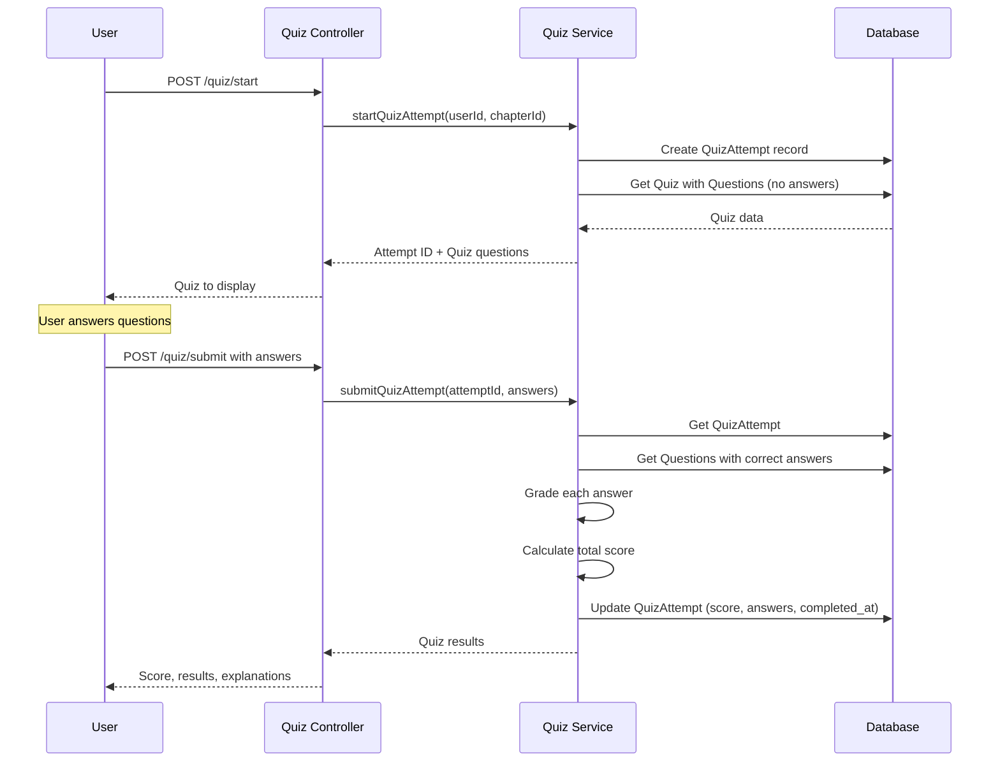

# Active Context: 05 - Chapter Quiz/Exam System

## ✔️ Status

- **Current Status**: Planning
- **Last Updated**: 2025-12-04

## ✏️ Business Requirements

- Users can take quizzes/exams after reading chapters to test their knowledge
- Quizzes are linked to specific chapters
- Support multiple question types for varied assessment
- Admin and Staff can create, update, and delete quiz questions
- Users earn points for correct answers
- Track user quiz attempts and scores
- Display quiz results with correct answers after completion

## TODO List

- ❌ Task 1: Design & Data Flow
- ❌ Task 2: Create Quiz and Question entities
- ❌ Task 3: Create QuizAttempt entity for tracking user progress
- ❌ Task 4: Create Quiz DTOs (Create, Answer, Submit)
- ❌ Task 5: Create Quiz Service with scoring logic
- ❌ Task 6: Create Admin Quiz Controller
- ❌ Task 7: Create User Quiz Controller
- ❌ Task 8: Update Books Module with Quiz components

## 📝 Active Decisions

- **Question Types**: Support 5 question types:
  - `TRUE_FALSE` - True/False or Yes/No questions
  - `MULTIPLE_CHOICE` - Single correct answer from multiple options
  - `MULTIPLE_ANSWER` - Multiple correct answers (checkboxes)
  - `MATCHING` - Match items from two lists (drag and drop)
  - `ORDERING` - Arrange items in correct order (drag and drop)
- **Scoring**: Each question has configurable points
- **Question Storage**: Store options and correct answers as JSON for flexibility
- **Attempt Tracking**: Record all user attempts with scores and answers
- **Pass Criteria**: Admin can set minimum passing score percentage per chapter
- **Immediate Feedback**: Show results immediately after submission

## 🔍 Technical Solution / Design

### Database Schema

**Quiz Entity** (`quizzes` table):

- `id` (PK)
- `chapter_id` (FK to chapters) - One quiz per chapter
- `title` (varchar) - Quiz title
- `description` (text, nullable) - Quiz instructions
- `passing_score_percentage` (int) - Minimum score to pass (0-100)
- `time_limit_minutes` (int, nullable) - Optional time limit
- `created_at`, `updated_at`

**Question Entity** (`questions` table):

- `id` (PK)
- `quiz_id` (FK to quizzes)
- `question_type` (enum) - TRUE_FALSE, MULTIPLE_CHOICE, MULTIPLE_ANSWER, MATCHING, ORDERING
- `question_text` (text) - The question
- `points` (int) - Points for correct answer
- `order` (int) - Display order
- `options` (jsonb) - Question-specific data (options, correct answers, pairs, etc.)
- `explanation` (text, nullable) - Explanation shown after answering
- `created_at`, `updated_at`

**QuizAttempt Entity** (`quiz_attempts` table):

- `id` (PK)
- `quiz_id` (FK to quizzes)
- `user_id` (FK to users)
- `score` (int) - Total points earned
- `max_score` (int) - Maximum possible points
- `percentage` (decimal) - Score percentage
- `passed` (boolean) - Whether user passed
- `answers` (jsonb) - User's answers for all questions
- `started_at` (timestamp)
- `completed_at` (timestamp)
- `created_at`, `updated_at`

### Question Type Data Structures

#### TRUE_FALSE

```json
{
  "correct_answer": true,
  "true_label": "Yes",
  "false_label": "No"
}
```

#### MULTIPLE_CHOICE

```json
{
  "options": [
    { "id": "a", "text": "Option A" },
    { "id": "b", "text": "Option B" },
    { "id": "c", "text": "Option C" }
  ],
  "correct_answer": "b"
}
```

#### MULTIPLE_ANSWER

```json
{
  "options": [
    { "id": "a", "text": "Option A" },
    { "id": "b", "text": "Option B" },
    { "id": "c", "text": "Option C" }
  ],
  "correct_answers": ["a", "c"]
}
```

#### MATCHING

```json
{
  "pairs": [
    { "left": "Feng", "right": "Wind", "id": 1 },
    { "left": "Shui", "right": "Water", "id": 2 }
  ]
}
```

#### ORDERING

```json
{
  "items": [
    { "id": "a", "text": "First step", "correct_order": 1 },
    { "id": "b", "text": "Second step", "correct_order": 2 },
    { "id": "c", "text": "Third step", "correct_order": 3 }
  ]
}
```

### API Endpoints

#### Admin API (Protected - Admin/Staff only)

```
POST   /api/admin/books/:bookId/chapters/:chapterId/quiz              - Create quiz for chapter
PUT    /api/admin/books/:bookId/chapters/:chapterId/quiz              - Update quiz settings
GET    /api/admin/books/:bookId/chapters/:chapterId/quiz              - Get quiz with all questions
DELETE /api/admin/books/:bookId/chapters/:chapterId/quiz              - Delete quiz

POST   /api/admin/quizzes/:quizId/questions                           - Add question to quiz
PUT    /api/admin/quizzes/:quizId/questions/:id                       - Update question
DELETE /api/admin/quizzes/:quizId/questions/:id                       - Delete question
PUT    /api/admin/quizzes/:quizId/questions/reorder                   - Reorder questions

GET    /api/admin/quizzes/:quizId/attempts                            - Get all attempts for a quiz
GET    /api/admin/quizzes/:quizId/attempts/:id                        - Get detailed attempt
```

#### User API (Public - Published books only)

```
GET    /api/books/:bookId/chapters/:chapterId/quiz                    - Get quiz (without answers)
POST   /api/books/:bookId/chapters/:chapterId/quiz/start              - Start quiz attempt
POST   /api/books/:bookId/chapters/:chapterId/quiz/submit             - Submit quiz answers
GET    /api/books/:bookId/chapters/:chapterId/quiz/attempts           - Get user's attempts
GET    /api/books/:bookId/chapters/:chapterId/quiz/attempts/:id       - Get attempt details with results
```

### DTOs

**CreateQuizDto**:

```typescript
{
  title: string;
  description?: string;
  passing_score_percentage: number;  // 0-100
  time_limit_minutes?: number;
}
```

**CreateQuestionDto**:

```typescript
{
  question_type: QuestionType;
  question_text: string;
  points: number;
  options: any;  // Type-specific JSON
  explanation?: string;
  order?: number;  // Auto-assigned if not provided
}
```

**StartQuizDto** (Response):

```typescript
{
  attempt_id: number;
  quiz: {
    title, description, time_limit_minutes, questions: [
      {id, question_type, question_text, points, options (without answers)}
    ]
  }
}
```

**SubmitQuizDto**:

```typescript
{
  attempt_id: number;
  answers: {
    [question_id: number]: any  // Answer format depends on question type
  }
}
```

**QuizResultDto** (Response):

```typescript
{
  score: number;
  max_score: number;
  percentage: number;
  passed: boolean;
  results: [
    {
      question_id,
      question_text,
      user_answer,
      correct_answer,
      is_correct,
      points_earned,
      explanation,
    },
  ];
}
```

### ⇅ Data Flow (Mermaid chart)

#### Taking a Quiz



### Components

- **Quiz Entity**: Quiz configuration for a chapter
- **Question Entity**: Individual questions with type-specific options
- **QuizAttempt Entity**: Tracks user quiz attempts and scores
- **QuizzesService**: Handles quiz CRUD, question management
- **QuizAttemptsService**: Handles starting, grading, and tracking attempts
- **AdminQuizzesController**: Admin endpoints for quiz management
- **UserQuizzesController**: User endpoints for taking quizzes

### 🔏 Security Patterns

- **Role-Based Access Control**:
  - Admin/Staff: Full CRUD on quizzes and questions
  - Users: Can only start and submit quizzes for published books
- **Attempt Validation**:
  - Verify attempt belongs to authenticated user
  - Prevent submitting same attempt twice
  - Validate all question IDs exist
- **Answer Storage**: Store user answers separately from correct answers
- **Published Book Filter**: Users can only access quizzes from published books
- **Time Limit Enforcement** (optional): Track start time and validate submission time

### ⌨️ Test Cases

**TC1 - Create Quiz (Admin)**:

- Given: Valid chapter ID and quiz data
- When: POST to `/api/admin/books/:bookId/chapters/:chapterId/quiz`
- Then: Quiz created successfully

**TC2 - Add Question (Admin)**:

- Given: Quiz ID and question with type MULTIPLE_CHOICE
- When: POST to `/api/admin/quizzes/:quizId/questions`
- Then: Question added with auto-assigned order

**TC3 - Start Quiz (User)**:

- Given: Published book with chapter and quiz
- When: POST to `/api/books/:bookId/chapters/:chapterId/quiz/start`
- Then: Attempt created, questions returned without correct answers

**TC4 - Submit Quiz - All Correct**:

- Given: Quiz attempt with all correct answers
- When: POST to `/api/books/:bookId/chapters/:chapterId/quiz/submit`
- Then: 100% score, passed = true

**TC5 - Submit Quiz - Partial Correct**:

- Given: Quiz attempt with some correct answers
- When: Submit quiz
- Then: Partial score calculated correctly, passed based on threshold

**TC6 - Grade TRUE_FALSE Question**:

- Given: Question type TRUE_FALSE, correct answer = true, user answer = true
- When: Grade submission
- Then: Full points awarded

**TC7 - Grade MULTIPLE_ANSWER Question**:

- Given: Correct answers = ["a", "c"], user answers = ["a", "b"]
- When: Grade submission
- Then: Partial credit or zero based on grading logic

**TC8 - Grade MATCHING Question**:

- Given: Matching pairs question, user provides all correct pairs
- When: Grade submission
- Then: Full points awarded

**TC9 - View Attempt Results**:

- Given: Completed quiz attempt
- When: GET attempt details
- Then: Returns score, answers, correct answers, explanations

**TC10 - Access Draft Book Quiz (User)**:

- Given: Draft book with quiz
- When: GET quiz
- Then: 404 Not Found

**TC11 - Reorder Questions (Admin)**:

- Given: Quiz with 3 questions
- When: PUT reorder with new order
- Then: Questions reordered successfully

**TC12 - Prevent Double Submission**:

- Given: Already submitted attempt
- When: Try to submit again
- Then: 400 Bad Request

## Additional Considerations

### Grading Logic per Question Type

- **TRUE_FALSE**: Exact match = full points
- **MULTIPLE_CHOICE**: Exact match = full points
- **MULTIPLE_ANSWER**:
  - All correct = full points
  - Partial match = proportional points OR zero (configurable)
- **MATCHING**: Proportional points for correct pairs
- **ORDERING**: Proportional points based on correct positions

### Future Enhancements

- Question bank / reusable questions
- Random question selection
- Question difficulty levels
- Time tracking per question
- Hints system
- Practice mode (unlimited attempts without scoring)
- Leaderboard
