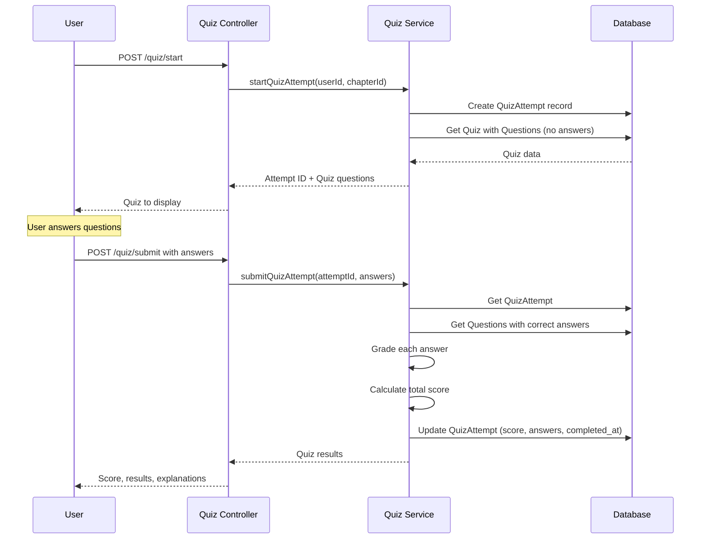

# Active Context: 05 - Chapter Quiz/Exam System

## ✔️ Status

- **Current Status**: In Progress - Backend Complete, Admin UI Complete
- **Last Updated**: 2025-12-07
- **Progress**:
  - ✅ Backend entities and APIs fully implemented
  - ✅ Admin dashboard with all 5 question types (TRUE_FALSE, MULTIPLE_CHOICE, MULTIPLE_ANSWER, MATCHING, ORDERING)
  - ✅ CSV import/export functionality
  - ❌ User-facing quiz interface (pending)

## ✏️ Business Requirements

- Users can take quizzes/exams after reading chapters to test their knowledge
- Each chapter has a question bank with reusable questions
- Quizzes are randomly generated from the chapter's question bank
- Support multiple question types for varied assessment
- Admin and Staff can create, update, and delete questions in the question bank
- Users earn points for correct answers
- Track user quiz attempts and scores
- Display quiz results with correct answers after completion

## TODO List

- ✅ Task 1: Design & Data Flow
- ✅ Task 2: Create QuizChapterConfig and Question entities
- ✅ Task 3: Create QuizAttempt entity for tracking user progress
- ✅ Task 4: Create Quiz DTOs (Config, Create Question, Answer, Submit)
- ✅ Task 5: Create Quiz Service with random selection and scoring logic
- ✅ Task 6: Create Admin Quiz Controller with CSV import/export
- ✅ Task 6.1: Create Admin UI QuizQuestionsTab with all question type forms
- ❌ Task 7: Create User Quiz Controller (API ready, UI pending)
- ❌ Task 8: Create User Quiz Interface (mobile app)

## 📝 Active Decisions

- **Question Bank**: Each chapter has its own question bank
- **Random Selection**: Quizzes are generated by randomly selecting questions from the bank
- **Question Types**: Support 5 question types:
  - `TRUE_FALSE` - True/False or Yes/No questions
  - `MULTIPLE_CHOICE` - Single correct answer from multiple options
  - `MULTIPLE_ANSWER` - Multiple correct answers (checkboxes)
  - `MATCHING` - Match items from two lists (drag and drop)
  - `ORDERING` - Arrange items in correct order (drag and drop)
- **Difficulty Levels**: EASY, MEDIUM, HARD - for balanced random selection
- **Scoring**: Each question has configurable points based on difficulty
- **Question Storage**: Store options and correct answers as JSON for flexibility
- **Attempt Tracking**: Record all user attempts with scores and answers
- **Pass Criteria**: Admin can set minimum passing score percentage per chapter
- **Immediate Feedback**: Show results immediately after submission

## 🔍 Technical Solution / Design

### Database Schema

**QuizChapterConfig Entity** (`quiz_chapter_configs` table):

- `id` (PK)
- `chapter_id` (FK to chapters, unique) - One config per chapter
- `title` (varchar) - Quiz title (e.g., "Chapter 1 Quiz")
- `description` (text, nullable) - Quiz instructions
- `questions_per_quiz` (int) - Number of questions to randomly select
- `passing_score_percentage` (int) - Minimum score to pass (0-100)
- `time_limit_minutes` (int, nullable) - Optional time limit
- `is_active` (boolean) - Whether quiz is available for this chapter
- `created_at`, `updated_at`

**Question Entity** (`questions` table):

- `id` (PK)
- `chapter_id` (FK to chapters) - Questions belong to chapter, not specific quiz
- `question_type` (enum) - TRUE_FALSE, MULTIPLE_CHOICE, MULTIPLE_ANSWER, MATCHING, ORDERING
- `difficulty` (enum) - EASY, MEDIUM, HARD
- `question_text` (text) - The question
- `points` (int) - Points for correct answer
- `options` (jsonb) - Question-specific data (options, correct answers, pairs, etc.)
- `explanation` (text, nullable) - Explanation shown after answering
- `is_active` (boolean) - Whether question is available for selection
- `created_at`, `updated_at`

**QuizAttempt Entity** (`quiz_attempts` table):

- `id` (PK)
- `chapter_id` (FK to chapters) - Chapter being quizzed
- `user_id` (FK to users)
- `selected_questions` (jsonb) - Array of question IDs randomly selected for this attempt
- `score` (int) - Total points earned
- `max_score` (int) - Maximum possible points
- `percentage` (decimal) - Score percentage
- `passed` (boolean) - Whether user passed
- `answers` (jsonb) - User's answers for all questions
- `started_at` (timestamp)
- `completed_at` (timestamp, nullable) - Null if not yet completed
- `created_at`, `updated_at`

### Question Type Data Structures

#### TRUE_FALSE

```json
{
  "correct_answer": true,
  "true_label": "Yes",
  "false_label": "No"
}
```

#### MULTIPLE_CHOICE

```json
{
  "options": [
    { "id": "a", "text": "Option A" },
    { "id": "b", "text": "Option B" },
    { "id": "c", "text": "Option C" }
  ],
  "correct_answer": "b"
}
```

#### MULTIPLE_ANSWER

```json
{
  "options": [
    { "id": "a", "text": "Option A" },
    { "id": "b", "text": "Option B" },
    { "id": "c", "text": "Option C" }
  ],
  "correct_answers": ["a", "c"]
}
```

#### MATCHING

```json
{
  "pairs": [
    { "left": "Feng", "right": "Wind", "id": 1 },
    { "left": "Shui", "right": "Water", "id": 2 }
  ]
}
```

#### ORDERING

```json
{
  "items": [
    { "id": "a", "text": "First step", "correct_order": 1 },
    { "id": "b", "text": "Second step", "correct_order": 2 },
    { "id": "c", "text": "Third step", "correct_order": 3 }
  ]
}
```

### API Endpoints

#### Admin API (Protected - Admin/Staff only)

```
# Quiz Configuration
POST   /api/admin/chapters/:chapterId/quiz-config                     - Create quiz config for chapter
PUT    /api/admin/chapters/:chapterId/quiz-config                     - Update quiz config settings
GET    /api/admin/chapters/:chapterId/quiz-config                     - Get quiz config
DELETE /api/admin/chapters/:chapterId/quiz-config                     - Delete quiz config

# Question Bank Management
GET    /api/admin/chapters/:chapterId/questions                       - Get all questions in chapter's bank
POST   /api/admin/chapters/:chapterId/questions                       - Add question to chapter's bank
PUT    /api/admin/chapters/:chapterId/questions/:id                   - Update question
DELETE /api/admin/chapters/:chapterId/questions/:id                   - Delete question
POST   /api/admin/chapters/:chapterId/questions/bulk                  - Bulk import questions (CSV)

# Analytics
GET    /api/admin/chapters/:chapterId/quiz-attempts                   - Get all attempts for chapter quiz
GET    /api/admin/chapters/:chapterId/quiz-attempts/:id               - Get detailed attempt
GET    /api/admin/chapters/:chapterId/questions/:questionId/stats     - Get question statistics
```

#### User API (Public - Published books only)

```
GET    /api/books/:bookId/chapters/:chapterId/quiz/info               - Get quiz config info
POST   /api/books/:bookId/chapters/:chapterId/quiz/start              - Start quiz (generates random questions)
POST   /api/books/:bookId/chapters/:chapterId/quiz/submit             - Submit quiz answers
GET    /api/books/:bookId/chapters/:chapterId/quiz/attempts           - Get user's attempt history
GET    /api/books/:bookId/chapters/:chapterId/quiz/attempts/:id       - Get specific attempt with results
```

### DTOs

**CreateQuizConfigDto**:

```typescript
{
  title: string;
  description?: string;
  questions_per_quiz: number;  // How many questions to select randomly
  passing_score_percentage: number;  // 0-100
  time_limit_minutes?: number;
  is_active: boolean;
}
```

**CreateQuestionDto**:

```typescript
{
  question_type: QuestionType;
  difficulty: DifficultyLevel;  // EASY, MEDIUM, HARD
  question_text: string;
  points: number;
  options: any;  // Type-specific JSON
  explanation?: string;
  order?: number;  // Auto-assigned if not provided
}
```

**StartQuizDto** (Response):

```typescript
{
  attempt_id: number;
  quiz_config: {
    title: string;
    description: string;
    time_limit_minutes?: number;
    questions_count: number;
  },
  questions: [
    {
      id: number;
      question_type: QuestionType;
      difficulty: DifficultyLevel;
      question_text: string;
      points: number;
      options: any;  // Without correct answers
    }
  ],
  started_at: timestamp;
  time_remaining_seconds?: number;
}
```

**SubmitQuizDto**:

```typescript
{
  attempt_id: number;
  answers: {
    [question_id: number]: any  // Answer format depends on question type
  }
}
```

**QuizResultDto** (Response):

```typescript
{
  score: number;
  max_score: number;
  percentage: number;
  passed: boolean;
  results: [
    {
      question_id,
      question_text,
      user_answer,
      correct_answer,
      is_correct,
      points_earned,
      explanation,
    },
  ];
}
```

### ⇅ Data Flow (Mermaid chart)

#### Taking a Quiz



### Components

- **QuizChapterConfig Entity**: Quiz configuration for a chapter (settings)
- **Question Entity**: Question bank - questions belong to chapters
- **QuizAttempt Entity**: Tracks user quiz attempts with selected questions
- **QuizConfigService**: Handles quiz configuration CRUD
- **QuestionBankService**: Manages chapter question banks
- **QuizAttemptsService**: Handles random selection, starting, grading, and tracking attempts
- **AdminQuizController**: Admin endpoints for config and question bank management
- **UserQuizController**: User endpoints for taking randomly generated quizzes

### 🔏 Security Patterns

- **Role-Based Access Control**:
  - Admin/Staff: Full CRUD on quizzes and questions
  - Users: Can only start and submit quizzes for published books
- **Attempt Validation**:
  - Verify attempt belongs to authenticated user
  - Prevent submitting same attempt twice
  - Validate all question IDs exist
- **Answer Storage**: Store user answers separately from correct answers
- **Published Book Filter**: Users can only access quizzes from published books
- **Time Limit Enforcement** (optional): Track start time and validate submission time

### ⌨️ Test Cases

**TC1 - Create Quiz Config (Admin)**:

- Given: Valid chapter ID and quiz config data
- When: POST to `/api/admin/chapters/:chapterId/quiz-config`
- Then: Quiz config created successfully

**TC2 - Add Question to Bank (Admin)**:

- Given: Chapter ID and question with type MULTIPLE_CHOICE and difficulty MEDIUM
- When: POST to `/api/admin/chapters/:chapterId/questions`
- Then: Question added to chapter's question bank

**TC3 - Start Quiz with Random Selection (User)**:

- Given: Published book, chapter with 20 questions in bank, config set to 10 questions per quiz
- When: POST to `/api/books/:bookId/chapters/:chapterId/quiz/start`
- Then: Attempt created with 10 randomly selected questions, no correct answers shown

**TC4 - Submit Quiz - All Correct**:

- Given: Quiz attempt with all correct answers
- When: POST to `/api/books/:bookId/chapters/:chapterId/quiz/submit`
- Then: 100% score, passed = true

**TC5 - Submit Quiz - Partial Correct**:

- Given: Quiz attempt with some correct answers
- When: Submit quiz
- Then: Partial score calculated correctly, passed based on threshold

**TC6 - Grade TRUE_FALSE Question**:

- Given: Question type TRUE_FALSE, correct answer = true, user answer = true
- When: Grade submission
- Then: Full points awarded

**TC7 - Grade MULTIPLE_ANSWER Question**:

- Given: Correct answers = ["a", "c"], user answers = ["a", "b"]
- When: Grade submission
- Then: Partial credit or zero based on grading logic

**TC8 - Grade MATCHING Question**:

- Given: Matching pairs question, user provides all correct pairs
- When: Grade submission
- Then: Full points awarded

**TC9 - View Attempt Results**:

- Given: Completed quiz attempt
- When: GET attempt details
- Then: Returns score, answers, correct answers, explanations

**TC10 - Access Draft Book Quiz (User)**:

- Given: Draft book with quiz
- When: GET quiz
- Then: 404 Not Found

**TC11 - Random Selection Distribution**:

- Given: Question bank with 10 EASY, 10 MEDIUM, 5 HARD questions, config for 15 questions
- When: Start quiz multiple times
- Then: Random selection maintains balanced difficulty distribution

**TC12 - Prevent Double Submission**:

- Given: Already submitted attempt
- When: Try to submit again
- Then: 400 Bad Request

## Additional Considerations

### Grading Logic per Question Type

- **TRUE_FALSE**: Exact match = full points
- **MULTIPLE_CHOICE**: Exact match = full points
- **MULTIPLE_ANSWER**:
  - All correct = full points
  - Partial match = proportional points OR zero (configurable)
- **MATCHING**: Proportional points for correct pairs
- **ORDERING**: Proportional points based on correct positions

### Random Selection Algorithm

**Strategy**: Weighted random selection based on difficulty distribution

1. **Default Distribution**:
   - 40% EASY questions
   - 40% MEDIUM questions
   - 20% HARD questions

2. **Selection Process**:
   - Calculate target count per difficulty level
   - Randomly select from each difficulty pool
   - If insufficient questions in a difficulty level, backfill from other levels
   - Shuffle final question order

3. **Avoiding Repetition**:
   - Track recently used questions per user (last 3 attempts)
   - Prioritize questions user hasn't seen recently
   - Only repeat questions if necessary (small question bank)

### Future Enhancements

- Weighted selection by topic/tag
- Time tracking per question
- Hints system
- Practice mode (unlimited attempts without scoring)
- Leaderboard
- Question difficulty auto-adjustment based on user performance
- Adaptive quizzes (adjust difficulty based on user answers)

## 📚 Question Bank

### Question Difficulty Guidelines

- **EASY**: Basic concepts, definitions, and straightforward recall questions
- **MEDIUM**: Application of concepts, analysis, and understanding relationships
- **HARD**: Complex scenarios, synthesis of multiple concepts, and deep analysis

### Chapter 1: Introduction to Feng Shui

#### EASY Questions

**Q1.1** - TRUE_FALSE (2 points)

```json
{
  "question_text": "Feng Shui literally translates to 'Wind' and 'Water'.",
  "difficulty": "EASY",
  "options": {
    "correct_answer": true,
    "true_label": "True",
    "false_label": "False"
  },
  "explanation": "The term Feng Shui (风水) directly translates from Chinese to mean 'Wind' (Feng) and 'Water' (Shui), representing the flow of natural energy."
}
```

**Q1.2** - MULTIPLE_CHOICE (2 points)

```json
{
  "question_text": "What is the primary goal of Feng Shui?",
  "difficulty": "EASY",
  "options": {
    "options": [
      { "id": "a", "text": "To decorate homes beautifully" },
      { "id": "b", "text": "To harmonize people with their surrounding environment" },
      { "id": "c", "text": "To increase property values" },
      { "id": "d", "text": "To follow ancient traditions strictly" }
    ],
    "correct_answer": "b"
  },
  "explanation": "The fundamental purpose of Feng Shui is to harmonize individuals with their surrounding environment through the flow of Chi (energy)."
}
```

**Q1.3** - MULTIPLE_CHOICE (2 points)

```json
{
  "question_text": "Which culture is Feng Shui primarily associated with?",
  "difficulty": "EASY",
  "options": {
    "options": [
      { "id": "a", "text": "Japanese" },
      { "id": "b", "text": "Chinese" },
      { "id": "c", "text": "Korean" },
      { "id": "d", "text": "Vietnamese" }
    ],
    "correct_answer": "b"
  },
  "explanation": "Feng Shui originated in ancient China over 3,000 years ago and is rooted in Chinese philosophy and cosmology."
}
```

#### MEDIUM Questions

**Q1.4** - MULTIPLE_ANSWER (4 points)

```json
{
  "question_text": "Which of the following are key elements in Feng Shui? Select all that apply.",
  "difficulty": "MEDIUM",
  "options": {
    "options": [
      { "id": "a", "text": "Wood" },
      { "id": "b", "text": "Fire" },
      { "id": "c", "text": "Light" },
      { "id": "d", "text": "Metal" },
      { "id": "e", "text": "Earth" },
      { "id": "f", "text": "Air" }
    ],
    "correct_answers": ["a", "b", "d", "e"]
  },
  "explanation": "The Five Elements in Feng Shui are Wood, Fire, Earth, Metal, and Water. These elements interact to create balance and harmony in living spaces. Light and Air are not among the traditional five elements."
}
```

**Q1.5** - MATCHING (4 points)

```json
{
  "question_text": "Match each Feng Shui concept with its correct definition.",
  "difficulty": "MEDIUM",
  "options": {
    "pairs": [
      { "left": "Chi", "right": "Life energy or vital force", "id": 1 },
      { "left": "Yin and Yang", "right": "Complementary opposites in balance", "id": 2 },
      { "left": "Bagua", "right": "Energy map of a space", "id": 3 },
      { "left": "Wu Xing", "right": "The Five Elements theory", "id": 4 }
    ]
  },
  "explanation": "These are fundamental concepts in Feng Shui: Chi is the vital energy, Yin and Yang represent balance, Bagua is used to map energy areas, and Wu Xing refers to the Five Elements system."
}
```

#### HARD Questions

**Q1.6** - MULTIPLE_CHOICE (5 points)

```json
{
  "question_text": "In classical Feng Shui, what does the 'Sheng Chi' position represent in a home?",
  "difficulty": "HARD",
  "options": {
    "options": [
      { "id": "a", "text": "The position of greatest vitality and prosperity" },
      { "id": "b", "text": "The entrance to the home" },
      { "id": "c", "text": "The center point of the dwelling" },
      { "id": "d", "text": "The location where water enters the property" }
    ],
    "correct_answer": "a"
  },
  "explanation": "Sheng Chi, meaning 'generating breath,' is considered the most auspicious direction and position in a space, associated with vitality, growth, and prosperity. It is one of the Eight Mansions in the Ba Zhai (Eight Mansions) school of Feng Shui."
}
```

**Q1.7** - ORDERING (5 points)

```json
{
  "question_text": "Arrange the following steps in the correct order for conducting a basic Feng Shui assessment of a home.",
  "difficulty": "HARD",
  "options": {
    "items": [
      { "id": "a", "text": "Determine the home's facing direction using a compass", "correct_order": 1 },
      { "id": "b", "text": "Overlay the Bagua map on the floor plan", "correct_order": 2 },
      { "id": "c", "text": "Identify areas of imbalance or blocked Chi", "correct_order": 3 },
      { "id": "d", "text": "Recommend adjustments using the Five Elements", "correct_order": 4 }
    ]
  },
  "explanation": "A proper Feng Shui assessment follows this sequence: First, establish the home's orientation; then apply the Bagua energy map; next, identify problem areas; and finally, propose remedies using elements and other Feng Shui principles."
}
```

### Chapter 2: The Five Elements

#### EASY Questions

**Q2.1** - MULTIPLE_CHOICE (2 points)

```json
{
  "question_text": "Which element is associated with the color green?",
  "difficulty": "EASY",
  "options": {
    "options": [
      { "id": "a", "text": "Fire" },
      { "id": "b", "text": "Wood" },
      { "id": "c", "text": "Metal" },
      { "id": "d", "text": "Water" }
    ],
    "correct_answer": "b"
  },
  "explanation": "The Wood element is associated with green and brown colors, representing growth, vitality, and expansion."
}
```

**Q2.2** - TRUE_FALSE (2 points)

```json
{
  "question_text": "The Fire element is associated with the South direction.",
  "difficulty": "EASY",
  "options": {
    "correct_answer": true,
    "true_label": "True",
    "false_label": "False"
  },
  "explanation": "In Feng Shui, the Fire element corresponds to the South direction, representing fame, recognition, and summer energy."
}
```

#### MEDIUM Questions

**Q2.3** - MATCHING (4 points)

```json
{
  "question_text": "Match each element with its corresponding shape.",
  "difficulty": "MEDIUM",
  "options": {
    "pairs": [
      { "left": "Wood", "right": "Rectangular/Columnar", "id": 1 },
      { "left": "Fire", "right": "Triangular/Pointed", "id": 2 },
      { "left": "Earth", "right": "Square/Flat", "id": 3 },
      { "left": "Metal", "right": "Round/Circular", "id": 4 },
      { "left": "Water", "right": "Wavy/Irregular", "id": 5 }
    ]
  },
  "explanation": "Each element has a characteristic shape: Wood is tall like trees, Fire points upward like flames, Earth is stable and square, Metal is round like coins, and Water flows in curves."
}
```

**Q2.4** - MULTIPLE_ANSWER (4 points)

```json
{
  "question_text": "Which elements are in the productive (nourishing) cycle? Select the correct sequence relationships.",
  "difficulty": "MEDIUM",
  "options": {
    "options": [
      { "id": "a", "text": "Water nourishes Wood" },
      { "id": "b", "text": "Fire nourishes Earth" },
      { "id": "c", "text": "Metal nourishes Fire" },
      { "id": "d", "text": "Earth nourishes Metal" },
      { "id": "e", "text": "Wood nourishes Fire" }
    ],
    "correct_answers": ["a", "b", "d", "e"]
  },
  "explanation": "In the productive cycle: Water nourishes Wood, Wood feeds Fire, Fire creates Earth (ash), Earth produces Metal, and Metal enriches Water. Metal does not nourish Fire; in fact, Fire melts Metal in the destructive cycle."
}
```

#### HARD Questions

**Q2.5** - MULTIPLE_CHOICE (5 points)

```json
{
  "question_text": "If a room has excessive Fire energy causing aggression and restlessness, which element should be introduced to harmonize the space according to the controlling cycle?",
  "difficulty": "HARD",
  "options": {
    "options": [
      { "id": "a", "text": "Wood - to feed the fire" },
      { "id": "b", "text": "Water - to directly control fire" },
      { "id": "c", "text": "Earth - to absorb fire energy" },
      { "id": "d", "text": "Metal - to indirectly weaken fire" }
    ],
    "correct_answer": "b"
  },
  "explanation": "In the controlling (destructive) cycle, Water controls Fire directly. While Earth can absorb some Fire energy, Water is the most effective element to balance excessive Fire. Wood would enhance Fire, and Metal would be melted by Fire."
}
```

**Q2.6** - ORDERING (5 points)

```json
{
  "question_text": "Arrange the five elements in the order of the productive (nourishing) cycle, starting with Water.",
  "difficulty": "HARD",
  "options": {
    "items": [
      { "id": "a", "text": "Water", "correct_order": 1 },
      { "id": "b", "text": "Wood", "correct_order": 2 },
      { "id": "c", "text": "Fire", "correct_order": 3 },
      { "id": "d", "text": "Earth", "correct_order": 4 },
      { "id": "e", "text": "Metal", "correct_order": 5 }
    ]
  },
  "explanation": "The productive cycle flows: Water → Wood → Fire → Earth → Metal → Water (completing the cycle). Each element nourishes the next in this sequence."
}
```

### Chapter 3: Yin and Yang

#### EASY Questions

**Q3.1** - TRUE_FALSE (2 points)

```json
{
  "question_text": "Yin represents active, bright, and warm qualities.",
  "difficulty": "EASY",
  "options": {
    "correct_answer": false,
    "true_label": "True",
    "false_label": "False"
  },
  "explanation": "Yang represents active, bright, and warm qualities, while Yin represents passive, dark, and cool qualities. They are complementary opposites."
}
```

**Q3.2** - MULTIPLE_CHOICE (2 points)

```json
{
  "question_text": "Which of the following is considered a Yang space in a home?",
  "difficulty": "EASY",
  "options": {
    "options": [
      { "id": "a", "text": "Bedroom" },
      { "id": "b", "text": "Living room" },
      { "id": "c", "text": "Meditation room" },
      { "id": "d", "text": "Storage room" }
    ],
    "correct_answer": "b"
  },
  "explanation": "Living rooms are Yang spaces - active, social areas with movement and energy. Bedrooms are Yin spaces for rest and quiet."
}
```

#### MEDIUM Questions

**Q3.3** - MATCHING (4 points)

```json
{
  "question_text": "Match each characteristic with either Yin or Yang energy.",
  "difficulty": "MEDIUM",
  "options": {
    "pairs": [
      { "left": "Sun", "right": "Yang", "id": 1 },
      { "left": "Moon", "right": "Yin", "id": 2 },
      { "left": "Cold", "right": "Yin", "id": 3 },
      { "left": "Movement", "right": "Yang", "id": 4 },
      { "left": "Stillness", "right": "Yin", "id": 5 }
    ]
  },
  "explanation": "Yang qualities include sun, heat, light, activity, and movement. Yin qualities include moon, cold, darkness, passivity, and stillness."
}
```

**Q3.4** - MULTIPLE_ANSWER (4 points)

```json
{
  "question_text": "Which design elements would add Yang energy to a space? Select all that apply.",
  "difficulty": "MEDIUM",
  "options": {
    "options": [
      { "id": "a", "text": "Bright lighting" },
      { "id": "b", "text": "Soft textures" },
      { "id": "c", "text": "Bold colors" },
      { "id": "d", "text": "Curved lines" },
      { "id": "e", "text": "Angular shapes" },
      { "id": "f", "text": "Muted tones" }
    ],
    "correct_answers": ["a", "c", "e"]
  },
  "explanation": "Yang design elements include bright lighting, bold/vibrant colors, and angular/sharp shapes. Soft textures, curved lines, and muted tones are Yin qualities."
}
```

#### HARD Questions

**Q3.5** - MULTIPLE_CHOICE (5 points)

```json
{
  "question_text": "A client complains their bedroom is too energizing and prevents restful sleep. The room has white walls, bright overhead lighting, and angular modern furniture. What is the best Feng Shui adjustment?",
  "difficulty": "HARD",
  "options": {
    "options": [
      { "id": "a", "text": "Add more plants to increase Wood energy" },
      { "id": "b", "text": "Replace lighting with dimmable lamps and add soft textiles in muted colors" },
      { "id": "c", "text": "Paint an accent wall in bright red to add Fire element" },
      { "id": "d", "text": "Install mirrors to expand the space" }
    ],
    "correct_answer": "b"
  },
  "explanation": "The bedroom has excessive Yang energy (bright, white, angular). To create a restful Yin environment, introduce softer lighting, gentle colors, and soft textures. Options A, C, and D would increase Yang energy further."
}
```

### Chapter 4: Bagua Map

#### EASY Questions

**Q4.1** - MULTIPLE_CHOICE (2 points)

```json
{
  "question_text": "How many life areas (guas) are there in the traditional Bagua map?",
  "difficulty": "EASY",
  "options": {
    "options": [
      { "id": "a", "text": "5" },
      { "id": "b", "text": "7" },
      { "id": "c", "text": "8" },
      { "id": "d", "text": "9" }
    ],
    "correct_answer": "d"
  },
  "explanation": "The Bagua map consists of 9 areas: 8 outer guas representing different life aspects (Wealth, Fame, Relationships, Family, Health/Center, Children, Knowledge, Career, Helpful People) plus the central Tai Chi area."
}
```

**Q4.2** - TRUE_FALSE (2 points)

```json
{
  "question_text": "The Wealth area of the Bagua is located in the far left corner from the entrance.",
  "difficulty": "EASY",
  "options": {
    "correct_answer": true,
    "true_label": "True",
    "false_label": "False"
  },
  "explanation": "When standing at the entrance facing in, the Wealth and Prosperity gua is in the far left corner (Southeast in compass Bagua)."
}
```

#### MEDIUM Questions

**Q4.3** - MATCHING (4 points)

```json
{
  "question_text": "Match each Bagua area with its associated element.",
  "difficulty": "MEDIUM",
  "options": {
    "pairs": [
      { "left": "Wealth", "right": "Wood", "id": 1 },
      { "left": "Fame", "right": "Fire", "id": 2 },
      { "left": "Relationships", "right": "Earth", "id": 3 },
      { "left": "Career", "right": "Water", "id": 4 },
      { "left": "Helpful People", "right": "Metal", "id": 5 }
    ]
  },
  "explanation": "Each Bagua area corresponds to a specific element: Wealth (Wood), Fame (Fire), Relationships (Earth), Career (Water), and Helpful People (Metal). Knowledge is also Earth, Family is Wood, Children is Metal, and the Center is Earth."
}
```

**Q4.4** - MULTIPLE_ANSWER (4 points)

```json
{
  "question_text": "Which colors are appropriate for enhancing the Fame and Reputation area? Select all that apply.",
  "difficulty": "MEDIUM",
  "options": {
    "options": [
      { "id": "a", "text": "Red" },
      { "id": "b", "text": "Blue" },
      { "id": "c", "text": "Purple" },
      { "id": "d", "text": "Orange" },
      { "id": "e", "text": "Green" },
      { "id": "f", "text": "Black" }
    ],
    "correct_answers": ["a", "c", "d"]
  },
  "explanation": "The Fame area is associated with the Fire element, so Fire colors are most appropriate: red, purple, orange, and bright pinks. Blue and black represent Water (which controls Fire), and green represents Wood."
}
```

#### HARD Questions

**Q4.5** - MULTIPLE_CHOICE (5 points)

```json
{
  "question_text": "A home office is located in the Relationships area (far right from entrance). The client is experiencing professional conflicts and partnership difficulties. What is the most effective Feng Shui remedy?",
  "difficulty": "HARD",
  "options": {
    "options": [
      { "id": "a", "text": "Remove all work-related items as they are incompatible with relationship energy" },
      {
        "id": "b",
        "text": "Add pairs of objects, Earth element colors, and ensure the desk faces a favorable direction"
      },
      { "id": "c", "text": "Paint the room blue to enhance Water energy" },
      { "id": "d", "text": "Add sharp, angular furniture to increase productivity" }
    ],
    "correct_answer": "b"
  },
  "explanation": "Rather than fighting the location, harmonize it: The Relationships area supports partnerships (including business). Use pairs of objects to symbolize cooperation, Earth element (relationship area's element) in decor, and position the desk favorably. Removing work items or adding Water (which weakens Earth) would be counterproductive."
}
```

### Chapter 5: Chi Flow and Space Clearing

#### EASY Questions

**Q5.1** - TRUE_FALSE (2 points)

```json
{
  "question_text": "Clutter blocks the flow of Chi in a space.",
  "difficulty": "EASY",
  "options": {
    "correct_answer": true,
    "true_label": "True",
    "false_label": "False"
  },
  "explanation": "Clutter is one of the main obstacles to healthy Chi flow. It creates stagnant energy and prevents positive energy from circulating freely through a space."
}
```

**Q5.2** - MULTIPLE_CHOICE (2 points)

```json
{
  "question_text": "What does 'Sha Chi' refer to in Feng Shui?",
  "difficulty": "EASY",
  "options": {
    "options": [
      { "id": "a", "text": "Positive, flowing energy" },
      { "id": "b", "text": "Negative, attacking energy" },
      { "id": "c", "text": "Stagnant, blocked energy" },
      { "id": "d", "text": "Balanced, harmonious energy" }
    ],
    "correct_answer": "b"
  },
  "explanation": "Sha Chi (煞气) refers to negative, sharp, or attacking energy often caused by pointed objects, sharp corners, or T-junctions aimed at a property."
}
```

#### MEDIUM Questions

**Q5.3** - MULTIPLE_ANSWER (4 points)

```json
{
  "question_text": "Which methods can be used to improve Chi flow in a long, narrow hallway? Select all that apply.",
  "difficulty": "MEDIUM",
  "options": {
    "options": [
      { "id": "a", "text": "Hang mirrors along one wall to widen the space visually" },
      { "id": "b", "text": "Place a meandering pathway with art or plants to slow energy" },
      { "id": "c", "text": "Keep it completely empty for maximum flow" },
      { "id": "d", "text": "Use lighting to create visual interest and slow Chi" },
      { "id": "e", "text": "Paint it dark colors to absorb excess energy" }
    ],
    "correct_answers": ["a", "b", "d"]
  },
  "explanation": "Long hallways cause Chi to move too rapidly. Solutions include mirrors to expand space, meandering elements (art, plants) to slow energy, and strategic lighting. Keeping it empty would speed up Chi flow even more, and dark colors would create stagnant energy."
}
```

**Q5.4** - ORDERING (4 points)

```json
{
  "question_text": "Arrange these space clearing steps in the recommended order.",
  "difficulty": "MEDIUM",
  "options": {
    "items": [
      { "id": "a", "text": "Remove clutter and clean the space thoroughly", "correct_order": 1 },
      { "id": "b", "text": "Open windows to allow fresh air circulation", "correct_order": 2 },
      { "id": "c", "text": "Use sound (bells, singing bowls) to break up stagnant energy", "correct_order": 3 },
      { "id": "d", "text": "Set intentions for the space and welcome positive energy", "correct_order": 4 }
    ]
  },
  "explanation": "Effective space clearing follows this progression: First, physically clean and declutter; then refresh with air; next, use energy-clearing techniques like sound; and finally, set positive intentions for the renewed space."
}
```

#### HARD Questions

**Q5.5** - MULTIPLE_CHOICE (5 points)

```json
{
  "question_text": "A business has its main entrance directly aligned with the back door, creating a straight 'Chi highway.' Sales have been inconsistent. What is the most effective remedy?",
  "difficulty": "HARD",
  "options": {
    "options": [
      { "id": "a", "text": "Keep the back door closed at all times" },
      { "id": "b", "text": "Place a screen, plant, or other obstacle between the doors to meander the Chi path" },
      { "id": "c", "text": "Hang a mirror on the back door to reflect energy back" },
      { "id": "d", "text": "Paint the back door red to activate energy" }
    ],
    "correct_answer": "b"
  },
  "explanation": "When aligned doors create a 'Chi highway,' energy (including prosperity) flows straight through without nourishing the space. A physical barrier that creates a meandering path allows Chi to circulate and settle. Closing the door isn't practical, mirrors would push energy away, and red would speed up the departing Chi."
}
```

### Question Implementation Notes

1. **Point Distribution**:
   - EASY: 2 points
   - MEDIUM: 4 points
   - HARD: 5 points

2. **Question Type Distribution** (recommended per chapter):
   - TRUE_FALSE: 20%
   - MULTIPLE_CHOICE: 40%
   - MULTIPLE_ANSWER: 20%
   - MATCHING: 10%
   - ORDERING: 10%

3. **Difficulty Distribution** (recommended per quiz):
   - EASY: 40% (foundation knowledge)
   - MEDIUM: 40% (application and analysis)
   - HARD: 20% (synthesis and complex scenarios)

4. **Creating New Questions**:
   - Always include clear explanations
   - Reference specific chapter concepts
   - Use real-world scenarios for HARD questions
   - Ensure distractors in MULTIPLE_CHOICE are plausible
   - Test questions for clarity and unambiguous answers
