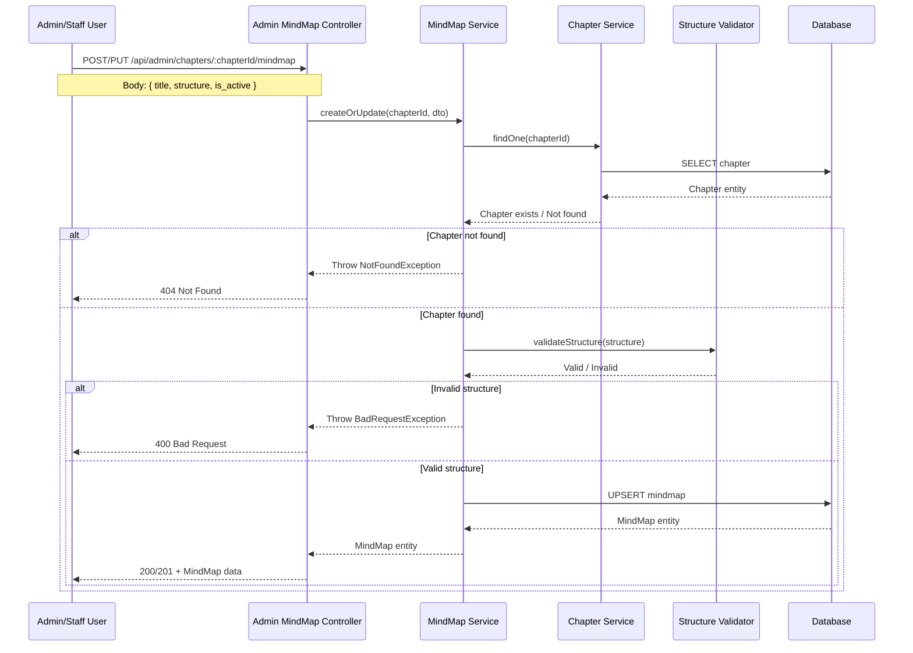
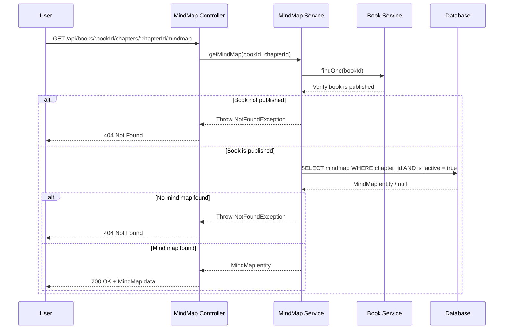

# Active Context: 06 - Chapter Mind Map System

## ✔️ Status

- **Current Status**: Planning
- **Last Updated**: 2025-12-04

## ✏️ Business Requirements

- Users can view interactive mind maps for each chapter to visualize concepts and relationships
- Mind maps help users understand the structure and connections within chapter content
- Admin and Staff can create and manage mind maps for chapters
- Mind maps support hierarchical node structure (central topic → main branches → sub-branches)
- Each node can contain text, color coding, and optional icons
- Support for node relationships/connections beyond parent-child hierarchy
- Mind maps are stored as structured JSON for flexibility and rendering
- Users can only view mind maps for published books
- Mind maps should be exportable (image, JSON) for offline study

## TODO List

- ❌ Task 1: Design & Data Flow
- ❌ Task 2: Create MindMap entity
- ❌ Task 3: Create MindMap DTOs (Create, Update, Node structure)
- ❌ Task 4: Create MindMap Service with CRUD operations
- ❌ Task 5: Create Admin MindMap Controller
- ❌ Task 6: Create User MindMap Controller
- ❌ Task 7: Update Books Module with MindMap components
- ❌ Task 8: Frontend: Integrate mind map rendering library (e.g., D3.js, MindElixir, React Flow)

## 📝 Active Decisions

- **Storage Format**: Mind maps stored as JSON structure in database
- **Node Structure**: Hierarchical tree with central node and branches
- **Rendering**: Client-side rendering using JavaScript library
- **One Map Per Chapter**: Each chapter has one primary mind map
- **Node Properties**: Support text, color, icon, position, and connections
- **Versioning**: Track mind map updates with timestamps
- **Export Formats**: Support JSON export (future: PNG/SVG image export)
- **Interactive Features**: Collapsible nodes, zoom, pan, drag-and-drop editing (admin only)

## 🔍 Technical Solution / Design

### Database Schema

**MindMap Entity** (`mindmaps` table):

- `id` (PK)
- `chapter_id` (FK to chapters, unique) - One mind map per chapter
- `title` (varchar) - Mind map title (e.g., "Chapter 1: Introduction to Feng Shui")
- `description` (text, nullable) - Optional description or learning objectives
- `structure` (jsonb) - Complete mind map structure (nodes, connections, layout)
- `is_active` (boolean) - Whether mind map is visible to users
- `created_at`, `updated_at`

### Mind Map JSON Structure

The `structure` field stores the complete mind map as JSON:

```json
{
  "version": "1.0",
  "layout": "radial", // or "tree", "org-chart"
  "centerNode": {
    "id": "root",
    "text": "Feng Shui Fundamentals",
    "color": "#4A90E2",
    "icon": "compass",
    "position": { "x": 0, "y": 0 }
  },
  "nodes": [
    {
      "id": "node1",
      "parentId": "root",
      "text": "Five Elements",
      "color": "#7ED321",
      "icon": "elements",
      "position": { "x": 200, "y": -100 },
      "collapsed": false,
      "metadata": {
        "order": 1,
        "notes": "Key concept",
        "linkedSectionId": "chapter1-section2"
      }
    },
    {
      "id": "node2",
      "parentId": "node1",
      "text": "Wood",
      "color": "#8BC34A",
      "position": { "x": 400, "y": -150 }
    },
    {
      "id": "node3",
      "parentId": "node1",
      "text": "Fire",
      "color": "#F44336",
      "position": { "x": 400, "y": -50 }
    }
    // ... more nodes
  ],
  "connections": [
    {
      "id": "conn1",
      "fromNodeId": "node2",
      "toNodeId": "node5",
      "type": "related", // "parent-child", "related", "opposed"
      "label": "nourishes",
      "style": "dashed"
    }
  ],
  "theme": {
    "fontFamily": "Inter, sans-serif",
    "fontSize": 14,
    "lineColor": "#333333",
    "backgroundColor": "#FFFFFF"
  }
}
```

### Node Structure Details

**Node Properties**:

- `id` (string): Unique identifier
- `parentId` (string): Parent node ID (null for root)
- `text` (string): Node label/content
- `color` (string): Hex color code for visual categorization
- `icon` (string, optional): Icon identifier
- `position` (object): {x, y} coordinates for rendering
- `collapsed` (boolean): Whether child nodes are hidden
- `metadata` (object, optional): Additional data (notes, links, order)

**Connection Properties**:

- `id` (string): Unique identifier
- `fromNodeId` (string): Source node
- `toNodeId` (string): Target node
- `type` (string): Connection type (parent-child, related, opposed)
- `label` (string, optional): Connection description
- `style` (string): Visual style (solid, dashed, dotted)

### API Endpoints

#### Admin API (Protected - Admin/Staff only)

```
POST   /api/admin/chapters/:chapterId/mindmap                         - Create mind map for chapter
PUT    /api/admin/chapters/:chapterId/mindmap                         - Update mind map structure
GET    /api/admin/chapters/:chapterId/mindmap                         - Get mind map (editable version)
DELETE /api/admin/chapters/:chapterId/mindmap                         - Delete mind map
PATCH  /api/admin/chapters/:chapterId/mindmap/toggle-active           - Toggle is_active status
POST   /api/admin/chapters/:chapterId/mindmap/validate                - Validate mind map structure
```

#### User API (Public - Published books only)

```
GET    /api/books/:bookId/chapters/:chapterId/mindmap                 - Get mind map (read-only)
GET    /api/books/:bookId/chapters/:chapterId/mindmap/export          - Export mind map as JSON
```

### DTOs

**CreateMindMapDto**:

```typescript
{
  title: string;
  description?: string;
  structure: MindMapStructure;  // JSON object following schema
  is_active: boolean;
}
```

**UpdateMindMapDto**:

```typescript
{
  title?: string;
  description?: string;
  structure?: MindMapStructure;
  is_active?: boolean;
}
```

**MindMapStructure** (TypeScript Interface):

```typescript
interface MindMapStructure {
  version: string;
  layout: 'radial' | 'tree' | 'org-chart';
  centerNode: MindMapNode;
  nodes: MindMapNode[];
  connections?: MindMapConnection[];
  theme?: MindMapTheme;
}

interface MindMapNode {
  id: string;
  parentId?: string;
  text: string;
  color?: string;
  icon?: string;
  position?: { x: number; y: number };
  collapsed?: boolean;
  metadata?: Record<string, any>;
}

interface MindMapConnection {
  id: string;
  fromNodeId: string;
  toNodeId: string;
  type: 'parent-child' | 'related' | 'opposed';
  label?: string;
  style?: 'solid' | 'dashed' | 'dotted';
}

interface MindMapTheme {
  fontFamily?: string;
  fontSize?: number;
  lineColor?: string;
  backgroundColor?: string;
}
```

**MindMapResponseDto**:

```typescript
{
  id: number;
  chapterId: number;
  title: string;
  description?: string;
  structure: MindMapStructure;
  is_active: boolean;
  created_at: Date;
  updated_at: Date;
}
```

### ⇅ Data Flow (Mermaid chart)

#### Creating/Updating Mind Map (Admin)



#### Viewing Mind Map (User)



### Components

- **MindMap Entity**: Database model for mind maps
- **MindMapsService**: Handles mind map CRUD, validation, and structure processing
- **StructureValidator**: Validates mind map JSON structure and node relationships
- **AdminMindMapsController**: REST endpoints for admin to manage mind maps
- **UserMindMapsController**: Read-only endpoints for users
- **Frontend MindMap Renderer**: Client-side component to visualize mind maps

### 🔏 Security Patterns

- **Role-Based Access Control**:
  - Admin/Staff: Full CRUD access to mind maps
  - Users: Read-only access to mind maps from published books with is_active = true
- **Input Validation**:
  - Validate JSON structure against schema
  - Prevent circular node references
  - Validate node IDs are unique
  - Ensure all parentId references exist
  - Validate color codes (hex format)
- **Published Book Filter**: Users can only access mind maps from published books
- **XSS Prevention**: Sanitize node text and labels to prevent script injection
- **Structure Size Limits**: Limit maximum number of nodes (e.g., 500) and connections (e.g., 200)

### ⌨️ Test Cases

**TC1 - Create Mind Map (Admin)**:

- Given: Valid chapter ID and mind map structure
- When: POST to `/api/admin/chapters/:chapterId/mindmap`
- Then: Mind map created successfully with structure stored

**TC2 - Create Mind Map with Invalid Structure**:

- Given: Mind map with circular node references
- When: POST to create endpoint
- Then: 400 Bad Request with validation errors

**TC3 - Update Mind Map (Admin)**:

- Given: Existing mind map and updated structure
- When: PUT to `/api/admin/chapters/:chapterId/mindmap`
- Then: Mind map updated successfully

**TC4 - View Mind Map (User - Published Book)**:

- Given: Published book with active mind map
- When: GET to `/api/books/:bookId/chapters/:chapterId/mindmap`
- Then: Returns mind map structure

**TC5 - View Mind Map (User - Draft Book)**:

- Given: Draft book with mind map
- When: GET to user endpoint
- Then: 404 Not Found

**TC6 - View Inactive Mind Map (User)**:

- Given: Published book with mind map where is_active = false
- When: GET to user endpoint
- Then: 404 Not Found

**TC7 - Validate Structure**:

- Given: Mind map with non-existent parentId references
- When: POST to validate endpoint
- Then: Returns validation errors listing orphaned nodes

**TC8 - Toggle Active Status (Admin)**:

- Given: Existing mind map with is_active = true
- When: PATCH to toggle-active endpoint
- Then: is_active set to false

**TC9 - Export Mind Map (User)**:

- Given: Published book with mind map
- When: GET to export endpoint
- Then: Returns JSON file download

**TC10 - Delete Mind Map (Admin)**:

- Given: Existing mind map
- When: DELETE to `/api/admin/chapters/:chapterId/mindmap`
- Then: Mind map deleted successfully

**TC11 - Unauthorized Access (User)**:

- Given: User without admin/staff role
- When: POST to admin endpoint
- Then: 403 Forbidden

**TC12 - Structure Size Limit**:

- Given: Mind map with 600 nodes (exceeds limit)
- When: POST to create endpoint
- Then: 400 Bad Request (too many nodes)

## Additional Considerations

### Mind Map Rendering Options

**Frontend Libraries**:

1. **React Flow** - Modern, flexible, good for interactive diagrams
2. **D3.js** - Powerful, highly customizable, steeper learning curve
3. **MindElixir** - Specialized for mind maps, easy to use
4. **Mermaid** - Markdown-based, simple, less interactive

**Recommended**: React Flow or MindElixir for balance of features and ease of use.

### Node Color Coding Strategy

**Suggested Color Scheme**:

- **Core Concepts**: Blue (#4A90E2)
- **Elements/Categories**: Green (#7ED321)
- **Principles**: Purple (#9013FE)
- **Applications**: Orange (#F5A623)
- **Warnings/Cautions**: Red (#D0021B)
- **Sub-topics**: Lighter shades of parent color

### Auto-Layout Algorithm

For automatic node positioning:

1. **Radial Layout**: Central node with branches radiating outward
2. **Tree Layout**: Top-down or left-to-right hierarchy
3. **Force-Directed**: Nodes repel/attract for natural spacing

### Future Enhancements

- **Collaborative Editing**: Real-time multi-user editing
- **Mind Map Templates**: Pre-built templates for common structures
- **Auto-Generation**: AI-powered mind map generation from chapter content
- **Image Export**: Export as PNG/SVG for offline use
- **Interactive Learning**: Click nodes to jump to chapter sections
- **Progress Tracking**: Track which nodes user has studied
- **Custom Themes**: User-selectable color schemes and styles
- **Mind Map Versioning**: Track and restore previous versions
- **Mobile Gestures**: Touch-friendly interactions for mobile devices
- **Search**: Search nodes within mind map
- **Annotations**: Users can add personal notes to nodes (stored separately)

### Accessibility Considerations

- **Keyboard Navigation**: Full keyboard support for navigation and interaction
- **Screen Reader Support**: Proper ARIA labels for nodes and connections
- **High Contrast Mode**: Alternative theme for visual impairments
- **Text Alternatives**: Provide text-based outline view of mind map structure
- **Zoom Controls**: Allow users to adjust zoom level for readability

### Performance Optimization

- **Lazy Loading**: Load large mind maps progressively
- **Virtual Rendering**: Only render visible nodes in viewport
- **Debounced Updates**: Batch updates during editing to reduce database calls
- **Caching**: Cache rendered mind maps on client side
- **Compression**: Compress large JSON structures before storage

## 📚 Example Mind Map Structure

### Chapter 1: Introduction to Feng Shui

```json
{
  "version": "1.0",
  "layout": "radial",
  "centerNode": {
    "id": "root",
    "text": "Feng Shui",
    "color": "#4A90E2",
    "icon": "yin-yang"
  },
  "nodes": [
    {
      "id": "history",
      "parentId": "root",
      "text": "History & Origins",
      "color": "#9013FE",
      "metadata": { "order": 1 }
    },
    {
      "id": "ancient-china",
      "parentId": "history",
      "text": "Ancient China (3000+ years)",
      "color": "#BD10E0"
    },
    {
      "id": "philosophy",
      "parentId": "root",
      "text": "Core Philosophy",
      "color": "#4A90E2",
      "metadata": { "order": 2 }
    },
    {
      "id": "chi",
      "parentId": "philosophy",
      "text": "Chi (氣)",
      "color": "#50E3C2"
    },
    {
      "id": "chi-def",
      "parentId": "chi",
      "text": "Life Force Energy",
      "color": "#7ED321"
    },
    {
      "id": "yin-yang",
      "parentId": "philosophy",
      "text": "Yin & Yang",
      "color": "#50E3C2"
    },
    {
      "id": "balance",
      "parentId": "yin-yang",
      "text": "Complementary Opposites",
      "color": "#7ED321"
    },
    {
      "id": "five-elements",
      "parentId": "root",
      "text": "Five Elements (Wu Xing)",
      "color": "#F5A623",
      "metadata": { "order": 3 }
    },
    {
      "id": "wood",
      "parentId": "five-elements",
      "text": "Wood",
      "color": "#8BC34A"
    },
    {
      "id": "fire",
      "parentId": "five-elements",
      "text": "Fire",
      "color": "#F44336"
    },
    {
      "id": "earth",
      "parentId": "five-elements",
      "text": "Earth",
      "color": "#D4A373"
    },
    {
      "id": "metal",
      "parentId": "five-elements",
      "text": "Metal",
      "color": "#9E9E9E"
    },
    {
      "id": "water",
      "parentId": "five-elements",
      "text": "Water",
      "color": "#2196F3"
    },
    {
      "id": "applications",
      "parentId": "root",
      "text": "Modern Applications",
      "color": "#F5A623",
      "metadata": { "order": 4 }
    },
    {
      "id": "home-design",
      "parentId": "applications",
      "text": "Home & Interior Design",
      "color": "#FFCC00"
    },
    {
      "id": "architecture",
      "parentId": "applications",
      "text": "Architecture",
      "color": "#FFCC00"
    },
    {
      "id": "landscape",
      "parentId": "applications",
      "text": "Landscape Design",
      "color": "#FFCC00"
    }
  ],
  "connections": [
    {
      "id": "conn1",
      "fromNodeId": "wood",
      "toNodeId": "fire",
      "type": "related",
      "label": "nourishes",
      "style": "solid"
    },
    {
      "id": "conn2",
      "fromNodeId": "fire",
      "toNodeId": "earth",
      "type": "related",
      "label": "creates",
      "style": "solid"
    },
    {
      "id": "conn3",
      "fromNodeId": "earth",
      "toNodeId": "metal",
      "type": "related",
      "label": "produces",
      "style": "solid"
    },
    {
      "id": "conn4",
      "fromNodeId": "metal",
      "toNodeId": "water",
      "type": "related",
      "label": "enriches",
      "style": "solid"
    },
    {
      "id": "conn5",
      "fromNodeId": "water",
      "toNodeId": "wood",
      "type": "related",
      "label": "nourishes",
      "style": "solid"
    }
  ],
  "theme": {
    "fontFamily": "Inter, sans-serif",
    "fontSize": 14,
    "lineColor": "#666666",
    "backgroundColor": "#FFFFFF"
  }
}
```

## Implementation Priority

1. **Phase 1 - MVP**:
   - Basic mind map entity and storage
   - Admin CRUD operations
   - Simple tree/radial layout
   - Read-only user view

2. **Phase 2 - Enhanced Features**:
   - Interactive editing (drag-drop, add/remove nodes)
   - Multiple layout options
   - Color coding and icons
   - Export functionality

3. **Phase 3 - Advanced Features**:
   - Auto-generation from content
   - Templates
   - Progress tracking
   - Mobile optimization
