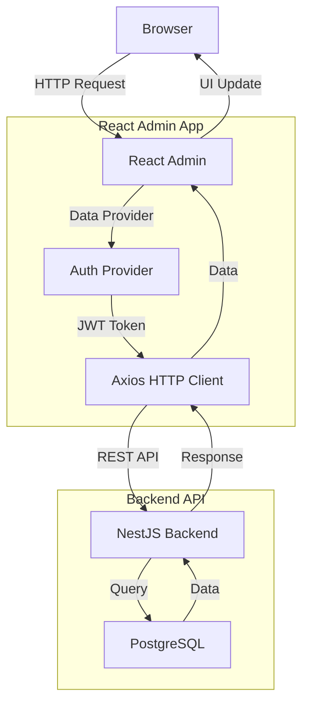

# Active Context: 07 - Admin Dashboard with React Admin

## ✔️ Status

- **Current Status**: In Progress
- **Last Updated**: 2025-12-07

## ✏️ Business Requirements

- **Admin Interface**: A web-based admin dashboard for administrators to manage all system resources.
- **Resource Management**: Ability to manage Users, Books, Chapters, and Flashcards through a user-friendly interface.
- **CRUD Operations**: Full Create, Read, Update, Delete capabilities for all resources.
- **Authentication**: Secure login for admin users with JWT authentication.
- **Responsive Design**: Dashboard should work on desktop and tablet devices.
- **Data Visualization**: Display lists, details, and statistics for all resources.
- **File Upload**: Support for uploading book files and cover images directly from the UI.
- **Content Processing**: Trigger book content processing and flashcard generation from the UI.

## TODO List

### Phase 1: Setup & Infrastructure

- ✅ Task 1: Initialize React Admin project in `apps/admin/`
- ✅ Task 2: Install dependencies (react-admin, react, react-router-dom, etc.)
- ✅ Task 3: Configure TypeScript for React Admin
- ✅ Task 4: Set up data provider to connect to NestJS backend API
- ✅ Task 5: Set up authentication provider (JWT)
- ✅ Task 6: Configure routing and basic layout

### Phase 2: Resource Management

- ✅ Task 7: Implement User resource (List, Show, Edit, Create)
- ✅ Task 8: Implement Book resource (List, Show, Edit, Create)
- ⏸ Task 9: Implement Chapter resource (List, Show, Edit, Create)
- ⏸ Task 10: Implement Flashcard resource (List, Show, Edit, Create)

### Phase 3: Advanced Features

- ❌ Task 11: Add file upload component for book files and covers
- ❌ Task 12: Add "Process Book" action button
- ❌ Task 13: Add "Generate Flashcards" action for chapters
- ❌ Task 14: Implement dashboard home page with statistics
- ❌ Task 15: Add filters and search for all resources

### Phase 4: Polish & Deployment

- ❌ Task 16: Add custom theme and branding
- ❌ Task 17: Implement proper error handling and notifications
- ❌ Task 18: Add loading states and optimistic updates
- ❌ Task 19: Set up production build configuration
- ❌ Task 20: Deploy admin dashboard to hosting platform

## 📝 Active Decisions

- **Framework Choice**: React Admin - provides built-in CRUD components, data providers, and authentication.
- **UI Library**: Material-UI (comes with React Admin) - modern, accessible, and customizable.
- **API Integration**: Connect to existing NestJS backend at `/api/*` endpoints.
- **Authentication Strategy**: JWT tokens stored in localStorage, sent via Authorization header.
- **Data Provider**: Custom data provider based on simple REST (matching NestJS endpoints).
- **Routing**:
  - `/` - Dashboard home
  - `/users` - User management
  - `/books` - Book management
  - `/chapters` - Chapter management
  - `/flashcards` - Flashcard management
  - `/login` - Login page

## 🔍 Technical Solution / Design

### Tech Stack

| Component        | Technology   | Version | Purpose                                       |
| ---------------- | ------------ | ------- | --------------------------------------------- |
| Framework        | React        | 18.x    | UI library                                    |
| Admin Framework  | React Admin  | 4.x     | Admin dashboard framework                     |
| UI Library       | Material-UI  | 5.x     | Component library (included with React Admin) |
| State Management | React Query  | 4.x     | Data fetching and caching (included)          |
| Router           | React Router | 6.x     | Client-side routing (included)                |
| HTTP Client      | Axios        | 1.x     | API requests                                  |
| Language         | TypeScript   | 5.x     | Type safety                                   |

### Project Structure

```
apps/admin/
├── public/
│   ├── index.html
│   └── favicon.ico
├── src/
│   ├── providers/
│   │   ├── authProvider.ts       # JWT authentication logic
│   │   └── dataProvider.ts       # API integration layer
│   ├── resources/
│   │   ├── users/
│   │   │   ├── UserList.tsx
│   │   │   ├── UserShow.tsx
│   │   │   ├── UserEdit.tsx
│   │   │   └── UserCreate.tsx
│   │   ├── books/
│   │   │   ├── BookList.tsx
│   │   │   ├── BookShow.tsx
│   │   │   ├── BookEdit.tsx
│   │   │   ├── BookCreate.tsx
│   │   │   └── BookActions.tsx
│   │   ├── chapters/
│   │   │   ├── ChapterList.tsx
│   │   │   ├── ChapterShow.tsx
│   │   │   ├── ChapterEdit.tsx
│   │   │   └── ChapterCreate.tsx
│   │   └── flashcards/
│   │       ├── FlashcardList.tsx
│   │       ├── FlashcardShow.tsx
│   │       ├── FlashcardEdit.tsx
│   │       └── FlashcardCreate.tsx
│   ├── components/
│   │   ├── Dashboard.tsx         # Home dashboard
│   │   ├── Layout.tsx            # Custom layout
│   │   ├── FileUpload.tsx        # File upload component
│   │   └── LoginPage.tsx         # Custom login page
│   ├── types/
│   │   └── index.ts              # TypeScript types
│   ├── utils/
│   │   └── api.ts                # API utility functions
│   ├── App.tsx                   # Main App component
│   └── index.tsx                 # Entry point
├── package.json
├── tsconfig.json
└── vite.config.ts                # Vite configuration
```

### API Integration

#### Auth Provider (authProvider.ts)

```typescript
import { AuthProvider } from 'react-admin';

const API_URL = import.meta.env.VITE_API_URL || 'http://localhost:3000/api';

export const authProvider: AuthProvider = {
  login: async ({ username, password }) => {
    const response = await fetch(`${API_URL}/auth/login`, {
      method: 'POST',
      headers: { 'Content-Type': 'application/json' },
      body: JSON.stringify({ email: username, password }),
    });
    if (response.ok) {
      const { access_token, user } = await response.json();
      localStorage.setItem('token', access_token);
      localStorage.setItem('user', JSON.stringify(user));
      return Promise.resolve();
    }
    return Promise.reject(new Error('Invalid credentials'));
  },

  logout: () => {
    localStorage.removeItem('token');
    localStorage.removeItem('user');
    return Promise.resolve();
  },

  checkAuth: () => {
    return localStorage.getItem('token') ? Promise.resolve() : Promise.reject();
  },

  checkError: (error) => {
    const status = error.status;
    if (status === 401 || status === 403) {
      localStorage.removeItem('token');
      return Promise.reject();
    }
    return Promise.resolve();
  },

  getIdentity: () => {
    const user = localStorage.getItem('user');
    return user ? Promise.resolve(JSON.parse(user)) : Promise.reject();
  },

  getPermissions: () => {
    const user = localStorage.getItem('user');
    return user ? Promise.resolve(JSON.parse(user).role) : Promise.reject();
  },
};
```

#### Data Provider (dataProvider.ts)

```typescript
import { DataProvider } from 'react-admin';
import axios from 'axios';

const API_URL = import.meta.env.VITE_API_URL || 'http://localhost:3000/api';

const httpClient = axios.create({
  baseURL: API_URL,
});

// Add token to all requests
httpClient.interceptors.request.use((config) => {
  const token = localStorage.getItem('token');
  if (token) {
    config.headers.Authorization = `Bearer ${token}`;
  }
  return config;
});

export const dataProvider: DataProvider = {
  getList: async (resource, params) => {
    const endpoint = getEndpoint(resource);
    const { page, perPage } = params.pagination;
    const { field, order } = params.sort;

    const response = await httpClient.get(endpoint, {
      params: {
        page,
        limit: perPage,
        sort: field,
        order: order.toLowerCase(),
        ...params.filter,
      },
    });

    return {
      data: response.data.data || response.data,
      total: response.data.total || response.data.length,
    };
  },

  getOne: async (resource, params) => {
    const endpoint = getEndpoint(resource);
    const response = await httpClient.get(`${endpoint}/${params.id}`);
    return { data: response.data };
  },

  getMany: async (resource, params) => {
    const endpoint = getEndpoint(resource);
    const responses = await Promise.all(params.ids.map((id) => httpClient.get(`${endpoint}/${id}`)));
    return { data: responses.map((r) => r.data) };
  },

  getManyReference: async (resource, params) => {
    const endpoint = getEndpoint(resource);
    const response = await httpClient.get(endpoint, {
      params: {
        [params.target]: params.id,
        ...params.filter,
      },
    });
    return {
      data: response.data.data || response.data,
      total: response.data.total || response.data.length,
    };
  },

  create: async (resource, params) => {
    const endpoint = getEndpoint(resource);
    const response = await httpClient.post(endpoint, params.data);
    return { data: { ...response.data, id: response.data.id } };
  },

  update: async (resource, params) => {
    const endpoint = getEndpoint(resource);
    const response = await httpClient.patch(`${endpoint}/${params.id}`, params.data);
    return { data: response.data };
  },

  updateMany: async (resource, params) => {
    const endpoint = getEndpoint(resource);
    const responses = await Promise.all(params.ids.map((id) => httpClient.patch(`${endpoint}/${id}`, params.data)));
    return { data: responses.map((r) => r.data.id) };
  },

  delete: async (resource, params) => {
    const endpoint = getEndpoint(resource);
    const response = await httpClient.delete(`${endpoint}/${params.id}`);
    return { data: response.data };
  },

  deleteMany: async (resource, params) => {
    const endpoint = getEndpoint(resource);
    await Promise.all(params.ids.map((id) => httpClient.delete(`${endpoint}/${id}`)));
    return { data: params.ids };
  },
};

function getEndpoint(resource: string): string {
  const endpoints: Record<string, string> = {
    users: '/admin/users',
    books: '/admin/books',
    chapters: '/admin/chapters',
    flashcards: '/admin/flashcards',
  };
  return endpoints[resource] || `/${resource}`;
}
```

### Resource Components

#### User Resource (users/UserList.tsx)

```typescript
import {
  List,
  Datagrid,
  TextField,
  EmailField,
  DateField,
  EditButton,
  ShowButton,
} from 'react-admin';

export const UserList = () => (
  <List>
    <Datagrid>
      <TextField source="id" />
      <TextField source="name" />
      <EmailField source="email" />
      <TextField source="role" />
      <DateField source="created_at" />
      <EditButton />
      <ShowButton />
    </Datagrid>
  </List>
);
```

#### Book Resource (books/BookList.tsx)

```typescript
import {
  List,
  Datagrid,
  TextField,
  ImageField,
  DateField,
  EditButton,
  ShowButton,
  CreateButton,
  TopToolbar,
} from 'react-admin';

const BookListActions = () => (
  <TopToolbar>
    <CreateButton />
  </TopToolbar>
);

export const BookList = () => (
  <List actions={<BookListActions />}>
    <Datagrid>
      <TextField source="id" />
      <TextField source="title" />
      <TextField source="author" />
      <TextField source="language" />
      <ImageField source="cover_url" label="Cover" />
      <TextField source="status" />
      <DateField source="created_at" />
      <EditButton />
      <ShowButton />
    </Datagrid>
  </List>
);
```

### Custom Actions

#### Process Book Button

```typescript
import { Button } from 'react-admin';
import { useNotify, useRefresh } from 'react-admin';
import axios from 'axios';

export const ProcessBookButton = ({ record }) => {
  const notify = useNotify();
  const refresh = useRefresh();

  const handleClick = async () => {
    try {
      const token = localStorage.getItem('token');
      await axios.post(
        `${API_URL}/admin/books/${record.id}/process`,
        {},
        { headers: { Authorization: `Bearer ${token}` } }
      );
      notify('Book processing started', { type: 'success' });
      refresh();
    } catch (error) {
      notify('Error processing book', { type: 'error' });
    }
  };

  return (
    <Button label="Process Book" onClick={handleClick} />
  );
};
```

#### Generate Flashcards Button

```typescript
import { Button } from 'react-admin';
import { useNotify, useRefresh } from 'react-admin';
import axios from 'axios';

export const GenerateFlashcardsButton = ({ record }) => {
  const notify = useNotify();
  const refresh = useRefresh();

  const handleClick = async () => {
    try {
      const token = localStorage.getItem('token');
      await axios.post(
        `${API_URL}/admin/flashcards/generate`,
        { chapterId: record.id },
        { headers: { Authorization: `Bearer ${token}` } }
      );
      notify('Flashcards generation started', { type: 'success' });
      refresh();
    } catch (error) {
      notify('Error generating flashcards', { type: 'error' });
    }
  };

  return (
    <Button label="Generate Flashcards" onClick={handleClick} />
  );
};
```

### ⇅ Data Flow



### 🔏 Security Patterns

- **JWT Authentication**: All API requests include JWT token in Authorization header
- **Role-Based Access**: Only admin users can access the admin dashboard
- **Token Validation**: Backend validates JWT on every request
- **HTTPS**: Use HTTPS in production for secure communication
- **CORS**: Configure CORS on backend to allow admin dashboard domain
- **XSS Protection**: React's built-in XSS protection
- **Input Validation**: Validate all inputs on both client and server side

### 🎨 UI/UX Considerations

- **Responsive Design**: Works on desktop and tablet (mobile support limited)
- **Loading States**: Show loading indicators for async operations
- **Error Handling**: Display user-friendly error messages
- **Notifications**: Toast notifications for success/error feedback
- **Confirmation Dialogs**: Confirm destructive actions (delete)
- **Optimistic Updates**: Update UI immediately, rollback on error
- **Pagination**: Handle large lists with pagination
- **Filters**: Allow filtering and searching resources
- **Bulk Actions**: Support bulk delete/update operations

### ⌨️ Test Cases

#### Authentication

- ✅ Login with valid credentials → Success, redirected to dashboard
- ✅ Login with invalid credentials → Error message displayed
- ✅ Logout → Token removed, redirected to login
- ✅ Access protected route without token → Redirected to login

#### User Management

- ✅ List all users → Display paginated user list
- ✅ View user details → Show full user information
- ✅ Edit user → Update user and show success notification
- ✅ Create new user → User created and added to list

#### Book Management

- ✅ List all books → Display book list with covers
- ✅ Create book with file upload → File uploaded, book created
- ✅ Process book → Processing triggered, notification shown
- ✅ Edit book metadata → Book updated
- ✅ Delete book → Book removed from list

#### Chapter Management

- ✅ List chapters for a book → Display chapter list
- ✅ Create new chapter → Chapter created
- ✅ Generate flashcards for chapter → Flashcards generated
- ✅ Edit chapter content → Chapter updated

#### Flashcard Management

- ✅ List flashcards for a chapter → Display flashcard list
- ✅ Create flashcard manually → Flashcard created
- ✅ Edit flashcard → Flashcard updated
- ✅ Delete flashcard → Flashcard removed

## 📦 Installation & Setup

### Step 1: Initialize Project

```bash
cd apps/admin
npx -y create-vite@latest ./ --template react-ts
npm install
```

### Step 2: Install React Admin

```bash
npm install react-admin ra-data-simple-rest
```

### Step 3: Install Additional Dependencies

```bash
npm install axios @mui/material @emotion/react @emotion/styled
```

### Step 4: Configure Environment

Create `.env` file:

```env
VITE_API_URL=http://localhost:3000/api
```

### Step 5: Update package.json

Add to `apps/admin/package.json`:

```json
{
  "name": "@quiz-game/admin",
  "scripts": {
    "dev": "vite",
    "build": "tsc && vite build",
    "preview": "vite preview"
  }
}
```

### Step 6: Update Turbo Configuration

Update root `turbo.json` to include admin:

```json
{
  "tasks": {
    "dev": {
      "cache": false,
      "persistent": true
    }
  }
}
```

## 🚀 Running the Admin Dashboard

```bash
# From root
npm run dev

# Or specifically for admin
npm run dev --workspace=@quiz-game/admin
```

The admin dashboard will be available at `http://localhost:5173`

## 📝 Future Enhancements

- **Dashboard Analytics**: Add charts and statistics on home page
- **Advanced Filters**: More sophisticated filtering options
- **Export Data**: Export resources to CSV/Excel
- **Import Data**: Bulk import from CSV
- **Real-time Updates**: WebSocket integration for live data
- **Audit Log**: Track all admin actions
- **Multi-language**: i18n support for multiple languages
- **Dark Mode**: Theme switcher
- **Mobile App**: Dedicated mobile admin app
- **Advanced Permissions**: Fine-grained permission system
