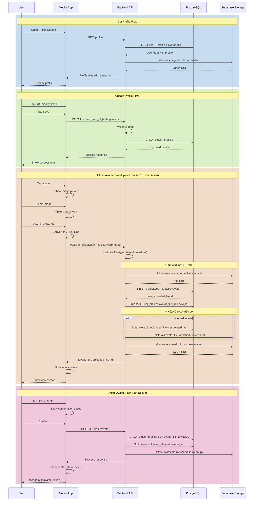

# 👤 Hệ Thống User Profile - Design Document

## ✔️ Status

- **Current Status**: Design Phase
- **Last Updated**: 2025-12-11

## ✏️ Business Requirements

- User có thể xem và chỉnh sửa thông tin cá nhân (profile)
- Thông tin profile bao gồm: ngày tháng năm sinh, giới tính, avatar
- Avatar được lưu trong bảng `uploaded_files` với type mới là `avatar`
- Nếu không có avatar, hiển thị chữ cái đầu của tên (như hiện tại)
- Trong màn hình profile mobile, user có thể edit avatar
- Khi upload avatar, có chức năng crop ảnh thành 400x400px
- API `POST /profile/avatar` để upload avatar lên Supabase
- Nếu đã có avatar cũ, thay thế bằng ảnh mới

---

## TODO List

- ❌ Task 1: Database Schema Design
- ❌ Task 2: Backend API Design
- ❌ Task 3: Mobile UI/UX Design
- ❌ Task 4: Avatar Upload & Crop Flow
- ❌ Task 5: Security & Validation Rules

---

## 📝 Active Decisions

### 1. Avatar Storage Strategy

- **Decision**: Sử dụng bảng `uploaded_files` hiện có, thêm type `avatar`
- **Rationale**:
  - Tận dụng infrastructure upload đã có
  - Consistent với cách quản lý files khác (book, cover)
  - Dễ dàng tracking và quản lý storage

### 2. Avatar Size & Format

- **Decision**: Crop thành 400x400px, format JPEG/PNG
- **Rationale**:
  - 400x400px đủ lớn cho hiển thị trên mobile và web
  - Giảm storage cost
  - Tối ưu loading time

### 3. Default Avatar Display

- **Decision**: Hiển thị chữ cái đầu của tên khi không có avatar
- **Rationale**:
  - Đã implement sẵn trong UI hiện tại
  - User-friendly và dễ nhận diện
  - Không cần placeholder image

### 4. Profile Data Structure

- **Decision**: Tạo bảng `user_profiles` riêng thay vì thêm vào bảng `users`
- **Rationale**:
  - Separation of concerns (auth data vs profile data)
  - Dễ mở rộng thêm fields profile sau này
  - Không ảnh hưởng đến auth flow hiện tại

---

## 🔍 Technical Solution / Design

### 🗄️ Database Schema

#### 1. Bảng `user_profiles` (New)

```sql
CREATE TABLE user_profiles (
  id SERIAL PRIMARY KEY,
  user_id INTEGER NOT NULL UNIQUE REFERENCES users(id) ON DELETE CASCADE,
  date_of_birth DATE,
  gender VARCHAR(20), -- 'male', 'female', 'other', 'prefer_not_to_say'
  avatar_file_id INTEGER REFERENCES uploaded_files(id) ON DELETE SET NULL,
  created_at TIMESTAMPTZ DEFAULT NOW(),
  updated_at TIMESTAMPTZ DEFAULT NOW()
);

CREATE INDEX idx_user_profiles_user_id ON user_profiles(user_id);
CREATE INDEX idx_user_profiles_avatar_file_id ON user_profiles(avatar_file_id);
```

**Fields**:

- `user_id`: Foreign key tới bảng `users` (1-1 relationship)
- `date_of_birth`: Ngày sinh (nullable, user có thể không muốn cung cấp)
- `gender`: Giới tính (nullable)
- `avatar_file_id`: Foreign key tới `uploaded_files` (nullable)

**Example Data**:

```
id | user_id | date_of_birth | gender | avatar_file_id
---|---------|---------------|--------|---------------
1  | 5       | 1990-05-15    | male   | 123
2  | 7       | 1995-08-20    | female | NULL
3  | 9       | 1988-12-01    | other  | 456
```

---

#### 2. Enum `FileType` (Update)

Thêm type `avatar` vào enum hiện có:

```typescript
// apps/backend/src/shares/enums/file-type.enum.ts
export enum FileType {
  BOOK = 'book',
  COVER = 'cover',
  AVATAR = 'avatar', // ✨ NEW
}
```

**Migration SQL**:

```sql
ALTER TYPE "public"."uploaded_files_type_enum" ADD VALUE 'avatar';
```

---

#### 3. Entity `UserProfile` (New)

```typescript
// apps/backend/src/modules/users/entities/user-profile.entity.ts

import { BaseEntity } from '../../typeorm/base.entity';
import { Column, Entity, JoinColumn, ManyToOne, OneToOne, PrimaryGeneratedColumn } from 'typeorm';
import { User } from './user.entity';
import { UploadedFile } from '../../upload/entities/uploaded-file.entity';

export enum Gender {
  MALE = 'male',
  FEMALE = 'female',
  OTHER = 'other',
  PREFER_NOT_TO_SAY = 'prefer_not_to_say',
}

@Entity('user_profiles')
export class UserProfile extends BaseEntity {
  @PrimaryGeneratedColumn('increment')
  id: number;

  @Column({ name: 'user_id', unique: true })
  user_id: number;

  @OneToOne(() => User)
  @JoinColumn({ name: 'user_id' })
  user: User;

  @Column({ type: 'date', nullable: true })
  date_of_birth: Date;

  @Column({
    type: 'enum',
    enum: Gender,
    nullable: true,
  })
  gender: Gender;

  @Column({ name: 'avatar_file_id', nullable: true })
  avatar_file_id: number;

  @ManyToOne(() => UploadedFile, { nullable: true })
  @JoinColumn({ name: 'avatar_file_id' })
  avatar_file: UploadedFile;
}
```

---

#### 4. Update `User` Entity

Thêm relationship tới `UserProfile`:

```typescript
// apps/backend/src/modules/users/entities/user.entity.ts

import { UserProfile } from './user-profile.entity';

@Entity('users')
export class User extends BaseEntity {
  // ... existing fields ...

  @OneToOne(() => UserProfile, (profile) => profile.user)
  profile: UserProfile;
}
```

---

### 📡 API Endpoints

#### 1. Get Current User Profile

```typescript
GET /profile

Headers:
  Authorization: Bearer <token>

Response 200:
{
  "id": 5,
  "email": "user@example.com",
  "full_name": "Tùng Net",
  "role": "normal_user",
  "experience_points": 5,
  "currency": 150,
  "profile": {
    "date_of_birth": "1990-05-15",
    "gender": "male",
    "avatar_url": "https://supabase.co/storage/v1/object/sign/avatars/user_5_avatar.jpg?token=..."
  }
}

Response 200 (No Avatar):
{
  "id": 7,
  "email": "user2@example.com",
  "full_name": "Nguyễn Văn A",
  "role": "normal_user",
  "experience_points": 10,
  "currency": 50,
  "profile": {
    "date_of_birth": null,
    "gender": null,
    "avatar_url": null  // Frontend sẽ hiển thị chữ cái đầu
  }
}
```

---

#### 2. Update User Profile

```typescript
PATCH /profile

Headers:
  Authorization: Bearer <token>

Body:
{
  "full_name": "Tùng Net Updated",  // Optional
  "date_of_birth": "1990-05-15",    // Optional, format: YYYY-MM-DD
  "gender": "male"                   // Optional: 'male' | 'female' | 'other' | 'prefer_not_to_say'
}

Response 200:
{
  "id": 5,
  "email": "user@example.com",
  "full_name": "Tùng Net Updated",
  "profile": {
    "date_of_birth": "1990-05-15",
    "gender": "male",
    "avatar_url": "https://..."
  }
}

Response 400 (Validation Error):
{
  "statusCode": 400,
  "message": [
    "date_of_birth must be a valid date in format YYYY-MM-DD",
    "gender must be one of: male, female, other, prefer_not_to_say"
  ],
  "error": "Bad Request"
}
```

**Validation Rules**:

- `date_of_birth`:
  - Format: YYYY-MM-DD
  - Must be in the past
  - User must be at least 13 years old
  - Cannot be more than 120 years ago
- `gender`: Must be one of the enum values
- `full_name`:
  - Min length: 2 characters
  - Max length: 100 characters

---

#### 3. Upload Avatar

```typescript
POST /profile/avatar

Headers:
  Authorization: Bearer <token>
  Content-Type: multipart/form-data

Body (FormData):
  file: <image file> (JPEG/PNG, max 1MB, already cropped to 400x400)

Response 200:
{
  "avatar_url": "https://supabase.co/storage/v1/object/sign/avatars/user_5_avatar_1702345678.jpg?token=...",
  "uploaded_file_id": 123
}

Response 400 (Invalid File):
{
  "statusCode": 400,
  "message": "Invalid file format. Only JPEG and PNG are allowed.",
  "error": "Bad Request"
}

Response 400 (File Too Large):
{
  "statusCode": 400,
  "message": "File size exceeds 5MB limit.",
  "error": "Bad Request"
}

Response 400 (Invalid Dimensions):
{
  "statusCode": 400,
  "message": "Image must be 400x400 pixels.",
  "error": "Bad Request"
}
```

**Upload Flow** (Upload mới trước, xóa cũ sau):

1. Client crop ảnh thành 400x400px
2. Upload file lên endpoint
3. Backend validate:
   - File type (JPEG/PNG only)
   - File size (max 5MB)
   - Dimensions (must be 400x400)
4. **Upload file mới lên Supabase Storage bucket `avatars`** ✨
5. **Tạo record mới trong `uploaded_files` với type = `avatar`** ✨
6. **Update `user_profiles.avatar_file_id` với ID mới** ✨
7. Nếu user đã có avatar cũ:
   - **Xóa file cũ khỏi Supabase** (hoặc soft delete)
   - **Xóa/Soft delete record cũ khỏi `uploaded_files`**
8. Return signed URL của avatar mới

**Lý do**: Upload mới trước để tránh user bị mất avatar nếu upload fail. Chỉ xóa avatar cũ sau khi upload mới thành công.

**Soft Delete Option**:

- Có thể dùng `deleted_at` field trong `uploaded_files` (đã có sẵn từ BaseEntity)
- Giữ lại file cũ trong Supabase một thời gian (ví dụ: 7 ngày) trước khi xóa hẳn
- Cho phép rollback nếu cần

---

#### 4. Delete Avatar

```typescript
DELETE /profile/avatar

Headers:
  Authorization: Bearer <token>

Response 200:
{
  "message": "Avatar deleted successfully"
}

Response 404:
{
  "statusCode": 404,
  "message": "No avatar found to delete",
  "error": "Not Found"
}
```

**Delete Flow**:

1. Kiểm tra user có avatar không
2. Set `user_profiles.avatar_file_id = NULL` (ngắt liên kết trước)
3. Soft delete record trong `uploaded_files` (set `deleted_at`)
4. Xóa file khỏi Supabase Storage (hoặc schedule xóa sau)
5. Return success

**Note**: Soft delete giúp có thể khôi phục nếu user xóa nhầm

---

### 📱 Mobile UI/UX Design

#### 1. Profile Screen (Current State)

Màn hình profile hiện tại (từ ảnh anh gửi):

```
┌─────────────────────────────────┐
│         [Avatar Circle]         │  ← Avatar (chữ cái đầu hoặc ảnh)
│          Tùng Net               │  ← Full Name
│        [PHÀM NHÂN]              │  ← Level Badge
├─────────────────────────────────┤
│   ▓▓▓░░░░░░░░░░░░░░  5%        │  ← XP Progress
│   5 XP              100 XP      │
├─────────────────────────────────┤
│  📚 THIÊN THƯ    💰 NGÂN LƯỢNG │
│       2               50         │
└─────────────────────────────────┘
```

---

#### 2. Profile Screen (Enhanced with Edit)

Thêm nút Edit và thông tin profile:

```
┌─────────────────────────────────┐
│         [Avatar Circle]         │  ← Tap để edit avatar
│            📷                    │  ← Camera icon overlay
│          Tùng Net               │
│        [PHÀM NHÂN]              │
│                        [✏️ Edit]│  ← Edit button
├─────────────────────────────────┤
│   ▓▓▓░░░░░░░░░░░░░░  5%        │
│   5 XP              100 XP      │
├─────────────────────────────────┤
│  📚 THIÊN THƯ    💰 NGÂN LƯỢNG │
│       2               50         │
├─────────────────────────────────┤
│  ℹ️ Thông Tin Cá Nhân          │
│                                  │
│  📅 Ngày sinh: 15/05/1990       │
│  👤 Giới tính: Nam              │
└─────────────────────────────────┘
```

**Interactions**:

- Tap vào avatar → Mở modal chọn ảnh
- Tap vào nút Edit → Mở màn hình Edit Profile
- Nếu chưa có thông tin profile → Hiển thị "Chưa cập nhật"

---

#### 3. Edit Profile Screen

```
┌─────────────────────────────────┐
│  ← Chỉnh Sửa Hồ Sơ    [💾 Lưu] │
├─────────────────────────────────┤
│                                  │
│  Họ và Tên                      │
│  ┌─────────────────────────┐   │
│  │ Tùng Net                │   │
│  └─────────────────────────┘   │
│                                  │
│  Ngày Sinh                      │
│  ┌─────────────────────────┐   │
│  │ 15/05/1990         📅   │   │ ← Date picker
│  └─────────────────────────┘   │
│                                  │
│  Giới Tính                      │
│  ┌─────────────────────────┐   │
│  │ Nam                  ▼  │   │ ← Dropdown
│  └─────────────────────────┘   │
│                                  │
│  Options: Nam, Nữ, Khác,        │
│           Không muốn tiết lộ    │
│                                  │
└─────────────────────────────────┘
```

**Validation**:

- Họ và tên: Bắt buộc, 2-100 ký tự
- Ngày sinh: Optional, phải >= 13 tuổi
- Giới tính: Optional

**Actions**:

- Tap "Lưu" → Validate → Call API → Show success toast → Navigate back
- Tap "←" → Confirm discard changes (if modified) → Navigate back

---

#### 4. Avatar Upload Flow

##### Step 1: Choose Avatar Source

```
┌─────────────────────────────────┐
│  Chọn Ảnh Đại Diện              │
├─────────────────────────────────┤
│                                  │
│  📷  Chụp Ảnh Mới               │
│                                  │
│  🖼️  Chọn Từ Thư Viện           │
│                                  │
│  🗑️  Xóa Ảnh Hiện Tại          │  ← Only if avatar exists
│                                  │
│  ❌  Hủy                        │
│                                  │
└─────────────────────────────────┘
```

**Actions**:

- Chụp ảnh mới → Open camera → Capture → Go to Step 2
- Chọn từ thư viện → Open gallery → Select → Go to Step 2
- Xóa ảnh → Confirm → Call DELETE API → Update UI
- Hủy → Close modal

---

##### Step 2: Crop Avatar

Sử dụng thư viện crop image (ví dụ: `react-native-image-crop-picker`):

```
┌─────────────────────────────────┐
│  ← Cắt Ảnh            [✓ Xong]  │
├─────────────────────────────────┤
│                                  │
│    ┌─────────────────────┐     │
│    │                     │     │
│    │   [Crop Area]       │     │  ← 1:1 ratio, 400x400
│    │    (Square)         │     │
│    │                     │     │
│    └─────────────────────┘     │
│                                  │
│  🔍 Zoom: [━━━━━○━━━━━]        │  ← Zoom slider
│                                  │
│  📐 Kích thước: 400x400px       │
│                                  │
└─────────────────────────────────┘
```

**Features**:

- Pinch to zoom
- Drag to pan
- Crop area always 1:1 ratio
- Output: 400x400px JPEG (quality: 90%)

**Actions**:

- Tap "Xong" → Crop image → Go to Step 3
- Tap "←" → Discard → Back to Step 1

---

##### Step 3: Upload & Preview

```
┌─────────────────────────────────┐
│  Đang Tải Lên...                │
├─────────────────────────────────┤
│                                  │
│      [Avatar Preview]            │  ← Cropped image preview
│                                  │
│  ▓▓▓▓▓▓▓▓▓▓░░░░░░  65%         │  ← Upload progress
│                                  │
│  Đang tải lên Supabase...       │
│                                  │
└─────────────────────────────────┘
```

**Upload Process**:

1. Show loading modal
2. Convert cropped image to JPEG blob
3. Create FormData with file
4. Call `POST /profile/avatar` with progress tracking
5. On success:
   - Update local state with new avatar URL
   - Show success toast
   - Close modal
6. On error:
   - Show error toast with message
   - Allow retry

---

### ⇅ Data Flow (Mermaid Chart)



---

### 🔏 Security Patterns

#### 1. Authentication & Authorization

**Rules**:

- ✅ All profile endpoints require authentication (JWT token)
- ✅ User can only view/edit their own profile
- ✅ Admin cannot edit other users' profiles (privacy)
- ✅ Use `@UseGuards(JwtAuthGuard)` on all endpoints

**Implementation**:

```typescript
@Controller('profile')
@UseGuards(JwtAuthGuard)
export class ProfileController {
  @Get()
  async getProfile(@Request() req) {
    const userId = req.user.id; // From JWT
    return this.profileService.getProfile(userId);
  }

  @Patch()
  async updateProfile(@Request() req, @Body() dto: UpdateProfileDto) {
    const userId = req.user.id;
    return this.profileService.updateProfile(userId, dto);
  }
}
```

---

#### 2. File Upload Security

**Validation Rules**:

- ✅ File type whitelist: `image/jpeg`, `image/png` only
- ✅ File size limit: 5MB max
- ✅ Image dimensions: Must be 400x400px (enforced on client, validated on server)
- ✅ File name sanitization: Remove special characters, use UUID
- ✅ Virus scanning (optional, future enhancement)

**Implementation**:

```typescript
@Post('avatar')
@UseInterceptors(FileInterceptor('file'))
async uploadAvatar(
  @Request() req,
  @UploadedFile(
    new ParseFilePipe({
      validators: [
        new MaxFileSizeValidator({ maxSize: 5 * 1024 * 1024 }), // 5MB
        new FileTypeValidator({ fileType: /(jpg|jpeg|png)$/ }),
      ],
    }),
  )
  file: Express.Multer.File,
) {
  // Additional dimension validation
  const dimensions = await this.imageService.getDimensions(file.buffer);
  if (dimensions.width !== 400 || dimensions.height !== 400) {
    throw new BadRequestException('Image must be 400x400 pixels');
  }

  const userId = req.user.id;
  return this.profileService.uploadAvatar(userId, file);
}
```

---

#### 3. Data Validation

**DTO for Update Profile**:

```typescript
// apps/backend/src/modules/users/dtos/update-profile.dto.ts

import { IsOptional, IsString, IsEnum, IsDateString, MinLength, MaxLength } from 'class-validator';
import { Gender } from '../entities/user-profile.entity';

export class UpdateProfileDto {
  @IsOptional()
  @IsString()
  @MinLength(2)
  @MaxLength(100)
  full_name?: string;

  @IsOptional()
  @IsDateString()
  date_of_birth?: string; // Format: YYYY-MM-DD

  @IsOptional()
  @IsEnum(Gender)
  gender?: Gender;
}
```

**Custom Validation for Date of Birth**:

```typescript
import { registerDecorator, ValidationOptions, ValidationArguments } from 'class-validator';

export function IsValidAge(minAge: number, validationOptions?: ValidationOptions) {
  return function (object: Object, propertyName: string) {
    registerDecorator({
      name: 'isValidAge',
      target: object.constructor,
      propertyName: propertyName,
      options: validationOptions,
      validator: {
        validate(value: any, args: ValidationArguments) {
          if (!value) return true; // Optional field

          const birthDate = new Date(value);
          const today = new Date();
          const age = today.getFullYear() - birthDate.getFullYear();
          const monthDiff = today.getMonth() - birthDate.getMonth();

          if (monthDiff < 0 || (monthDiff === 0 && today.getDate() < birthDate.getDate())) {
            age--;
          }

          return age >= minAge && age <= 120;
        },
        defaultMessage(args: ValidationArguments) {
          return `Age must be between ${minAge} and 120 years`;
        },
      },
    });
  };
}

// Usage in DTO:
export class UpdateProfileDto {
  @IsOptional()
  @IsDateString()
  @IsValidAge(13)
  date_of_birth?: string;
}
```

---

#### 4. Supabase Storage Security

**Bucket Configuration**:

```sql
-- Create avatars bucket
INSERT INTO storage.buckets (id, name, public)
VALUES ('avatars', 'avatars', false);

-- RLS Policy: Users can only read their own avatar
CREATE POLICY "Users can read own avatar"
ON storage.objects FOR SELECT
USING (
  bucket_id = 'avatars'
  AND auth.uid()::text = (storage.foldername(name))[1]
);

-- RLS Policy: Users can only upload to their own folder
CREATE POLICY "Users can upload own avatar"
ON storage.objects FOR INSERT
WITH CHECK (
  bucket_id = 'avatars'
  AND auth.uid()::text = (storage.foldername(name))[1]
);

-- RLS Policy: Users can only delete their own avatar
CREATE POLICY "Users can delete own avatar"
ON storage.objects FOR DELETE
USING (
  bucket_id = 'avatars'
  AND auth.uid()::text = (storage.foldername(name))[1]
);
```

**File Path Structure**:

```
avatars/
  ├── user_5/
  │   └── avatar_1702345678.jpg
  ├── user_7/
  │   └── avatar_1702345890.jpg
  └── user_9/
      └── avatar_1702346000.jpg
```

**Signed URL Generation**:

- Expiry: 1 hour (3600 seconds)
- Regenerate on each API call
- Do not store signed URLs in database

---

## 🔧 Backend Implementation Logic

### ProfileService.uploadAvatar() - Detailed Implementation

```typescript
// apps/backend/src/modules/users/services/profile.service.ts

import { Injectable, BadRequestException } from '@nestjs/common';
import { InjectRepository } from '@nestjs/typeorm';
import { Repository, DataSource } from 'typeorm';
import { UserProfile } from '../entities/user-profile.entity';
import { UploadedFile } from '../../upload/entities/uploaded-file.entity';
import { SupabaseService } from '../../supabase/supabase.service';
import { FileType } from '../../../shares/enums/file-type.enum';
import * as sharp from 'sharp';

@Injectable()
export class ProfileService {
  constructor(
    @InjectRepository(UserProfile)
    private userProfileRepository: Repository<UserProfile>,
    @InjectRepository(UploadedFile)
    private uploadedFileRepository: Repository<UploadedFile>,
    private supabaseService: SupabaseService,
    private dataSource: DataSource,
  ) {}

  /**
   * Upload avatar với flow: Upload mới → Update DB → Xóa cũ
   * Đảm bảo user không bị mất avatar nếu upload fail
   */
  async uploadAvatar(userId: number, file: Express.Multer.File) {
    // 1. Validate dimensions
    const metadata = await sharp(file.buffer).metadata();
    if (metadata.width !== 400 || metadata.height !== 400) {
      throw new BadRequestException('Image must be 400x400 pixels');
    }

    // 2. Get current profile (để lấy old avatar_file_id)
    let profile = await this.userProfileRepository.findOne({
      where: { user_id: userId },
      relations: ['avatar_file'],
    });

    // Create profile if not exists
    if (!profile) {
      profile = this.userProfileRepository.create({ user_id: userId });
      await this.userProfileRepository.save(profile);
    }

    const oldAvatarFileId = profile.avatar_file_id;
    const oldAvatarFile = profile.avatar_file;

    // 3. Generate unique filename
    const timestamp = Date.now();
    const extension = file.mimetype === 'image/png' ? 'png' : 'jpg';
    const filename = `avatar_${timestamp}.${extension}`;
    const path = `user_${userId}/${filename}`;

    let newUploadedFile: UploadedFile;
    let uploadedToSupabase = false;

    try {
      // 4. ✨ UPLOAD MỚI TRƯỚC - Upload to Supabase
      const supabasePath = await this.supabaseService.uploadFile('avatars', path, file.buffer, file.mimetype);
      uploadedToSupabase = true;

      // 5. ✨ TẠO RECORD MỚI - Create new uploaded_file record
      newUploadedFile = this.uploadedFileRepository.create({
        user_id: userId,
        type: FileType.AVATAR,
        original_name: file.originalname,
        filename: filename,
        path: supabasePath,
        mimetype: file.mimetype,
        size: file.size,
      });
      await this.uploadedFileRepository.save(newUploadedFile);

      // 6. ✨ UPDATE PROFILE - Link new avatar to profile
      await this.userProfileRepository.update({ user_id: userId }, { avatar_file_id: newUploadedFile.id });

      // 7. ✨ XÓA CŨ SAU - Cleanup old avatar (if exists)
      if (oldAvatarFileId && oldAvatarFile) {
        try {
          // Soft delete old record
          await this.uploadedFileRepository.softDelete(oldAvatarFileId);

          // Delete old file from Supabase (or schedule for later)
          await this.supabaseService.deleteFile('avatars', oldAvatarFile.path);
        } catch (cleanupError) {
          // Log error but don't fail the request
          console.error('Failed to cleanup old avatar:', cleanupError);
          // Could schedule cleanup job here
        }
      }

      // 8. Generate signed URL for new avatar
      const signedUrl = await this.supabaseService.getSignedUrl(
        'avatars',
        supabasePath,
        3600, // 1 hour
      );

      return {
        avatar_url: signedUrl,
        uploaded_file_id: newUploadedFile.id,
      };
    } catch (error) {
      // Rollback: If upload succeeded but DB failed, cleanup uploaded file
      if (uploadedToSupabase) {
        try {
          await this.supabaseService.deleteFile('avatars', path);
        } catch (rollbackError) {
          console.error('Failed to rollback uploaded file:', rollbackError);
        }
      }

      // If new record was created but update failed, delete it
      if (newUploadedFile?.id) {
        try {
          await this.uploadedFileRepository.delete(newUploadedFile.id);
        } catch (rollbackError) {
          console.error('Failed to rollback uploaded_file record:', rollbackError);
        }
      }

      throw error;
    }
  }

  /**
   * Delete avatar với soft delete
   */
  async deleteAvatar(userId: number) {
    const profile = await this.userProfileRepository.findOne({
      where: { user_id: userId },
      relations: ['avatar_file'],
    });

    if (!profile?.avatar_file_id) {
      throw new BadRequestException('No avatar found to delete');
    }

    const avatarFile = profile.avatar_file;

    try {
      // 1. Ngắt liên kết trước (user sẽ thấy initials ngay lập tức)
      await this.userProfileRepository.update({ user_id: userId }, { avatar_file_id: null });

      // 2. Soft delete record
      await this.uploadedFileRepository.softDelete(profile.avatar_file_id);

      // 3. Xóa file từ Supabase (hoặc schedule cleanup)
      if (avatarFile) {
        try {
          await this.supabaseService.deleteFile('avatars', avatarFile.path);
        } catch (deleteError) {
          console.error('Failed to delete file from Supabase:', deleteError);
          // Schedule cleanup job
        }
      }

      return { message: 'Avatar deleted successfully' };
    } catch (error) {
      // If something fails, try to restore the link
      if (profile.avatar_file_id) {
        await this.userProfileRepository.update({ user_id: userId }, { avatar_file_id: profile.avatar_file_id });
      }
      throw error;
    }
  }
}
```

### Key Implementation Points

#### 1. **Upload Flow Order** 🔄

```
Upload mới → Tạo record mới → Update profile → Xóa cũ
```

- Đảm bảo user luôn có avatar (hoặc cũ hoặc mới)
- Nếu upload fail → User vẫn giữ avatar cũ
- Nếu upload success nhưng DB fail → Rollback file đã upload

#### 2. **Error Handling** ⚠️

- Try-catch ở mỗi bước quan trọng
- Rollback file nếu DB operation fail
- Log errors nhưng không fail request khi cleanup old file
- Restore profile link nếu delete fail

#### 3. **Soft Delete Strategy** 🗑️

- Dùng `softDelete()` thay vì `delete()`
- File cũ vẫn tồn tại trong DB với `deleted_at`
- Có thể khôi phục nếu cần
- Schedule cleanup job để xóa hẳn sau 7 ngày

#### 4. **Transaction Safety** 🔒

- Không dùng DB transaction vì có external call (Supabase)
- Thay vào đó: Upload trước, DB sau, cleanup cuối
- Rollback manual nếu có lỗi

#### 5. **Filename Strategy** 📁

```
avatars/user_{userId}/avatar_{timestamp}.{ext}
```

- Unique per user
- Timestamp để tránh cache issues
- Easy to identify and cleanup

---

### ⌨️ Test Cases

#### 1. Unit Tests

##### ProfileService Tests

```typescript
describe('ProfileService', () => {
  describe('getProfile', () => {
    it('should return user profile with avatar URL', async () => {
      // Arrange
      const userId = 1;
      const mockUser = { id: 1, email: 'test@example.com', full_name: 'Test User' };
      const mockProfile = {
        user_id: 1,
        date_of_birth: new Date('1990-01-01'),
        gender: Gender.MALE,
        avatar_file: { id: 1, path: 'avatars/user_1/avatar.jpg' },
      };

      // Act
      const result = await service.getProfile(userId);

      // Assert
      expect(result).toHaveProperty('profile');
      expect(result.profile).toHaveProperty('avatar_url');
      expect(result.profile.avatar_url).toContain('supabase.co');
    });

    it('should return null avatar_url when no avatar exists', async () => {
      // Arrange
      const userId = 2;
      const mockProfile = { user_id: 2, avatar_file: null };

      // Act
      const result = await service.getProfile(userId);

      // Assert
      expect(result.profile.avatar_url).toBeNull();
    });
  });

  describe('updateProfile', () => {
    it('should update profile successfully', async () => {
      // Arrange
      const userId = 1;
      const dto = { date_of_birth: '1990-01-01', gender: Gender.MALE };

      // Act
      const result = await service.updateProfile(userId, dto);

      // Assert
      expect(result.profile.date_of_birth).toBe('1990-01-01');
      expect(result.profile.gender).toBe(Gender.MALE);
    });

    it('should throw error for invalid age', async () => {
      // Arrange
      const userId = 1;
      const dto = { date_of_birth: '2020-01-01' }; // Too young

      // Act & Assert
      await expect(service.updateProfile(userId, dto)).rejects.toThrow();
    });
  });

  describe('uploadAvatar', () => {
    it('should upload new avatar successfully', async () => {
      // Arrange
      const userId = 1;
      const file = { buffer: Buffer.from('fake-image'), originalname: 'avatar.jpg' };

      // Act
      const result = await service.uploadAvatar(userId, file);

      // Assert
      expect(result).toHaveProperty('avatar_url');
      expect(result).toHaveProperty('uploaded_file_id');
    });

    it('should replace old avatar when uploading new one', async () => {
      // Arrange
      const userId = 1;
      const oldAvatarId = 5;
      const file = { buffer: Buffer.from('new-image'), originalname: 'new.jpg' };

      // Mock existing avatar
      jest.spyOn(service, 'getProfile').mockResolvedValue({
        profile: { avatar_file_id: oldAvatarId },
      });

      // Act
      await service.uploadAvatar(userId, file);

      // Assert
      expect(supabaseService.deleteFile).toHaveBeenCalledWith(expect.stringContaining('user_1'));
      expect(uploadedFileRepository.delete).toHaveBeenCalledWith(oldAvatarId);
    });

    it('should throw error for invalid file type', async () => {
      // Arrange
      const userId = 1;
      const file = { buffer: Buffer.from('fake'), originalname: 'avatar.pdf' };

      // Act & Assert
      await expect(service.uploadAvatar(userId, file)).rejects.toThrow('Invalid file format');
    });

    it('should throw error for invalid dimensions', async () => {
      // Arrange
      const userId = 1;
      const file = { buffer: Buffer.from('fake'), originalname: 'avatar.jpg' };
      jest.spyOn(imageService, 'getDimensions').mockResolvedValue({ width: 500, height: 500 });

      // Act & Assert
      await expect(service.uploadAvatar(userId, file)).rejects.toThrow('Image must be 400x400');
    });
  });

  describe('deleteAvatar', () => {
    it('should delete avatar successfully', async () => {
      // Arrange
      const userId = 1;
      const avatarFileId = 5;

      // Act
      await service.deleteAvatar(userId);

      // Assert
      expect(supabaseService.deleteFile).toHaveBeenCalled();
      expect(uploadedFileRepository.delete).toHaveBeenCalledWith(avatarFileId);
      expect(userProfileRepository.update).toHaveBeenCalledWith({ user_id: userId }, { avatar_file_id: null });
    });

    it('should throw error when no avatar exists', async () => {
      // Arrange
      const userId = 2;
      jest.spyOn(service, 'getProfile').mockResolvedValue({
        profile: { avatar_file_id: null },
      });

      // Act & Assert
      await expect(service.deleteAvatar(userId)).rejects.toThrow('No avatar found');
    });
  });
});
```

---

#### 2. Integration Tests

##### Profile API Tests

```typescript
describe('ProfileController (e2e)', () => {
  let app: INestApplication;
  let authToken: string;

  beforeAll(async () => {
    // Setup test app and get auth token
  });

  describe('GET /profile', () => {
    it('should return current user profile', () => {
      return request(app.getHttpServer())
        .get('/profile')
        .set('Authorization', `Bearer ${authToken}`)
        .expect(200)
        .expect((res) => {
          expect(res.body).toHaveProperty('id');
          expect(res.body).toHaveProperty('email');
          expect(res.body).toHaveProperty('profile');
        });
    });

    it('should return 401 without auth token', () => {
      return request(app.getHttpServer()).get('/profile').expect(401);
    });
  });

  describe('PATCH /profile', () => {
    it('should update profile successfully', () => {
      return request(app.getHttpServer())
        .patch('/profile')
        .set('Authorization', `Bearer ${authToken}`)
        .send({
          full_name: 'Updated Name',
          date_of_birth: '1990-01-01',
          gender: 'male',
        })
        .expect(200)
        .expect((res) => {
          expect(res.body.full_name).toBe('Updated Name');
          expect(res.body.profile.gender).toBe('male');
        });
    });

    it('should return 400 for invalid date format', () => {
      return request(app.getHttpServer())
        .patch('/profile')
        .set('Authorization', `Bearer ${authToken}`)
        .send({ date_of_birth: 'invalid-date' })
        .expect(400);
    });

    it('should return 400 for underage user', () => {
      return request(app.getHttpServer())
        .patch('/profile')
        .set('Authorization', `Bearer ${authToken}`)
        .send({ date_of_birth: '2020-01-01' })
        .expect(400);
    });
  });

  describe('POST /profile/avatar', () => {
    it('should upload avatar successfully', () => {
      return request(app.getHttpServer())
        .post('/profile/avatar')
        .set('Authorization', `Bearer ${authToken}`)
        .attach('file', 'test/fixtures/avatar_400x400.jpg')
        .expect(200)
        .expect((res) => {
          expect(res.body).toHaveProperty('avatar_url');
          expect(res.body).toHaveProperty('uploaded_file_id');
        });
    });

    it('should return 400 for invalid file type', () => {
      return request(app.getHttpServer())
        .post('/profile/avatar')
        .set('Authorization', `Bearer ${authToken}`)
        .attach('file', 'test/fixtures/document.pdf')
        .expect(400);
    });

    it('should return 400 for file too large', () => {
      return request(app.getHttpServer())
        .post('/profile/avatar')
        .set('Authorization', `Bearer ${authToken}`)
        .attach('file', 'test/fixtures/large_image_10mb.jpg')
        .expect(400);
    });
  });

  describe('DELETE /profile/avatar', () => {
    it('should delete avatar successfully', () => {
      return request(app.getHttpServer())
        .delete('/profile/avatar')
        .set('Authorization', `Bearer ${authToken}`)
        .expect(200);
    });

    it('should return 404 when no avatar exists', () => {
      return request(app.getHttpServer())
        .delete('/profile/avatar')
        .set('Authorization', `Bearer ${authToken}`)
        .expect(404);
    });
  });
});
```

---

#### 3. Mobile UI Tests

##### Profile Screen Tests

```typescript
describe('ProfileScreen', () => {
  it('should display user profile with avatar', () => {
    const mockUser = {
      full_name: 'Test User',
      profile: {
        date_of_birth: '1990-01-01',
        gender: 'male',
        avatar_url: 'https://example.com/avatar.jpg',
      },
    };

    const { getByText, getByTestId } = render(<ProfileScreen user={mockUser} />);

    expect(getByText('Test User')).toBeTruthy();
    expect(getByText('15/01/1990')).toBeTruthy();
    expect(getByText('Nam')).toBeTruthy();
    expect(getByTestId('avatar-image')).toBeTruthy();
  });

  it('should display initials when no avatar', () => {
    const mockUser = {
      full_name: 'Test User',
      profile: { avatar_url: null },
    };

    const { getByText } = render(<ProfileScreen user={mockUser} />);

    expect(getByText('T')).toBeTruthy(); // First letter of name
  });

  it('should open edit screen when tapping edit button', () => {
    const mockNavigation = { navigate: jest.fn() };
    const { getByTestId } = render(<ProfileScreen navigation={mockNavigation} />);

    fireEvent.press(getByTestId('edit-button'));

    expect(mockNavigation.navigate).toHaveBeenCalledWith('EditProfile');
  });

  it('should open image picker when tapping avatar', () => {
    const mockImagePicker = jest.spyOn(ImagePicker, 'openPicker');
    const { getByTestId } = render(<ProfileScreen />);

    fireEvent.press(getByTestId('avatar-container'));

    expect(mockImagePicker).toHaveBeenCalled();
  });
});
```

---

## 📊 Database Migration Script

```typescript
// apps/backend/src/migrations/XXXXXX-add-user-profiles.ts

import { MigrationInterface, QueryRunner } from 'typeorm';

export class AddUserProfiles1702345678901 implements MigrationInterface {
  public async up(queryRunner: QueryRunner): Promise<void> {
    // 1. Add 'avatar' to FileType enum
    await queryRunner.query(`
      ALTER TYPE "public"."uploaded_files_type_enum"
      ADD VALUE IF NOT EXISTS 'avatar'
    `);

    // 2. Create Gender enum
    await queryRunner.query(`
      CREATE TYPE "public"."user_profiles_gender_enum" AS ENUM(
        'male',
        'female',
        'other',
        'prefer_not_to_say'
      )
    `);

    // 3. Create user_profiles table
    await queryRunner.query(`
      CREATE TABLE "user_profiles" (
        "id" SERIAL NOT NULL,
        "user_id" INTEGER NOT NULL,
        "date_of_birth" DATE,
        "gender" "public"."user_profiles_gender_enum",
        "avatar_file_id" INTEGER,
        "created_at" TIMESTAMP WITH TIME ZONE NOT NULL DEFAULT now(),
        "updated_at" TIMESTAMP WITH TIME ZONE NOT NULL DEFAULT now(),
        "deleted_at" TIMESTAMP WITH TIME ZONE,
        CONSTRAINT "PK_user_profiles" PRIMARY KEY ("id"),
        CONSTRAINT "UQ_user_profiles_user_id" UNIQUE ("user_id")
      )
    `);

    // 4. Create indexes
    await queryRunner.query(`
      CREATE INDEX "idx_user_profiles_user_id"
      ON "user_profiles" ("user_id")
    `);

    await queryRunner.query(`
      CREATE INDEX "idx_user_profiles_avatar_file_id"
      ON "user_profiles" ("avatar_file_id")
    `);

    // 5. Add foreign key constraints
    await queryRunner.query(`
      ALTER TABLE "user_profiles"
      ADD CONSTRAINT "FK_user_profiles_user_id"
      FOREIGN KEY ("user_id")
      REFERENCES "users"("id")
      ON DELETE CASCADE
      ON UPDATE NO ACTION
    `);

    await queryRunner.query(`
      ALTER TABLE "user_profiles"
      ADD CONSTRAINT "FK_user_profiles_avatar_file_id"
      FOREIGN KEY ("avatar_file_id")
      REFERENCES "uploaded_files"("id")
      ON DELETE SET NULL
      ON UPDATE NO ACTION
    `);

    // 6. Create default profiles for existing users
    await queryRunner.query(`
      INSERT INTO "user_profiles" ("user_id", "created_at", "updated_at")
      SELECT id, NOW(), NOW()
      FROM "users"
      WHERE NOT EXISTS (
        SELECT 1 FROM "user_profiles" WHERE "user_profiles"."user_id" = "users"."id"
      )
    `);
  }

  public async down(queryRunner: QueryRunner): Promise<void> {
    // 1. Drop foreign key constraints
    await queryRunner.query(`
      ALTER TABLE "user_profiles"
      DROP CONSTRAINT "FK_user_profiles_avatar_file_id"
    `);

    await queryRunner.query(`
      ALTER TABLE "user_profiles"
      DROP CONSTRAINT "FK_user_profiles_user_id"
    `);

    // 2. Drop indexes
    await queryRunner.query(`
      DROP INDEX "idx_user_profiles_avatar_file_id"
    `);

    await queryRunner.query(`
      DROP INDEX "idx_user_profiles_user_id"
    `);

    // 3. Drop table
    await queryRunner.query(`
      DROP TABLE "user_profiles"
    `);

    // 4. Drop enum
    await queryRunner.query(`
      DROP TYPE "public"."user_profiles_gender_enum"
    `);

    // Note: Cannot remove value from enum in PostgreSQL
    // 'avatar' will remain in uploaded_files_type_enum
  }
}
```

---

## 🎨 Mobile Component Structure

### 1. Component Hierarchy

```
ProfileScreen/
├── ProfileHeader
│   ├── AvatarSection
│   │   ├── AvatarImage (if avatar_url exists)
│   │   └── AvatarInitials (if no avatar)
│   ├── UserName
│   └── LevelBadge
├── XPProgressSection
├── StatsSection (Books & Currency)
├── ProfileInfoSection
│   ├── DateOfBirthRow
│   └── GenderRow
└── EditButton

EditProfileScreen/
├── Header (Back button + Save button)
├── Form
│   ├── FullNameInput
│   ├── DateOfBirthPicker
│   └── GenderDropdown
└── ValidationErrors

AvatarUploadModal/
├── SourceSelector
│   ├── CameraOption
│   ├── GalleryOption
│   └── DeleteOption
└── CropScreen
    ├── ImageCropper
    ├── ZoomSlider
    └── ConfirmButton
```

---

### 2. Key Components

#### AvatarSection Component

```typescript
// apps/mobile/components/profile/AvatarSection.tsx

import React from 'react';
import { View, TouchableOpacity, Image, Text, StyleSheet } from 'react-native';
import { Camera } from 'lucide-react-native';

interface AvatarSectionProps {
  avatarUrl?: string | null;
  fullName: string;
  onPress: () => void;
}

export const AvatarSection: React.FC<AvatarSectionProps> = ({
  avatarUrl,
  fullName,
  onPress,
}) => {
  const getInitials = (name: string) => {
    return name.charAt(0).toUpperCase();
  };

  return (
    <TouchableOpacity
      style={styles.container}
      onPress={onPress}
      testID="avatar-container"
    >
      {avatarUrl ? (
        <Image
          source={{ uri: avatarUrl }}
          style={styles.avatar}
          testID="avatar-image"
        />
      ) : (
        <View style={styles.initialsContainer}>
          <Text style={styles.initials}>{getInitials(fullName)}</Text>
        </View>
      )}

      <View style={styles.cameraOverlay}>
        <Camera size={24} color="#fff" />
      </View>
    </TouchableOpacity>
  );
};

const styles = StyleSheet.create({
  container: {
    width: 120,
    height: 120,
    borderRadius: 60,
    position: 'relative',
  },
  avatar: {
    width: '100%',
    height: '100%',
    borderRadius: 60,
  },
  initialsContainer: {
    width: '100%',
    height: '100%',
    borderRadius: 60,
    backgroundColor: '#FFC107',
    justifyContent: 'center',
    alignItems: 'center',
  },
  initials: {
    fontSize: 48,
    fontWeight: 'bold',
    color: '#1E1E2E',
  },
  cameraOverlay: {
    position: 'absolute',
    bottom: 0,
    right: 0,
    width: 36,
    height: 36,
    borderRadius: 18,
    backgroundColor: 'rgba(0, 0, 0, 0.6)',
    justifyContent: 'center',
    alignItems: 'center',
  },
});
```

---

#### ProfileInfoSection Component

```typescript
// apps/mobile/components/profile/ProfileInfoSection.tsx

import React from 'react';
import { View, Text, StyleSheet } from 'react-native';
import { Calendar, User } from 'lucide-react-native';
import { format } from 'date-fns';
import { vi } from 'date-fns/locale';

interface ProfileInfoSectionProps {
  dateOfBirth?: Date | null;
  gender?: string | null;
}

const GENDER_LABELS = {
  male: 'Nam',
  female: 'Nữ',
  other: 'Khác',
  prefer_not_to_say: 'Không muốn tiết lộ',
};

export const ProfileInfoSection: React.FC<ProfileInfoSectionProps> = ({
  dateOfBirth,
  gender,
}) => {
  const formatDate = (date: Date) => {
    return format(date, 'dd/MM/yyyy', { locale: vi });
  };

  return (
    <View style={styles.container}>
      <Text style={styles.title}>ℹ️ Thông Tin Cá Nhân</Text>

      <View style={styles.row}>
        <Calendar size={20} color="#888" />
        <Text style={styles.label}>Ngày sinh:</Text>
        <Text style={styles.value}>
          {dateOfBirth ? formatDate(dateOfBirth) : 'Chưa cập nhật'}
        </Text>
      </View>

      <View style={styles.row}>
        <User size={20} color="#888" />
        <Text style={styles.label}>Giới tính:</Text>
        <Text style={styles.value}>
          {gender ? GENDER_LABELS[gender] : 'Chưa cập nhật'}
        </Text>
      </View>
    </View>
  );
};

const styles = StyleSheet.create({
  container: {
    backgroundColor: '#2A2A3E',
    borderRadius: 12,
    padding: 16,
    marginTop: 16,
  },
  title: {
    fontSize: 16,
    fontWeight: 'bold',
    color: '#fff',
    marginBottom: 12,
  },
  row: {
    flexDirection: 'row',
    alignItems: 'center',
    marginBottom: 8,
  },
  label: {
    fontSize: 14,
    color: '#aaa',
    marginLeft: 8,
    flex: 1,
  },
  value: {
    fontSize: 14,
    color: '#fff',
    fontWeight: '500',
  },
});
```

---

## 🚀 Implementation Phases

### Phase 1: Backend Foundation (Week 1)

- ✅ Create database migration
- ✅ Create UserProfile entity
- ✅ Update User entity with relationship
- ✅ Add 'avatar' to FileType enum
- ✅ Create ProfileService
- ✅ Create ProfileController
- ✅ Write unit tests for service
- ✅ Write integration tests for API

### Phase 2: Avatar Upload (Week 2)

- ✅ Implement avatar upload endpoint
- ✅ Implement avatar delete endpoint
- ✅ Add file validation (type, size, dimensions)
- ✅ Integrate with Supabase Storage
- ✅ Configure bucket and RLS policies
- ✅ Generate signed URLs
- ✅ Handle old avatar cleanup

### Phase 3: Mobile UI (Week 3)

- ✅ Create ProfileInfoSection component
- ✅ Update ProfileScreen to show profile info
- ✅ Create EditProfileScreen
- ✅ Implement form validation
- ✅ Integrate with profile API
- ✅ Add loading states and error handling

### Phase 4: Avatar Upload UI (Week 4)

- ✅ Create AvatarSection component
- ✅ Implement image picker integration
- ✅ Implement image cropper
- ✅ Add upload progress indicator
- ✅ Handle upload errors
- ✅ Update avatar display after upload

### Phase 5: Testing & Polish (Week 5)

- ✅ Write mobile component tests
- ✅ Perform end-to-end testing
- ✅ Fix bugs and edge cases
- ✅ Optimize performance
- ✅ Update documentation

---

## 📚 Libraries & Dependencies

### Backend

```json
{
  "class-validator": "^0.14.0",
  "class-transformer": "^0.5.1",
  "@nestjs/platform-express": "^10.0.0",
  "multer": "^1.4.5-lts.1",
  "sharp": "^0.33.0" // For image processing & validation
}
```

### Mobile

```json
{
  "react-native-image-picker": "^7.0.0", // Image selection
  "react-native-image-crop-picker": "^0.40.0", // Image cropping
  "date-fns": "^3.0.0", // Date formatting
  "lucide-react-native": "^0.300.0" // Icons
}
```

---

## 🔄 Future Enhancements

### Phase 6: Advanced Features (Future)

- 🔲 Multiple avatar options (upload or choose from gallery)
- 🔲 Avatar filters and effects
- 🔲 Profile completion percentage
- 🔲 Profile privacy settings
- 🔲 Social profile links
- 🔲 Bio/About me section
- 🔲 Profile badges and achievements
- 🔲 Profile sharing (QR code)

### Phase 7: Analytics (Future)

- 🔲 Track profile completion rate
- 🔲 Track avatar upload success rate
- 🔲 Monitor storage usage
- 🔲 User demographics analytics

---

## 📖 References

- [NestJS File Upload](https://docs.nestjs.com/techniques/file-upload)
- [Supabase Storage](https://supabase.com/docs/guides/storage)
- [React Native Image Picker](https://github.com/react-native-image-picker/react-native-image-picker)
- [React Native Image Crop Picker](https://github.com/ivpusic/react-native-image-crop-picker)
- [TypeORM Relations](https://typeorm.io/relations)

---

## 📝 Notes

### Important Considerations

1. **Privacy**:
   - Ngày sinh và giới tính là optional
   - User có quyền không cung cấp thông tin
   - Không hiển thị thông tin profile cho users khác (chưa có social features)

2. **Performance**:
   - Signed URLs có expiry 1 hour
   - Cache avatar URLs trên mobile
   - Lazy load avatar images
   - Optimize image size (400x400, quality 90%)

3. **UX**:
   - Hiển thị loading state khi upload
   - Hiển thị progress bar
   - Clear error messages
   - Confirm before deleting avatar
   - Auto-save profile changes

4. **Security**:
   - Validate file type và size trên cả client và server
   - Sanitize file names
   - Use signed URLs, không public URLs
   - Rate limit upload endpoints
   - Virus scanning (future)

---

## ✅ Checklist Before Implementation

- [ ] Review database schema với team
- [ ] Confirm Supabase bucket configuration
- [ ] Decide on image processing library (Sharp vs Jimp)
- [ ] Confirm mobile image picker library
- [ ] Review security policies
- [ ] Prepare test fixtures (sample images)
- [ ] Update API documentation
- [ ] Create user stories for testing
- [ ] Plan rollout strategy (beta users first?)
- [ ] Prepare rollback plan

---

**Document Version**: 1.0
**Created**: 2025-12-11
**Last Updated**: 2025-12-11
**Author**: Antigravity AI
**Status**: ✅ Design Complete - Ready for Review
