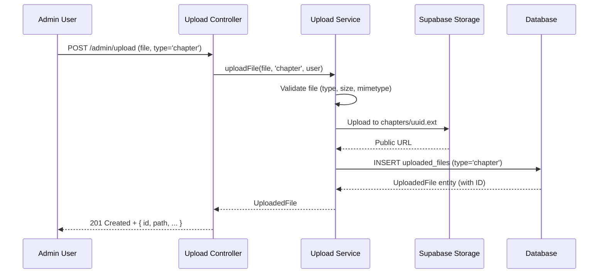
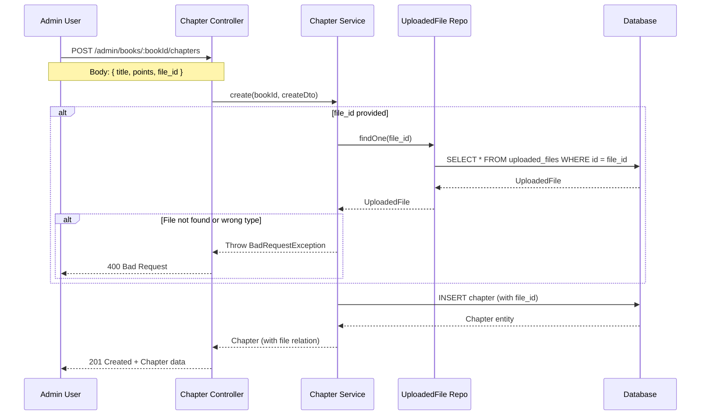
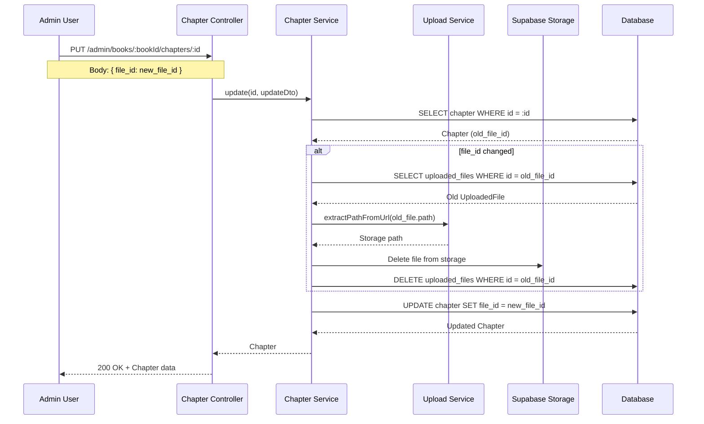
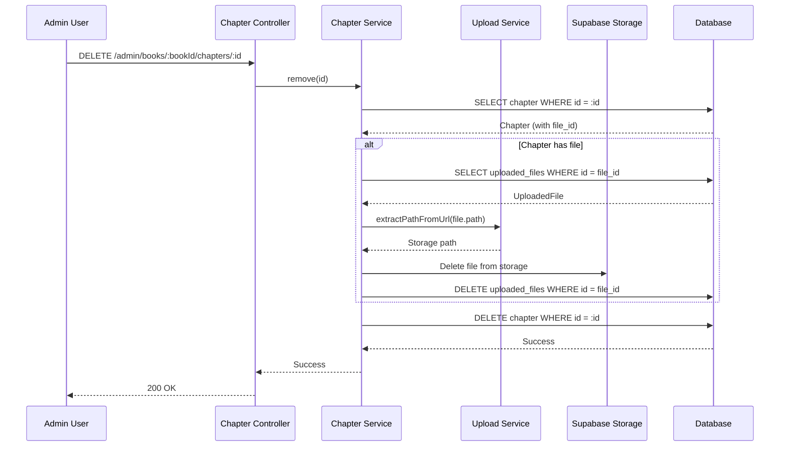

# Active Context: 16 - Chapter File Upload System

## ✔️ Status

- **Current Status**: Planning
- **Last Updated**: 2026-01-03

## ✏️ Business Requirements

- Admin và Staff users có thể upload file sách (PDF, DOCX, TXT, EPUB, Markdown) cho từng chapter.
- **Ràng buộc**: Mỗi chapter chỉ có **tối đa 1 file** để đọc.
- File có thể được thay thế hoặc xóa bỏ.
- Users có thể xem/đọc file của chapter (nếu chapter thuộc published book).
- Khi xóa chapter hoặc thay đổi file, file cũ phải được xóa khỏi storage để tránh orphan files.

## TODO List

- [ ] Task 1: Update FileType enum và Chapter entity
- [ ] Task 2: Create database migration
- [ ] Task 3: Update DTOs (Create/Update Chapter)
- [ ] Task 4: Update UploadService validation
- [ ] Task 5: Update ChaptersService logic (CRUD + file cleanup)
- [ ] Task 6: Update Controllers và Swagger docs
- [ ] Task 7: Update Admin UI (Create/Edit/List)
- [ ] Task 8: Write unit tests
- [ ] Task 9: Write integration tests
- [ ] Task 10: Manual testing
- [ ] Task 11: Update Mobile app (optional)

## 📝 Active Decisions

- **File Storage**: Sử dụng Supabase Storage bucket `books` hiện tại, lưu vào folder `chapters/`
- **File Types**: PDF, DOCX, TXT, EPUB, Markdown (giống như Book file)
- **File Size Limit**: 20MB (giống như Book file)
- **File Cleanup Strategy**:
  - Khi update `file_id`: xóa file cũ khỏi Supabase Storage
  - Khi delete chapter: xóa file liên quan khỏi Supabase Storage
  - Sử dụng `UploadService` để handle file deletion
- **Nullable Field**: `file_id` là nullable vì chapter có thể không có file
- **Access Control**:
  - Admin API: Full CRUD access cho file upload
  - User API: Read-only access để xem/download file (chỉ published books)

## 🔍 Technical Solution / Design

### Database Schema Updates

**Chapter Entity** (`chapters` table):

Thêm field mới:

- `file_id` (nullable, FK to uploaded_files) - Link to chapter file

**Migration SQL:**

```sql
ALTER TABLE chapters
ADD COLUMN file_id INTEGER NULL,
ADD CONSTRAINT fk_chapter_file
  FOREIGN KEY (file_id)
  REFERENCES uploaded_files(id)
  ON DELETE SET NULL;
```

### API Endpoints

Không cần thêm endpoint mới, chỉ update existing endpoints:

#### Admin API (Protected - Admin/Staff only)

```
POST   /api/admin/books/:bookId/chapters       - Create chapter (with optional file_id)
PUT    /api/admin/books/:bookId/chapters/:id   - Update chapter (can change file_id)
DELETE /api/admin/books/:bookId/chapters/:id   - Delete chapter (auto-delete file)

POST   /api/admin/upload                       - Upload file (type='chapter')
```

#### User API (Public - Published books only)

```
GET    /api/books/:bookId/chapters             - List chapters (include file info)
GET    /api/books/:bookId/chapters/:id         - Get chapter (include file info)
```

### DTOs

**CreateChapterDto** (Updated):

```typescript
{
  title: string;           // Required
  points: number;          // Required
  content?: string;        // Optional
  order?: number;          // Optional
  file_id?: number;        // NEW - Optional file reference
}
```

**UpdateChapterDto** (Updated):

```typescript
{
  title?: string;
  points?: number;
  content?: string;
  order?: number;
  file_id?: number | null; // NEW - Can set to null to remove file
}
```

### Enum Updates

**FileType Enum:**

```typescript
export enum FileType {
  BOOK = 'book',
  COVER = 'cover',
  AVATAR = 'avatar',
  CHAPTER = 'chapter', // NEW
}
```

### ⇅ Data Flow (Mermaid chart)

#### Flow 1: Upload File cho Chapter



#### Flow 2: Create Chapter với File



#### Flow 3: Update Chapter File (Replace)



#### Flow 4: Delete Chapter (Auto-cleanup File)



### Components

#### Backend Components

1. **FileType Enum** (Updated):
   - Add `CHAPTER = 'chapter'`

2. **Chapter Entity** (Updated):
   - Add `file_id: number | null`
   - Add `@ManyToOne` relation to `UploadedFile`

3. **UploadService** (Updated):
   - Add validation for `FileType.CHAPTER`
   - Allowed mimetypes: PDF, DOCX, TXT, EPUB, Markdown
   - Max size: 20MB
   - Storage path: `chapters/uuid.ext`
   - Add method `deleteFile(filePath: string)` for cleanup

4. **ChaptersService** (Updated):
   - Inject `UploadedFileRepository` and `UploadService`
   - `create()`: Validate file_id exists and type = 'chapter'
   - `update()`: Delete old file when file_id changes
   - `remove()`: Delete associated file before deleting chapter
   - `findOne()` / `findByBook()`: Eager load file relation

5. **CreateChapterDto / UpdateChapterDto** (Updated):
   - Add `file_id` field with validation

6. **Controllers** (Updated):
   - Update Swagger documentation
   - Update response schemas to include file info

#### Frontend Components (Admin)

1. **ChapterCreate**:
   - File upload button
   - Display selected file name
   - Submit with file_id

2. **ChapterEdit**:
   - Display current file (if exists)
   - "Change File" button
   - "Remove File" button
   - File preview/download link

3. **ChapterList**:
   - "File" column with icon/name
   - Download link

### 🔏 Security Patterns

- **Role-Based Access Control (RBAC)**:
  - Upload endpoint: Require `ADMIN` or `STAFF` role
  - Admin chapter endpoints: Require `ADMIN` or `STAFF` role
  - User endpoints: Public but filtered to published books only

- **File Validation**:
  - Validate file type (mimetype)
  - Validate file size (max 20MB)
  - Validate file_id exists and has correct type before associating with chapter

- **File Cleanup**:
  - Prevent orphan files by deleting from storage when:
    - Chapter is deleted
    - Chapter file is replaced
    - Chapter file is removed (set to null)

- **Input Validation**:
  - Validate `file_id` is a positive integer
  - Validate `file_id` references an existing `UploadedFile` with type='chapter'

### ⌨️ Test Cases

#### Unit Tests (ChaptersService)

**TC1 - Create Chapter with Valid File ID**:

- Given: Valid book ID, chapter data, and file_id of type 'chapter'
- When: Call `create(bookId, createDto)`
- Then: Chapter created successfully with file_id

**TC2 - Create Chapter without File ID**:

- Given: Valid book ID and chapter data, no file_id
- When: Call `create(bookId, createDto)`
- Then: Chapter created successfully with file_id = null

**TC3 - Create Chapter with Invalid File ID**:

- Given: Valid book ID, chapter data, but non-existent file_id
- When: Call `create(bookId, createDto)`
- Then: Throw BadRequestException

**TC4 - Create Chapter with Wrong File Type**:

- Given: Valid book ID, chapter data, but file_id with type='cover'
- When: Call `create(bookId, createDto)`
- Then: Throw BadRequestException

**TC5 - Update Chapter File (Replace)**:

- Given: Existing chapter with old_file_id, update with new_file_id
- When: Call `update(id, { file_id: new_file_id })`
- Then: Old file deleted from storage, chapter updated with new_file_id

**TC6 - Remove Chapter File**:

- Given: Existing chapter with file_id
- When: Call `update(id, { file_id: null })`
- Then: File deleted from storage, chapter.file_id = null

**TC7 - Delete Chapter with File**:

- Given: Existing chapter with file_id
- When: Call `remove(id)`
- Then: File deleted from storage, chapter deleted from DB

**TC8 - Find Chapter includes File Info**:

- Given: Chapter with file_id
- When: Call `findOne(id)`
- Then: Returns chapter with file relation populated

#### Integration Tests

**TC9 - Full Upload Flow**:

- Given: Admin user with valid file
- When: POST /admin/upload with type='chapter'
- Then: File uploaded to Supabase, UploadedFile created with type='chapter'

**TC10 - Full Create Chapter Flow**:

- Given: Uploaded file_id and valid chapter data
- When: POST /admin/books/:bookId/chapters
- Then: Chapter created with file_id, GET returns chapter with file info

**TC11 - Full Update Chapter Flow**:

- Given: Chapter with old file, new uploaded file
- When: PUT /admin/books/:bookId/chapters/:id with new file_id
- Then: Old file deleted, chapter updated, new file accessible

**TC12 - Full Delete Chapter Flow**:

- Given: Chapter with file
- When: DELETE /admin/books/:bookId/chapters/:id
- Then: File deleted from Supabase, chapter deleted from DB

**TC13 - User Access to Chapter File**:

- Given: Published book with chapter having file
- When: GET /api/books/:bookId/chapters/:id
- Then: Returns chapter with file info (public URL or signed URL)

**TC14 - User Cannot Access Draft Book Chapter File**:

- Given: Draft book with chapter having file
- When: GET /api/books/:bookId/chapters/:id
- Then: 404 Not Found

#### Manual Tests (Admin UI)

**TC15 - Upload File for New Chapter**:

- Navigate to Create Chapter
- Click "Upload File"
- Select PDF file
- Verify file name displayed
- Submit form
- Verify chapter created with file

**TC16 - Change Chapter File**:

- Navigate to Edit Chapter (with existing file)
- Click "Change File"
- Upload new file
- Submit form
- Verify old file deleted, new file accessible

**TC17 - Remove Chapter File**:

- Navigate to Edit Chapter (with existing file)
- Click "Remove File"
- Submit form
- Verify file deleted, chapter has no file

**TC18 - Delete Chapter with File**:

- Navigate to Chapter List
- Delete chapter with file
- Verify chapter deleted
- Verify file deleted from Supabase (check storage)

**TC19 - View Chapter File in List**:

- Navigate to Chapter List
- Verify "File" column shows file icon/name
- Click file name
- Verify file downloads/opens

#### Manual Tests (Mobile App - Optional)

**TC20 - Read Chapter File**:

- Open chapter detail (with file)
- Verify "Đọc file" button displayed
- Click button
- Verify file opens in WebView or external viewer

**TC21 - Download Chapter File**:

- Open chapter detail (with file)
- Click download button
- Verify file downloaded to device

## 🚨 Risks & Considerations

### Risk 1: Orphan Files

**Problem**: Nếu xóa file thất bại trên Supabase nhưng đã update DB, sẽ có file orphan.

**Mitigation**:

- Implement try-catch để rollback DB transaction nếu xóa file thất bại
- Tạo cleanup job để định kỳ xóa orphan files
- Log errors để admin có thể manual cleanup

### Risk 2: File Size và Performance

**Problem**: File lớn (20MB) có thể làm chậm upload/download.

**Mitigation**:

- Implement progress indicator trong UI
- Consider compression cho file lớn
- Implement lazy loading cho file content
- Cache signed URLs để giảm số lần gọi Supabase API

### Risk 3: Database Migration

**Problem**: Migration thêm column mới có thể fail trên production.

**Mitigation**:

- Backup database trước khi chạy migration
- Test migration trên staging environment
- Column là nullable nên không ảnh hưởng existing data
- Có rollback plan nếu migration fail

### Risk 4: Concurrent Updates

**Problem**: Nếu 2 admin cùng update chapter file, có thể xóa nhầm file.

**Mitigation**:

- Implement optimistic locking (version field)
- Show warning nếu chapter đã được update bởi user khác
- Log all file operations để có audit trail

## 📋 Implementation Checklist

### Phase 1: Backend Core (Database & Entities)

- [ ] Update `FileType` enum
- [ ] Update `Chapter` entity
- [ ] Create and run database migration
- [ ] Verify migration on dev database

### Phase 2: Backend Services

- [ ] Update `UploadService` validation
- [ ] Update `UploadController` Swagger docs
- [ ] Update `ChaptersService` CRUD methods
- [ ] Add file cleanup logic
- [ ] Update DTOs

### Phase 3: Backend Controllers & API

- [ ] Update `AdminChaptersController` Swagger docs
- [ ] Update `ChaptersController` response schema
- [ ] Test API endpoints with Postman/Swagger

### Phase 4: Testing

- [ ] Write unit tests for `ChaptersService`
- [ ] Write integration tests
- [ ] Run all tests and verify coverage

### Phase 5: Frontend Admin

- [ ] Update `ChapterCreate` component
- [ ] Update `ChapterEdit` component
- [ ] Update `ChapterList` component
- [ ] Manual testing on admin UI

### Phase 6: Mobile App (Optional)

- [ ] Update `ChapterDetail` screen
- [ ] Add file viewer/download functionality
- [ ] Manual testing on mobile

### Phase 7: Deployment

- [ ] Code review
- [ ] Update documentation
- [ ] Deploy to staging
- [ ] Test on staging
- [ ] Deploy to production
- [ ] Monitor for errors

## 📚 Related Documents

- [01-book-management.md](./01-book-management.md) - Book upload system (reference)
- [03-chapter-management.md](./03-chapter-management.md) - Chapter management (base)
- [08-signed-urls.md](./08-signed-urls.md) - Signed URLs for private files
