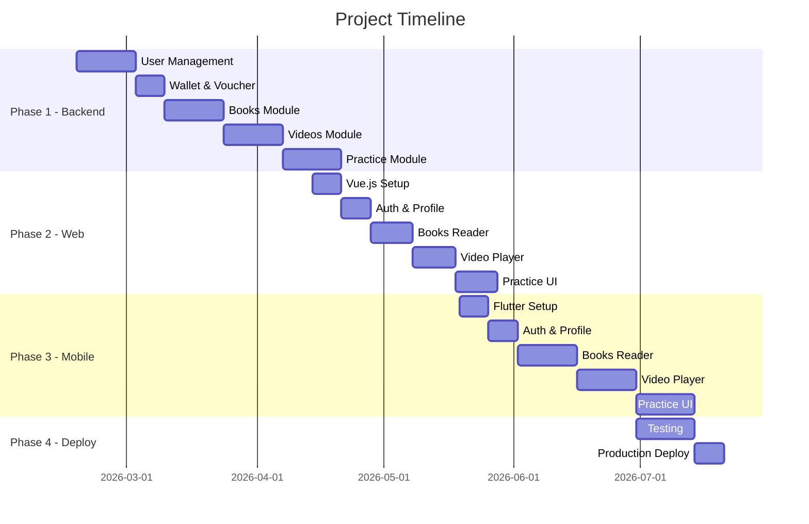
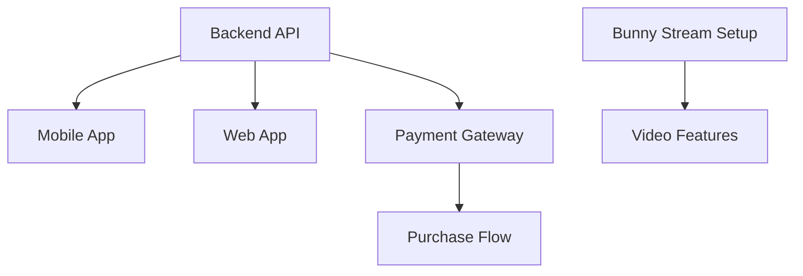

# Implementation Tasks & Progress Tracking

## Document Information
- **Project**: Thiên Thư - Feng Shui Learning Platform
- **Version**: 1.0
- **Last Updated**: 2026-02-21
- **Status**: Planning Complete → Ready for Implementation

## Backend Detail Designs (md/design/)
| Feature | Doc | Description | Status |
| :--- | :--- | :--- | :--- |
| 1 | [feature-1-detail-design.md](design/feature-1-detail-design.md) | User Management & Authentication | ✅ |
| 2 | [feature-2-detail-design.md](design/feature-2-detail-design.md) | Books Module | ✅ |
| 3 | [feature-3-detail-design.md](design/feature-3-detail-design.md) | Videos Module | ✅ |
| 4 | [feature-4-detail-design.md](design/feature-4-detail-design.md) | Exams & Practice | ✅ |
| 5 | [feature-5-detail-design.md](design/feature-5-detail-design.md) | Comments & Interactions | ✅ |
| 6 | [feature-6-detail-design.md](design/feature-6-detail-design.md) | Notifications | ✅ |
| 7 | [feature-7-detail-design.md](design/feature-7-detail-design.md) | Wallet & Payment Bridge | ✅ |

---

## Project Phases Overview

---

## Phase 1: Backend API Development (6 weeks)

### Feature 1: User Management & Authentication
**Priority**: Critical | **Estimated**: 2 weeks

- [x] **1.1 User Model & Database**
  - [x] Create User model with custom fields (phone_number, user_type, device_id)
  - [x] Create UserDevice model for device tracking
  - [x] Database migrations
  - [x] **BaseModel implementation (Private ID + Public UUID)**
  - [ ] **Multi-tier Logging setup (Daily files for Dev, Sentry for Prod)**
  - [x] Admin interface configuration (with Jazzmin theme)
  - **Assignee**: Backend Dev
  - **Due**: Week 1

- [x] **1.2 Authentication API**
  - [x] POST `/api/auth/register/` - User registration with device registration
  - [x] POST `/api/auth/login/` - Login with device verification
  - [x] POST `/api/auth/refresh/` - JWT token refresh
  - [x] POST `/api/auth/logout/` - Logout and session cleanup
  - [ ] Hybrid monetization logic (FREE, VIP, Paid USER)
  - [x] **Hard Device Locking logic (Persistent Binding)**
  - [x] **Login-integrated Reset Flow** (Cooldown check + Confirmation flag)
  - [x] **Admin un-link override capability** (Subject to Audit Log)
  - [x] **AdminAuditLog system implementation (Currency & VIP tracking)**
  - [x] **Middleware/Signals for sensitive action logging**
  - [x] **UserDevice management table (Historical & Active tracking)**
  - [x] **Audit logging for device un-link actions**
  - [x] **Audit logging (IP, User Agent, Last Active)**
  - **Assignee**: Backend Dev
  - **Due**: Week 1

- [x] **1.3 User Profile API**
  - [x] GET `/api/users/me/` - Get current user profile
  - [x] PUT `/api/users/me/` - Update profile
  - [x] **POST `/api/auth/login/` (reset_device=true)** - Confirmation logic
  - [x] GET `/api/users/me/device-status/` - Show bound device and next reset date
  - [x] Admin interface for viewing and revoking individual devices
  - [x] **Admin Audit Log dashboard (For SuperAdmins only)**
  - **Assignee**: Backend Dev
  - **Due**: Week 2

---

### Feature 7: Wallet & Payment Bridge (Externalized)
**Priority**: Critical | **Estimated**: 1 week  
**Detail design**: [feature-7-detail-design.md](design/feature-7-detail-design.md) | **Status**: ✅ Implemented

- [x] **7.1 Models & Logic**
  - [x] Wallet model (balance tracking)
  - [x] Voucher model (codes, values, status)
  - [x] Transaction model (audit log for all LT movements)
  - [x] Admin Audit Log integration for manual LT edits

- [x] **7.2 API Development**
  - [x] GET `/api/wallet/me/` - Current balance
  - [x] POST `/api/wallet/redeem/` - Redeem voucher code
  - [x] GET `/api/wallet/history/` - Transaction history
  - [x] POST `/api/payments/purchase-book/` - Buy book using LT
  - [x] POST `/api/payments/purchase-video/` - Buy video using LT
  - [x] POST `/api/payments/subscribe-vip/` - Sub VIP using LT

- [x] **7.3 Admin Voucher Tool**
  - [x] Function to generate bulk vouchers
  - [x] Export vouchers to CSV for external sale
  - [ ] Revenue estimation dashboard (based on redeemed vouchers)

- [ ] **7.4 Integration**
  - [ ] Update Book/Course detail pages with "Buy with Linh Thạch" button
  - [ ] Real-time balance update in profile header
  - [x] Notification on successful recharge/purchase

- [ ] **7.5 Testing**
  - [ ] Unit tests for wallet & voucher logic
  - [ ] API endpoint tests for redemption and purchases
  - **Assignee**: Backend Dev
  - **Due**: Week 2

---

### Feature 2: Books Module
**Priority**: Critical | **Estimated**: 2 weeks  
**Detail design**: [feature-2-detail-design.md](design/feature-2-detail-design.md) | **Status**: ✅ Backend implemented

- [x] **2.1 Models & Database**
  - [x] BookCategory model
  - [x] Book model with cover image support
  - [x] BookChapter model with PDF file support
  - [x] Configure local storage for media (Images/PDFs)
  - [x] UserBookPurchase model
  - [x] Database migrations and indexes
  - **Assignee**: Backend Dev
  - **Due**: Week 3

- [x] **2.2 Books API**
  - [x] GET `/api/books/categories/` - List categories
  - [x] GET `/api/books/` - List books with filters
  - [x] GET `/api/books/{slug}/` - Book detail with chapters
  - [x] GET `/api/books/{slug}/chapters/{order}/` - Chapter content
    - [x] Permission checks (VIP, purchased, demo)
  - [x] Link to optional Final Exam (final_exam_id)
  - [x] Watermark configuration generation
  - **Assignee**: Backend Dev
  - **Due**: Week 3

- [x] **2.3 Admin Interface**
  - [x] Book management interface
  - [x] Chapter inline editor
  - [ ] Bulk import functionality
  - [x] Category management
  - **Assignee**: Backend Dev
  - **Due**: Week 4

- [ ] **2.4 Testing & Data Import**
  - [ ] Unit tests for book services
  - [ ] API endpoint tests
  - [ ] Import existing book data
  - [ ] Seed demo data
  - **Assignee**: Backend Dev
  - **Due**: Week 4

---

### Feature 3: Videos Module
**Priority**: Critical | **Estimated**: 2 weeks  
**Detail design**: [feature-3-detail-design.md](design/feature-3-detail-design.md) | **Status**: ✅ Backend implemented

- [x] **3.1 Models & Database**
  - [x] VideoCourse model with cover image support
  - [x] VideoLesson model with thumbnail support
  - [x] Configure local storage for thumbnails and covers
  - [x] UserVideoPurchase model
  - [x] UserLessonProgress model
  - [x] Database migrations
  - **Assignee**: Backend Dev
  - **Due**: Week 5

- [x] **3.2 Video Platform (Bunny Stream & Local Fallback)**
  - [x] GET `/api/videos/` - List videos
  - [x] GET `/api/videos/{slug}/` - Video detail with dynamic URL (local or signed)
  - [x] GET `/api/videos/{slug}/lessons/{lesson_slug}/` - Lesson with video URL
  - [x] POST `/api/videos/{slug}/lessons/{lesson_slug}/progress/` - Update watch progress
  - [x] GET `/api/videos/{slug}/progress/` - Course progress
  - [ ] Bunny Stream integration service (Signed URL generation)
  - [x] **Development Fallback**: Local file serving when `DEBUG=True`
  - **Assignee**: Backend Dev
  - **Due**: Week 5

- [ ] **3.3 Bunny Stream Setup**
  - [ ] Configure Bunny Stream library
  - [ ] Set up video upload workflow
  - [ ] Configure security settings (token auth, geo-blocking)
  - [ ] Test video streaming
  - **Assignee**: Backend Dev + DevOps
  - **Due**: Week 6

- [ ] **3.4 Testing**
  - [ ] Unit tests for video services
  - [ ] API endpoint tests
  - [ ] Video streaming tests
  - [ ] Progress tracking tests
  - **Assignee**: Backend Dev
  - **Due**: Week 6

---

### Feature 4: Exams & Practice Module
**Priority**: High | **Estimated**: 2.5 weeks  
**Detail design**: [feature-4-detail-design.md](design/feature-4-detail-design.md) | **Status**: ✅ Backend implemented

- [x] **4.1 Standalone Exams (Critical)**
  - [x] Exam model (Final exams, practice tests)
  - [x] PracticeQuestion model
  - [x] UserExamProgress model
  - [x] GET `/api/exams/` - List exams
  - [x] GET `/api/exams/{slug}/` - Get exam details
  - [x] POST `/api/exams/{slug}/submit/` - Submit exam
  - **Assignee**: Backend Dev
  - **Due**: Week 7

- [x] **4.2 Practice Tower (Kỳ Môn Focus)**
  - [x] PracticeModule model (Tower structure)
  - [x] Link Tower stages to specific Exams
  - [x] Flashcard model
  - [x] FlashcardReview model (SM-2 state)
  - [x] Database migrations
  - **Assignee**: Backend Dev
  - **Due**: Week 7-8

- [x] **4.3 Spaced Repetition (SM-2 Algorithm)**
  - [x] Implement SM-2 algorithm for flashcards
  - [x] GET `/api/practice/modules/{slug}/flashcards/`
  - [x] POST `/api/practice/flashcards/{id}/review/`
  - **Assignee**: Backend Dev
  - **Due**: Week 8

- [ ] **4.4 Testing & Content**
  - [ ] Unit tests for exam/practice logic
  - [ ] API endpoint tests
  - [ ] Create sample practice content
  - [ ] Test progressive unlocking
  - **Assignee**: Backend Dev
  - **Due**: Week 8

---

### Feature 5: Comments & Interactions
**Priority**: Medium | **Estimated**: 1 week  
**Detail design**: [feature-5-detail-design.md](design/feature-5-detail-design.md) | **Status**: ✅ Backend implemented

- [x] **5.1 Models & API**
  - [x] Comment model with GenericForeignKey
  - [x] CommentReply model
  - [x] GET `/api/comments/` - List comments (query: content_type, object_id)
  - [x] POST `/api/comments/create/` - Create comment (with purchase check)
  - [x] POST `/api/comments/{id}/reply/` - Reply to comment
  - [x] DELETE `/api/comments/{id}/` - Delete own comment
  - [x] Permission: only purchased users (or VIP) can comment
  - **Assignee**: Backend Dev
  - **Due**: Week 9

---

### Feature 6: Notifications
**Priority**: Medium | **Estimated**: 1 week  
**Detail design**: [feature-6-detail-design.md](design/feature-6-detail-design.md) | **Status**: ✅ Backend implemented (in-app + models)

- [x] **6.1 Notification System & Email Quota**
  - [x] **EmailLog model (Full audit trail for all outgoing emails)**
  - [x] **EmailQuota model (Daily 300-email limit enforcement)**
  - [x] Notification model (In-app alerts)
  - [x] GET `/api/notifications/` - List notifications
  - [x] POST `/api/notifications/{id}/mark-read/` - Mark as read
  - [x] POST `/api/notifications/mark-all-read/` - Mark all read
  - [x] In-app notification on recharge/purchase/VIP (from wallet)
  - [ ] Celery task for sending emails with quota check
  - [ ] Email notification service (Gmail SMTP integration)
  - [x] **Admin Email Dashboard (View logs & current daily quota)**
  - [ ] Push notification integration (FCM/APNs)
  - **Assignee**: Backend Dev
  - **Due**: Week 9

---

### Feature 7: Wallet & Payment Bridge (duplicate ref – see Feature 7 above)
- In-app purchase & voucher logic implemented (see [feature-7-detail-design.md](design/feature-7-detail-design.md)).
  - [x] POST `/api/payments/purchase-book/`, `purchase-video/`, `subscribe-vip/`
  - [x] Voucher generation (Admin) and redeem API

---

## Phase 2: Vue.js Web App (5 weeks)

### Feature 8: Vue.js Project Setup
**Priority**: Critical | **Estimated**: 1 week

- [ ] **8.1 Project Initialization**
  - [ ] Create Vite + Vue.js project
  - [ ] Configure dependencies (Pinia, Axios, Vuetify)
  - [ ] Set up project structure
  - [ ] Configure router
  - **Assignee**: Frontend Dev
  - **Due**: Week 11

- [ ] **8.2 Core Services**
  - [ ] API client with Axios
  - [ ] Auth interceptor
  - [ ] Device fingerprinting service
  - [ ] Watermark composable
  - **Assignee**: Frontend Dev
  - **Due**: Week 11

---

### Feature 9: Authentication & Profile (Web)
**Priority**: Critical | **Estimated**: 1 week

- [ ] **9.1 Auth Pages**
  - [ ] Login page
  - [ ] Registration page
  - [ ] Device limit error handling
  - [ ] Auth store (Pinia)
  - **Assignee**: Frontend Dev
  - **Due**: Week 12

- [ ] **9.2 Profile & Settings**
  - [ ] Profile page
  - [ ] Edit profile
  - [ ] Device management
  - [ ] VIP banner
  - **Assignee**: Frontend Dev
  - **Due**: Week 12

---

### Feature 10: Books Module (Web)
**Priority**: Critical | **Estimated**: 1.5 weeks

- [ ] **10.1 Books List & Detail**
  - [ ] Books list page with filters
  - [ ] Book detail page
  - [ ] Purchase flow
  - **Assignee**: Frontend Dev
  - **Due**: Week 13

- [ ] **10.2 Book Reader**
  - [ ] Book reader page
  - [ ] HTML content rendering
  - [ ] Watermark overlay component
  - [ ] Chapter navigation
  - [ ] CSS-based screenshot prevention
  - **Assignee**: Frontend Dev
  - **Due**: Week 13-14

---

### Feature 11: Videos Module (Web)
**Priority**: Critical | **Estimated**: 1.5 weeks

- [ ] **11.1 Videos List & Detail**
  - [ ] Videos list page
  - [ ] Video detail page
  - [ ] Purchase flow
  - **Assignee**: Frontend Dev
  - **Due**: Week 14

- [ ] **11.2 Video Player**
  - [ ] Video player page (Video.js)
  - [ ] Video watermark overlay
  - [ ] Progress tracking
  - [ ] Transcript/Summary tabs
  - [ ] Quiz section
  - **Assignee**: Frontend Dev
  - **Due**: Week 15

---

### Feature 12: Practice Module (Web)
**Priority**: High | **Estimated**: 1.5 weeks

- [ ] **12.1 Practice Interface**
  - [ ] Practice modules page
  - [ ] Chapters list with unlock status
  - [ ] Flashcard viewer
  - [ ] Test interface
  - [ ] Case study viewer
  - [ ] Results display
  - **Assignee**: Frontend Dev
  - **Due**: Week 15-16

---

## Phase 3: Flutter Mobile App (6 weeks)

### Feature 13: Flutter Project Setup
**Priority**: Critical | **Estimated**: 1 week

- [ ] **13.1 Project Initialization**
  - [ ] Create Flutter project
  - [ ] Configure dependencies (Riverpod, Dio, etc.)
  - [ ] Set up project structure
  - [ ] Configure build settings (Android/iOS)
  - **Assignee**: Mobile Dev
  - **Due**: Week 17

- [ ] **13.2 Core Services**
  - [ ] API client with Dio
  - [ ] Auth interceptor
  - [ ] Secure storage service
  - [ ] Device service (fingerprinting)
  - [ ] Watermark service
  - **Assignee**: Mobile Dev
  - **Due**: Week 17

---

### Feature 14: Authentication & Profile (Mobile)
**Priority**: Critical | **Estimated**: 1 week

- [ ] **14.1 Auth Screens**
  - [ ] Login screen
  - [ ] Registration screen
  - [ ] Device limit error handling
  - [ ] Auth state management (Riverpod)
  - **Assignee**: Mobile Dev
  - **Due**: Week 18

- [ ] **14.2 Profile & Settings**
  - [ ] Profile screen
  - [ ] Edit profile
  - [ ] Device management
  - [ ] VIP badge display
  - **Assignee**: Mobile Dev
  - **Due**: Week 18

---

### Feature 15: Books Module (Mobile)
**Priority**: Critical | **Estimated**: 2 weeks

- [ ] **15.1 Books List & Detail**
  - [ ] Books list screen with categories
  - [ ] Book detail screen
  - [ ] Table of contents
  - [ ] Purchase flow
  - **Assignee**: Mobile Dev
  - **Due**: Week 19

- [ ] **15.2 Book Reader**
  - [ ] Book reader screen
  - [ ] HTML content rendering
  - [ ] Watermark overlay widget
  - [ ] Chapter navigation
  - [ ] Reading progress tracking
  - [ ] Screenshot prevention (FLAG_SECURE)
  - **Assignee**: Mobile Dev
  - **Due**: Week 20

---

### Feature 16: Videos Module (Mobile)
**Priority**: Critical | **Estimated**: 2 weeks

- [ ] **16.1 Videos List & Detail**
  - [ ] Videos list screen
  - [ ] Video detail screen
  - [ ] Purchase flow
  - **Assignee**: Mobile Dev
  - **Due**: Week 21

- [ ] **16.2 Video Player**
  - [ ] Video player screen
  - [ ] Video controls
  - [ ] Video watermark overlay (periodic)
  - [ ] Progress tracking
  - [ ] Transcript/Summary tabs
  - [ ] Quiz section
  - [ ] Screenshot prevention
  - **Assignee**: Mobile Dev
  - **Due**: Week 22

---

### Feature 17: Practice Module (Mobile)
**Priority**: High | **Estimated**: 2 weeks

- [ ] **17.1 Practice Navigation**
  - [ ] Practice modules list
  - [ ] Chapters list with unlock status
  - [ ] Progress visualization
  - **Assignee**: Mobile Dev
  - **Due**: Week 23

- [ ] **17.2 Flashcards**
  - [ ] Flashcard viewer with flip animation
  - [ ] Review quality input
  - [ ] Progress tracking
  - **Assignee**: Mobile Dev
  - **Due**: Week 23

- [ ] **17.3 Tests & Case Studies**
  - [ ] Question display (multiple choice, true/false)
  - [ ] Test submission
  - [ ] Results screen
  - [ ] Case study viewer
  - **Assignee**: Mobile Dev
  - **Due**: Week 24

---

## Phase 4: Testing & Deployment (3 weeks)

### Feature 18: Integration Testing
**Priority**: Critical | **Estimated**: 2 weeks

- [ ] **18.1 Backend Testing**
  - [ ] API integration tests
  - [ ] Load testing
  - [ ] Security testing
  - **Assignee**: QA + Backend Dev
  - **Due**: Week 25

- [ ] **18.2 Mobile Testing**
  - [ ] Flutter integration tests
  - [ ] iOS device testing
  - [ ] Android device testing
  - [ ] Payment flow testing
  - **Assignee**: QA + Mobile Dev
  - **Due**: Week 25

- [ ] **18.3 Web Testing**
  - [ ] E2E tests (Cypress)
  - [ ] Cross-browser testing
  - [ ] Responsive design testing
  - **Assignee**: QA + Frontend Dev
  - **Due**: Week 26

---

### Feature 19: Production Deployment
**Priority**: Critical | **Estimated**: 1 week

- [ ] **19.1 Infrastructure Setup**
  - [ ] VPS provisioning
  - [ ] Docker setup
  - [ ] SSL certificates
  - [ ] Domain configuration
  - **Assignee**: DevOps
  - **Due**: Week 27

- [ ] **19.2 Backend Deployment**
  - [ ] Deploy Django API
  - [ ] Configure Nginx
  - [ ] Set up Celery workers
  - [ ] Database migration
  - [ ] Monitoring setup (Sentry)
  - **Assignee**: DevOps
  - **Due**: Week 27

- [ ] **19.3 Frontend Deployment**
  - [ ] Build Vue.js app
  - [ ] Deploy to CDN/hosting
  - [ ] Configure environment variables
  - **Assignee**: DevOps + Frontend Dev
  - **Due**: Week 27

- [ ] **19.4 Mobile App Submission**
  - [ ] Build release APK/AAB
  - [ ] Build release IPA
  - [ ] Submit to Google Play
  - [ ] Submit to App Store
  - **Assignee**: Mobile Dev
  - **Due**: Week 27

---

## Progress Tracking Legend

- `[ ]` Not started
- `[/]` In progress
- `[x]` Completed
- `[!]` Blocked/Issues

---

## Risk Management

### High Risk Items
1. **Device Locking** - Complex logic, needs thorough testing
2. **Payment Integration** - Requires sandbox testing and compliance
3. **Bunny Stream** - Video streaming performance and security
4. **App Store Approval** - May face rejection, need buffer time

### Mitigation Strategies
- Early prototyping of high-risk features
- Parallel development where possible
- Regular stakeholder demos
- Buffer time in timeline

---

## Dependencies

---

## Team Allocation

| Role | Allocation | Phases |
|------|-----------|--------|
| Backend Developer | Full-time | Phase 1 (6 weeks) |
| Frontend Developer | Full-time | Phase 2 (5 weeks) |
| Mobile Developer | Full-time | Phase 3 (6 weeks) |
| DevOps Engineer | Part-time | All phases |
| QA Engineer | Full-time | Phase 4 (3 weeks) |

---

## Milestones

- **Week 6**: Backend API MVP complete
- **Week 16**: Web app full features complete
- **Week 24**: Mobile app full features complete
- **Week 27**: Production deployment & app store submission

---

*Last updated: 2026-02-17*
