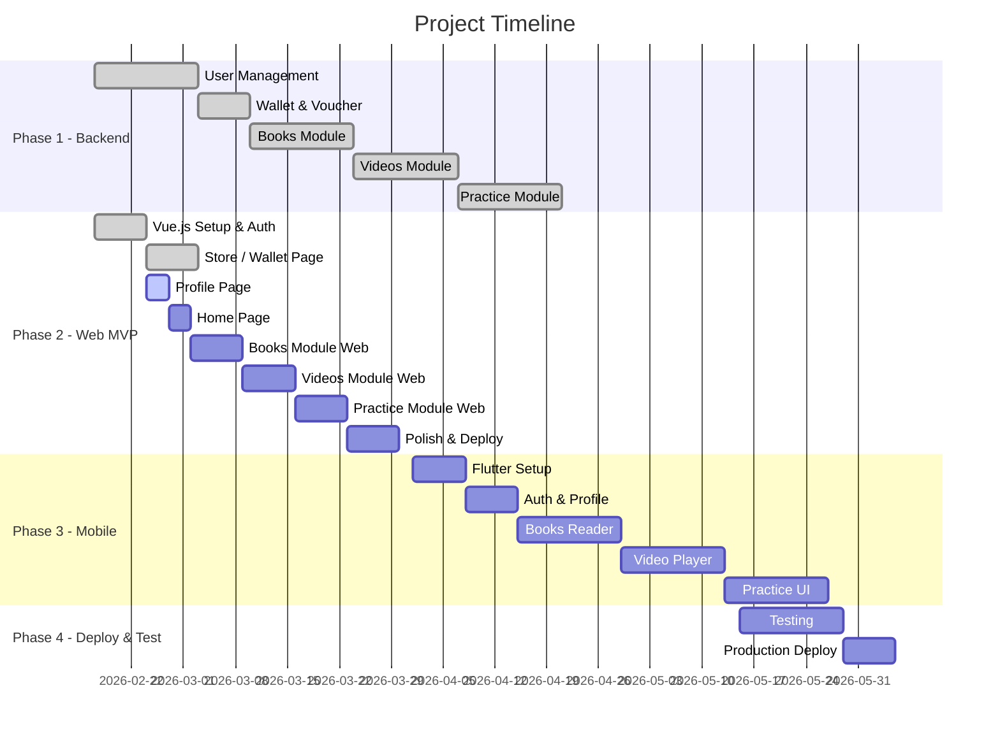

# Implementation Tasks & Progress Tracking

## Document Information
- **Project**: Thiên Thư - Feng Shui Learning Platform
- **Version**: 1.2
- **Last Updated**: 2026-02-24
- **Status**: Phase 1 Backend ✅ Complete | Phase 2 Web MVP 🚧 In Progress | Admin Panel 🆕 Planned

## Backend Detail Designs (md/design/)
| Feature | Doc | Description | Status |
| :--- | :--- | :--- | :--- |
| 1 | [feature-1-detail-design.md](design/feature-1-detail-design.md) | User Management & Authentication | ✅ |
| **Frontend (Phase 2)** | **[frontend-detail-design.md](design/frontend-detail-design.md)** | **Design system, Auth (Login/Register), Profile, Books/Videos/Practice outlines** | ✅ |
| 2 | [feature-2-detail-design.md](design/feature-2-detail-design.md) | Books Module | ✅ |
| 3 | [feature-3-detail-design.md](design/feature-3-detail-design.md) | Videos Module | ✅ |
| 4 | [feature-4-detail-design.md](design/feature-4-detail-design.md) | Exams & Practice | ✅ |
| 5 | [feature-5-detail-design.md](design/feature-5-detail-design.md) | Comments & Interactions | ✅ |
| 6 | [feature-6-detail-design.md](design/feature-6-detail-design.md) | Notifications | ✅ |
| 7 | [feature-7-detail-design.md](design/feature-7-detail-design.md) | Wallet & Payment Bridge | ✅ |

---

## MVP Definition (Web App)

> **Mục tiêu MVP**: Ra mắt web app đầy đủ chức năng cho phép người dùng đăng ký, mua và học nội dung Phong Thủy (sách + video + luyện tập).

### MVP Scope (Web Only)
| Module | Minimum Required | Priority |
|--------|-----------------|----------|
| Auth | Login + Register + Device lock flow | P0 |
| Profile | Xem profile + cập nhật tên | P0 |
| Trang chủ | Hiển thị nội dung nổi bật + điều hướng | P0 |
| Sách | List + Detail + PDF Reader (watermark) | P0 |
| Video | List + Detail + Player (tiến trình) | P0 |
| Luyện tập | Flashcard + Bài thi | P1 |
| Ví / Cửa hàng | Xem số dư + Nạp voucher + Mua nội dung | P0 |
| Thông báo | Danh sách + Đánh dấu đã đọc | P2 |

### Out of Scope cho MVP
- Mobile App (Flutter) — Phase 3
- Push notification (FCM/APNs)
- Bunny Stream production setup
- Admin revenue dashboard
- Comment system (UI)
- Full E2E test suite

---

## Project Phases Overview

---

## Phase 1: Backend API Development ✅ COMPLETE

### Feature 1: User Management & Authentication ✅
**Priority**: Critical | **Status**: ✅ Implemented

- [x] **1.1 User Model & Database**
  - [x] Create User model với custom fields (phone_number, user_type, device_id)
  - [x] Create UserDevice model for device tracking
  - [x] Database migrations
  - [x] BaseModel implementation (Private ID + Public UUID)
  - [ ] **Multi-tier Logging setup (Daily files for Dev, Sentry for Prod)** ← còn lại
  - [x] Admin interface configuration (with Jazzmin theme)

- [x] **1.2 Authentication API**
  - [x] POST `/api/auth/register/`
  - [x] POST `/api/auth/login/`
  - [x] POST `/api/auth/refresh/`
  - [x] POST `/api/auth/logout/`
  - [x] Hard Device Locking logic
  - [x] Login-integrated Reset Flow (Cooldown check + Confirmation flag)
  - [x] Admin un-link override capability
  - [x] AdminAuditLog system
  - [ ] Hybrid monetization logic (FREE → VIP → Paid) ← chưa hoàn chỉnh

- [x] **1.3 User Profile API**
  - [x] GET `/api/users/me/`
  - [x] PUT `/api/users/me/`
  - [x] GET `/api/users/me/device-status/`
  - [x] Admin interface + Audit Log dashboard

---

### Feature 7: Wallet & Payment Bridge ✅ (core done)
**Priority**: Critical | **Status**: ✅ Core | 🚧 Dashboard & Tests pending

- [x] **7.1 Models & Logic**
  - [x] Wallet model (balance tracking)
  - [x] Voucher model (codes, values, status)
  - [x] Transaction model (audit log for all LT movements)
  - [x] Admin Audit Log integration

- [x] **7.2 API Development**
  - [x] GET `/api/wallet/me/`
  - [x] POST `/api/wallet/redeem/`
  - [x] GET `/api/wallet/history/`
  - [x] POST `/api/payments/purchase-book/`
  - [x] POST `/api/payments/purchase-video/`
  - [x] POST `/api/payments/subscribe-vip/`

- [x] **7.3 Admin Voucher Tool**
  - [x] Generate bulk vouchers
  - [x] Export vouchers to CSV
  - [ ] Revenue estimation dashboard

- [ ] **7.4 Integration**
  - [ ] Update Book/Course detail pages với nút "Mua bằng Linh Thạch"
  - [ ] Real-time balance update in profile header

- [ ] **7.5 Testing** (post-MVP)
  - [ ] Unit tests for wallet & voucher logic
  - [ ] API endpoint tests

---

### Feature 2: Books Module ✅
**Priority**: Critical | **Status**: ✅ Implemented

- [x] **2.1 Models & Database** — BookCategory, Book, BookChapter, UserBookPurchase ✅
- [x] **2.2 Books API** — CRUD + Permission + Watermark config ✅
- [x] **2.3 Admin Interface** — Book management + Chapter inline editor ✅
  - [ ] Bulk import functionality (post-MVP)
- [ ] **2.4 Testing & Data Import** (post-MVP)

---

### Feature 3: Videos Module ✅ (Bunny Stream pending)
**Priority**: Critical | **Status**: ✅ Core | 🚧 Bunny Stream pending

- [x] **3.1 Models & Database** — VideoCourse, VideoLesson, UserVideoPurchase, UserLessonProgress ✅
- [x] **3.2 Video API** — List, Detail, Progress tracking, Local fallback ✅
- [ ] **3.3 Bunny Stream Setup** (production only, not MVP blocker)
- [ ] **3.4 Testing** (post-MVP)

---

### Feature 4: Exams & Practice Module ✅
**Priority**: High | **Status**: ✅ Implemented

- [x] **4.1 Standalone Exams** — Exam, PracticeQuestion, UserExamProgress, Submit API ✅
- [x] **4.2 Practice Tower** — PracticeModule, Flashcard models ✅
- [x] **4.3 Spaced Repetition (SM-2)** — FlashcardReview, SM-2 algorithm ✅
- [ ] **4.4 Testing & Content** (post-MVP)

---

### Feature 5: Comments & Interactions ✅
**Priority**: Medium | **Status**: ✅ Implemented

- [x] Comment model với GenericForeignKey ✅
- [x] CommentReply model ✅
- [x] CRUD APIs với purchase verification ✅

---

### Feature 6: Notifications 🚧
**Priority**: Medium | **Status**: ✅ In-app done | 🚧 Email/Push pending

- [x] **6.1 In-app Notification** — Model + Mark read API ✅
- [x] EmailLog + EmailQuota model ✅
- [ ] Celery task for email với quota check (không cần cho MVP)
- [ ] Push notification (FCM/APNs) (post-MVP)

---

## Phase 2: Vue.js Web App MVP 🚧 IN PROGRESS

### Feature 8: Vue.js Project Setup ✅ COMPLETE
**Status**: ✅ Done (2026-02-17)

- [x] **8.1 Project Initialization**
  - [x] Vite + Vue.js project
  - [x] Pinia + Axios + Vue Router + vue-i18n
  - [x] Project structure (`src/api`, `src/components`, `src/layouts`, `src/stores`, `src/router`, `src/style`, `src/services`, `src/composables`)
  - [x] Pre-commit hooks (Prettier)

- [x] **8.2 Core Services**
  - [x] API client với Axios interceptor (`api/client.js`)
  - [x] Auth interceptor (JWT auto-refresh)
  - [x] Device fingerprinting (`composables/useDeviceId.js`)
  - [x] Language support (Tiếng Việt + English)
  - [x] Auth store (Pinia - `stores/auth.js`)
  - [x] Wallet service (`services/wallet.service.js`)
  - [ ] Watermark composable (`composables/useWatermark.js`) ← cần làm

---

### Feature 9: Authentication & Profile 🚧
**Priority**: P0 | **Status**: 🚧 Auth done, Profile cần hoàn thiện

- [x] **9.1 Auth Pages**
  - [x] Login page (`LoginView.vue`) — phone/email + password + device lock handling ✅
  - [x] Registration page (`RegisterView.vue`) — form đầy đủ + device registration ✅
  - [x] DeviceLockModal component ✅
  - [x] Auth store with JWT management ✅

- [/] **9.2 Profile Page** ← ĐANG LÀM
  - [x] ProfileView.vue skeleton
  - [ ] Hiển thị thông tin user (tên, phone/email, loại tài khoản, VIP badge)
  - [ ] Form chỉnh sửa tên (gọi PUT `/api/users/me/`)
  - [ ] Hiển thị số dư Linh Thạch trong header/profile
  - [ ] Nút đăng xuất (gọi POST `/api/auth/logout/`)
  - [ ] Device management UI (xem device hiện tại, thời gian reset tiếp theo)

---

### Feature 10: Home Page ← MỚI
**Priority**: P0 | **Status**: ❌ Chỉ có skeleton

- [ ] **10.0 HomeView.vue** ← CẦN LÀM
  - [ ] Header với greeting + số dư Linh Thạch
  - [ ] Section "Sách nổi bật" (top 4 books từ API)
  - [ ] Section "Video khóa học" (top 4 video courses từ API)
  - [ ] Section "Luyện tập hôm nay" (flashcards due hoặc prompt luyện thi)
  - [ ] Navigation bottom bar hoàn chỉnh
  - [ ] Loading skeletons
  - [ ] Xử lý lỗi khi API fail

---

### Feature 11: Books Module (Web) ← ĐỔI SỐ từ 10
**Priority**: P0 | **Status**: 🟡 Skeleton only

- [/] **11.1 Books List & Detail**
  - [x] BooksView.vue skeleton
  - [ ] Gọi API GET `/api/books/categories/` → hiển thị filter tabs
  - [ ] Gọi API GET `/api/books/` → hiển thị danh sách sách với ảnh bìa, tên, giá
  - [ ] Filter theo category
  - [ ] BookDetailView.vue — Ảnh bìa + mô tả + danh sách chương + giá
  - [ ] Nút "Mua" → gọi POST `/api/payments/purchase-book/`
  - [ ] Hiển thị trạng thái: Demo / VIP / Đã mua / Cần mua

- [ ] **11.2 Book Reader**
  - [ ] BookReaderView.vue — hiển thị nội dung chương
  - [ ] Gọi API GET `/api/books/{slug}/chapters/{order}/` để lấy PDF URL
  - [ ] Nhúng PDF viewer (iframe hoặc pdf.js)
  - [ ] Watermark overlay component (hiển thị tên user + timestamp)
  - [ ] Chapter navigation (Prev / Next)
  - [ ] Lưu reading progress khi chuyển chương

---

### Feature 12: Videos Module (Web) ← ĐỔI SỐ từ 11
**Priority**: P0 | **Status**: 🟡 Skeleton / List đang làm

- [/] **12.1 Videos List & Detail**
  - [x] VideosView.vue — danh sách khóa học với ảnh thumbnail, tên, giảng viên, giá ✅ (2026-02-24)
  - [x] Search + filter UI trong VideosView.vue ✅
  - [ ] Gọi API GET `/api/videos/` thật (hiện dùng dữ liệu tĩnh/fake)
  - [ ] Filter theo category từ API
  - [ ] VideoDetailView.vue — danh sách bài học, mô tả khóa học
  - [ ] Hiển thị tiến độ học nếu đã mua (% hoàn thành)
  - [ ] Nút "Mua" → gọi POST `/api/payments/purchase-video/`
  - [ ] Hiển thị trạng thái từng bài: Preview / Locked / Completed

- [ ] **12.2 Video Player**
  - [ ] VideoPlayerView.vue
  - [ ] Gọi API GET `/api/videos/{slug}/lessons/{lesson_slug}/` lấy video URL
  - [ ] Nhúng HTML5 video player (hoặc Video.js)
  - [ ] Watermark overlay (hiển thị username + timestamp ở góc ngẫu nhiên)
  - [ ] Tự động gọi POST `/api/videos/{slug}/lessons/{lesson_slug}/progress/` mỗi 10 giây
  - [ ] Tabs: Nội dung / Transcript / Tóm tắt
  - [ ] Nút bài tiếp theo / bài trước

---

### Feature 13: Practice Module (Web) ← ĐỔI SỐ từ 12
**Priority**: P1 | **Status**: ❌ Chưa bắt đầu

- [ ] **13.1 Practice Navigation**
  - [ ] PracticeView.vue — danh sách các module luyện tập
  - [ ] Gọi API GET `/api/practice/modules/` → hiển thị Tower structure
  - [ ] Hiển thị unlock status của từng stage
  - [ ] PracticeModuleDetailView.vue — nội dung module (flashcards + bài thi)

- [ ] **13.2 Flashcard Viewer**
  - [ ] FlashcardView.vue — hiển thị từng flashcard
  - [ ] Gọi API GET `/api/practice/modules/{slug}/flashcards/` (lấy cards cần ôn hôm nay)
  - [ ] Flip animation (câu hỏi → đáp án)
  - [ ] Nút đánh giá: Dễ / Trung bình / Khó → POST `/api/practice/flashcards/{id}/review/`
  - [ ] Progress bar (đã ôn / tổng)

- [ ] **13.3 Exam Interface**
  - [ ] ExamView.vue — giao diện làm bài thi
  - [ ] Gọi API GET `/api/exams/{slug}/` → hiển thị câu hỏi
  - [ ] Multiple choice + True/False question rendering
  - [ ] Timer (nếu có thời gian)
  - [ ] Submit → POST `/api/exams/{slug}/submit/` → hiển thị kết quả

---

### Feature 14: Store / Wallet Page ✅ COMPLETE
**Priority**: P0 | **Status**: ✅ Done (2026-02-24)

- [x] StoreView.vue
  - [x] Hiển thị số dư Linh Thạch
  - [x] Hiển thị trạng thái VIP
  - [x] Form nhập voucher + nút đổi
  - [x] Danh sách gói VIP (tháng / năm) + nút đăng ký
  - [x] Lịch sử giao dịch
  - [x] Loading states + error handling

---

### Feature 15: Notifications (Web) ← MỚI
**Priority**: P2 | **Status**: ❌ Chưa bắt đầu

- [ ] **15.1 Notification Center**
  - [ ] NotificationsView.vue
  - [ ] Gọi API GET `/api/notifications/`
  - [ ] Danh sách thông báo (icon + nội dung + thời gian)
  - [ ] Nút "Đánh dấu tất cả đã đọc" → POST `/api/notifications/mark-all-read/`
  - [ ] Badge số thông báo chưa đọc trên bottom nav

---

### Feature 16: UX & Polish ← MỚI
**Priority**: P1 | **Status**: ❌ Chưa bắt đầu

- [ ] **16.1 Global UX**
  - [ ] Global error handler (toast notifications)
  - [ ] Loading skeleton components (tái sử dụng)
  - [ ] Empty state components (khi không có dữ liệu)
  - [ ] Pull-to-refresh (cho mobile browser)

- [ ] **16.2 Purchase Flow UX**
  - [ ] Confirmation modal khi mua sách/video
  - [ ] Success state sau khi mua thành công
  - [ ] Insufficient balance — redirect đến Store

- [ ] **16.3 Responsive Design**
  - [ ] Kiểm tra layout trên mobile browser (375px - 428px)
  - [ ] Kiểm tra layout trên tablet (768px)
  - [ ] Kiểm tra layout trên desktop (>1024px)

- [ ] **16.4 Security**
  - [ ] CSS-based screenshot prevention trên book reader
  - [ ] Disable right-click trên video player + book reader
  - [ ] Watermark composable tái sử dụng cho cả sách và video

---

### Feature 17: Frontend API Integration Layer ← MỚI
**Priority**: P0 | **Status**: 🚧 Một số services đã có

- [x] `auth.service.js` — login, register, refresh token ✅
- [x] `wallet.service.js` — balance, transactions, voucher redeem ✅
- [x] `books.service.js` — getCategories, getBooks, getBookDetail, getChapter, purchaseBook ✅ (2026-02-24)
- [x] `videos.service.js` — getVideos, getVideoDetail, getLesson, updateProgress, purchaseVideo ✅ (2026-02-24)
- [ ] `practice.service.js` — getModules, getFlashcards, reviewFlashcard
- [ ] `exams.service.js` — getExam, submitExam
- [ ] `notifications.service.js` — getNotifications, markRead, markAllRead
- [ ] `user.service.js` — getProfile, updateProfile, getDeviceStatus

---

### Feature 18: Admin Panel (Vue.js) — `src/admin` 🆕
**Priority**: P1 | **Status**: ❌ Chưa bắt đầu
**Mô tả**: Giao diện quản trị riêng biệt, xây dựng bằng Vue.js, code lưu tại `src/admin/` (tách biệt với `src/frontend/`). Giao tiếp với Django Admin API / Django REST Framework.

- [ ] **18.1 Admin Project Setup** (`src/admin/`)
  - [ ] Vite + Vue.js project mới tại `src/admin/`
  - [ ] Pinia + Axios + Vue Router
  - [ ] UI library: Element Plus hoặc Naive UI (phù hợp dashboard)
  - [ ] Admin auth store (JWT, chỉ cho staff/superuser)
  - [ ] Admin layout: Sidebar + Header + Content area
  - [ ] Route guard: chỉ cho phép `is_staff = true`

- [ ] **18.2 Dashboard Overview**
  - [ ] Tổng số user, sách, video, doanh thu
  - [ ] Biểu đồ giao dịch / doanh thu theo ngày (Chart.js hoặc ECharts)
  - [ ] Thống kê voucher (đã dùng / còn lại)
  - [ ] Recent signups + recent purchases

- [ ] **18.3 User Management**
  - [ ] Danh sách users (phân trang, search theo tên/phone/email)
  - [ ] Xem chi tiết user: thông tin, loại tài khoản, số dư, device
  - [ ] Admin unlink device (gọi API admin override)
  - [ ] Thay đổi user_type (FREE → VIP)
  - [ ] Xem lịch sử giao dịch của user

- [ ] **18.4 Books Management**
  - [ ] Danh sách sách (CRUD: thêm, sửa, xóa)
  - [ ] Quản lý danh mục sách (BookCategory)
  - [ ] Thêm/sửa/xóa chương sách (BookChapter inline)
  - [ ] Upload ảnh bìa + file PDF

- [ ] **18.5 Videos Management**
  - [ ] Danh sách khóa học (CRUD)
  - [ ] Quản lý bài học trong khóa (VideoLesson inline)
  - [ ] Upload thumbnail + video URL (Bunny Stream ID)
  - [ ] Cập nhật tiến trình học của user (nếu cần)

- [ ] **18.6 Voucher & Revenue Management**
  - [ ] Tạo voucher hàng loạt (nhập số lượng + giá trị)
  - [ ] Danh sách voucher (filter: chưa dùng / đã dùng / hết hạn)
  - [ ] Export voucher ra CSV
  - [ ] Bảng doanh thu ước tính (số LT đã nạp × tỷ giá)

- [ ] **18.7 Practice & Exams Management**
  - [ ] Quản lý PracticeModule (thêm/sửa/xóa module)
  - [ ] Quản lý Flashcard (CRUD theo module)
  - [ ] Quản lý Exam + PracticeQuestion

- [ ] **18.8 Notifications Management**
  - [ ] Tạo thông báo broadcast (gửi cho tất cả users)
  - [ ] Danh sách thông báo đã gửi

- [ ] **18.9 Admin API Services** (`src/admin/src/services/`)
  - [ ] `admin.auth.service.js` — login staff
  - [ ] `admin.users.service.js` — CRUD users, device unlink
  - [ ] `admin.books.service.js` — CRUD books, chapters, categories
  - [ ] `admin.videos.service.js` — CRUD courses, lessons
  - [ ] `admin.vouchers.service.js` — generate, list, export CSV
  - [ ] `admin.dashboard.service.js` — stats, charts data

---

## Phase 3: Flutter Mobile App (Post-MVP)

### Feature 18-22: Mobile App
**Status**: ❌ Not started — sau khi web MVP hoàn thành

- [ ] Flutter project setup
- [ ] Auth screens
- [ ] Books reader (PDF + watermark)
- [ ] Video player (+ screenshot prevention FLAG_SECURE)
- [ ] Practice module
- [ ] Wallet & store

---

## Phase 4: Testing & Production Deployment

### Feature 23: Integration Testing (Post-MVP)
- [ ] Backend API tests
- [ ] E2E tests (Cypress) for web
- [ ] Cross-browser testing
- [ ] Load testing

### Feature 24: Production Deployment
- [ ] **24.1 Infrastructure**
  - [ ] VPS provisioning (Hetzner CPX21)
  - [ ] Docker + Nginx setup
  - [ ] SSL certificates
  - [ ] Domain configuration

- [ ] **24.2 Backend Deploy**
  - [ ] Deploy Django API + Gunicorn
  - [ ] Configure Celery workers
  - [ ] Database migration (PostgreSQL)
  - [ ] Sentry monitoring setup

- [ ] **24.3 Frontend Deploy**
  - [ ] Build Vue.js (`npm run build`)
  - [ ] Deploy static files via Nginx
  - [ ] Configure environment variables

- [ ] **24.4 Post-MVP: Mobile**
  - [ ] Build release APK/AAB
  - [ ] Build release IPA
  - [ ] Submit to Google Play + App Store

---

## Progress Tracking Legend

- `[ ]` Not started
- `[/]` In progress
- `[x]` Completed
- `[!]` Blocked/Issues

---

## Current Sprint (2026-02-24)

**Branch**: `feature/enable-video-trainer`

### Đã hoàn thành
- [x] Vue.js project setup + Vite + Pinia + Axios
- [x] Auth flows (Login + Register + Device lock handling)
- [x] Wallet/Store page (StoreView.vue)
- [x] Auth store + JWT interceptor
- [x] Device fingerprinting composable
- [x] Language support (VI + EN)
- [x] `books.service.js` — API service cho Books module
- [x] `videos.service.js` — API service cho Videos module
- [x] `VideosView.vue` — danh sách video courses với search + filter UI
- [x] Fake data fixtures (`src/backend/fixtures/fake/`) + management command import

### Đang làm
- [/] Profile page (ProfileView.vue) — cần hoàn thiện form + device info
- [/] Videos module — VideosView done, cần kết nối API thật + VideoDetailView

### Tiếp theo (theo thứ tự ưu tiên)
1. Hoàn thiện Profile page (form chỉnh tên, device info, logout)
2. Home page với content nổi bật
3. Books list + detail + reader (books.service.js đã có)
4. Videos detail + player (videos.service.js đã có)
5. Practice module (flashcards + exam)
6. Notifications badge
7. UX polish + responsive
8. **Admin Panel** (`src/admin/`) — Vue.js dashboard riêng cho quản trị viên

---

## MVP Completion Checklist

### Backend (Ready ✅)
- [x] Auth APIs
- [x] Books APIs
- [x] Videos APIs
- [x] Exams & Practice APIs
- [x] Wallet APIs
- [x] Notifications APIs

### Web Frontend (In Progress 🚧)
- [x] Project setup
- [x] Auth (Login + Register)
- [x] Wallet / Store page
- [x] API services: auth, wallet, books, videos
- [x] Videos list page (search + filter UI)
- [ ] Profile page
- [ ] Home page
- [ ] Books list + detail + reader
- [ ] Videos detail + player
- [ ] Practice + Flashcards + Exam
- [ ] Notification center
- [ ] API services: practice, exams, notifications, user
- [ ] Purchase flows end-to-end
- [ ] Watermark composable
- [ ] UX polish (errors, loading, empty states)
- [ ] Responsive design check

### Admin Panel — `src/admin/` (Planned)
- [ ] Vue.js project setup tại `src/admin/`
- [ ] Dashboard tổng quan
- [ ] User management
- [ ] Books + Videos management
- [ ] Voucher management + Revenue
- [ ] Practice & Exams management

---

## Phase 1 Completion Summary

| Feature | Backend | Status |
|---------|---------|--------|
| 1. User Management & Auth | Fully implemented | ✅ |
| 2. Books Module | Fully implemented | ✅ |
| 3. Videos Module | Implemented (Bunny Stream pending) | ✅ |
| 4. Exams & Practice | Fully implemented | ✅ |
| 5. Comments & Interactions | Fully implemented | ✅ |
| 6. Notifications | In-app done, email/push pending | 🚧 |
| 7. Wallet & Payment | Core done, dashboard pending | 🚧 |

## Phase 2 Progress Summary

| Feature | Web Frontend | Status |
|---------|-------------|--------|
| 8. Vue.js Setup | Vite + Pinia + Axios + Router + i18n done | ✅ |
| 9. Auth & Profile | Login + Register done; Profile skeleton | 🚧 |
| 10. Home Page | Skeleton only | ❌ |
| 11. Books (Web) | Skeleton only | ❌ |
| 12. Videos (Web) | VideosView.vue (list + search/filter) done; detail + player pending | 🟡 |
| 13. Practice (Web) | Not started | ❌ |
| 14. Store / Wallet (Web) | Fully implemented | ✅ |
| 15. Notifications (Web) | Not started | ❌ |
| 16. UX & Polish | Not started | ❌ |
| 17. API Services Layer | Auth + Wallet + Books + Videos done; practice/exams/notifs pending | 🚧 |
| 18. Admin Panel (Vue.js) | Chưa bắt đầu — `src/admin/` | ❌ |

---

## Risk Management

### High Risk Items
1. **Video Player** — Cần kiểm tra với local dev server trước khi kết nối Bunny Stream
2. **PDF Viewer** — pdf.js có thể nặng; cân nhắc iframe fallback
3. **Watermark implementation** — CSS không đủ ngăn screenshot, cần kết hợp server-side
4. **Device Locking UX** — Người dùng dễ bị kẹt nếu flow không rõ ràng

### Mitigation
- Test video player với file local trước
- Dùng iframe cho PDF nếu pdf.js quá phức tạp cho MVP
- Ưu tiên UX rõ ràng hơn security hoàn hảo cho MVP
- Thêm contact support link khi device bị lock

---

*Last updated: 2026-02-24 (v1.2 — thêm Feature 18: Admin Panel Vue.js tại `src/admin/`; cập nhật trạng thái books.service, videos.service, VideosView)*
