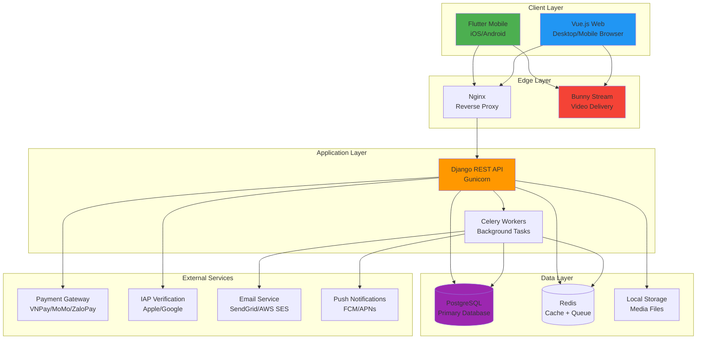
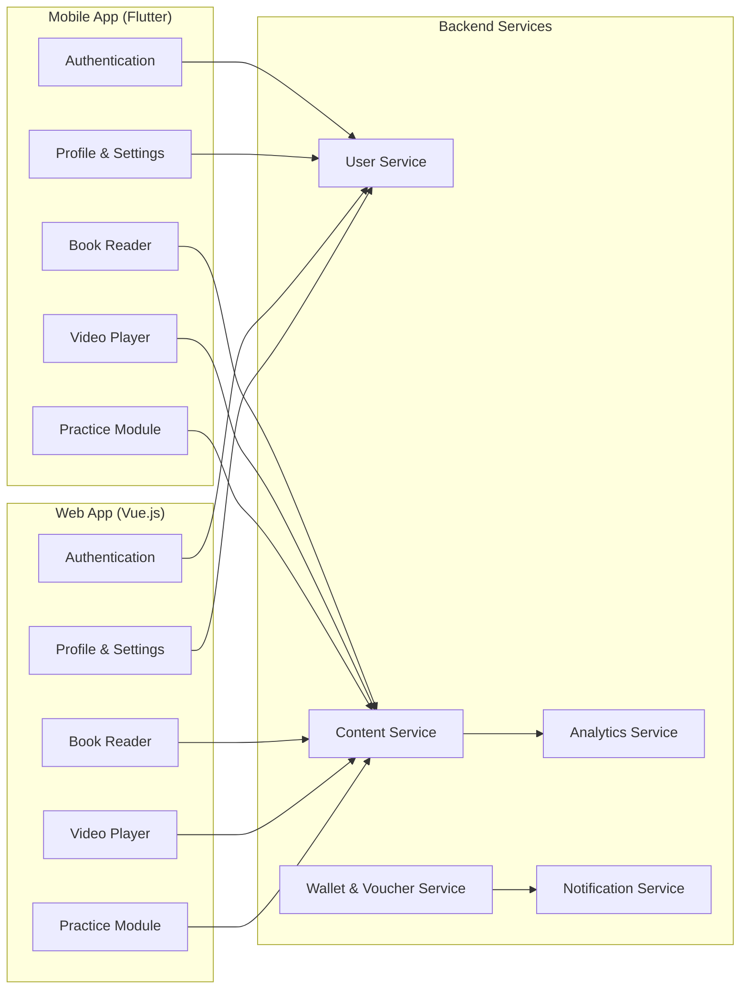
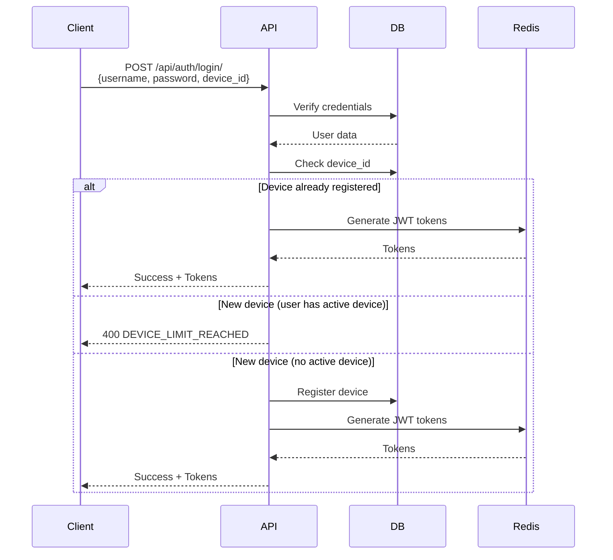
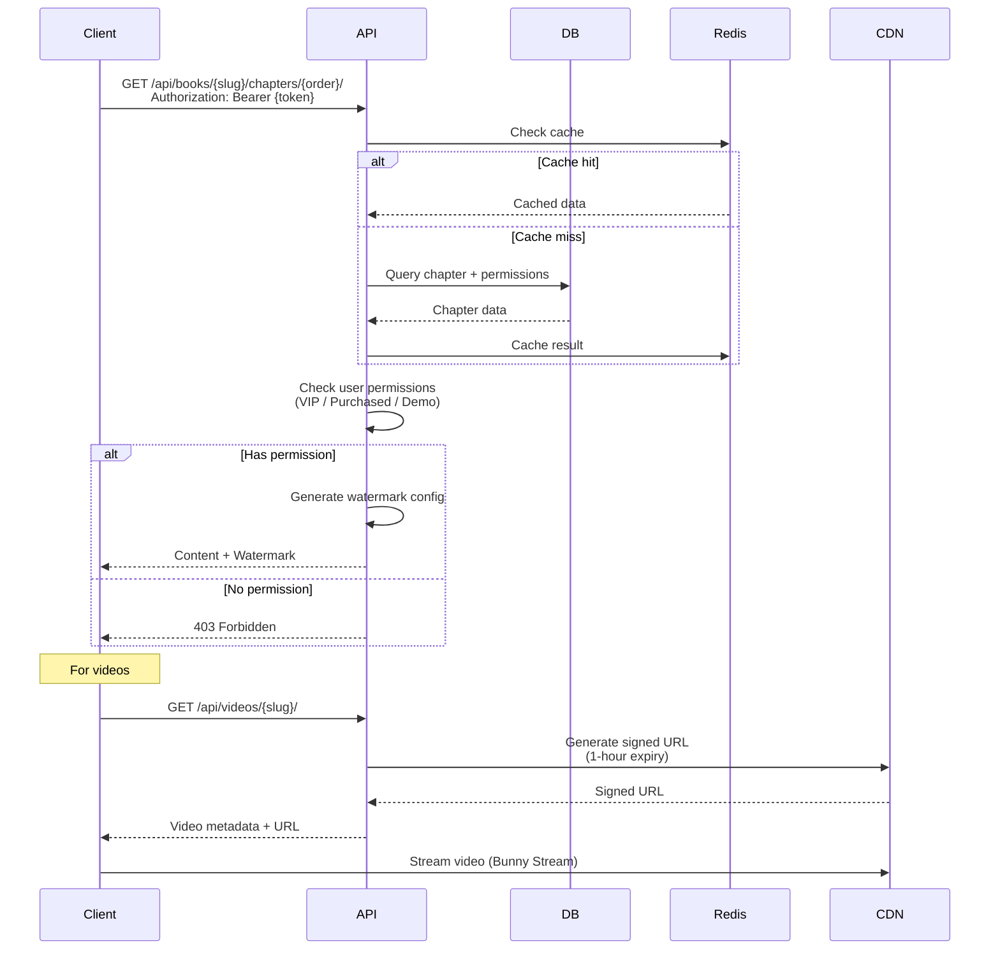
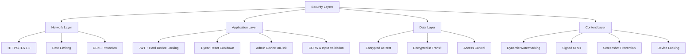
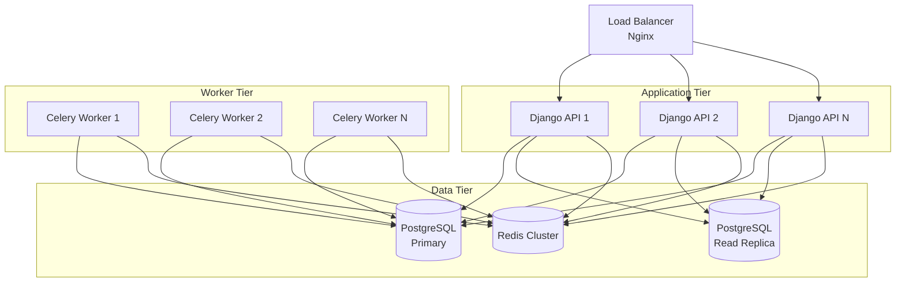
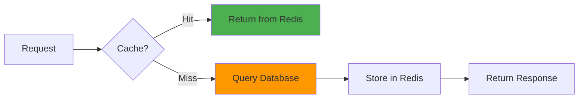
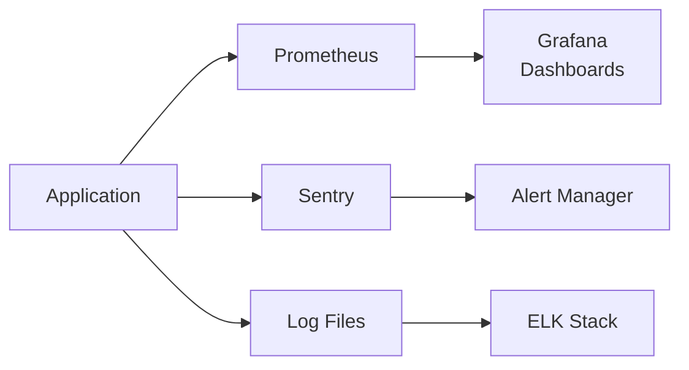
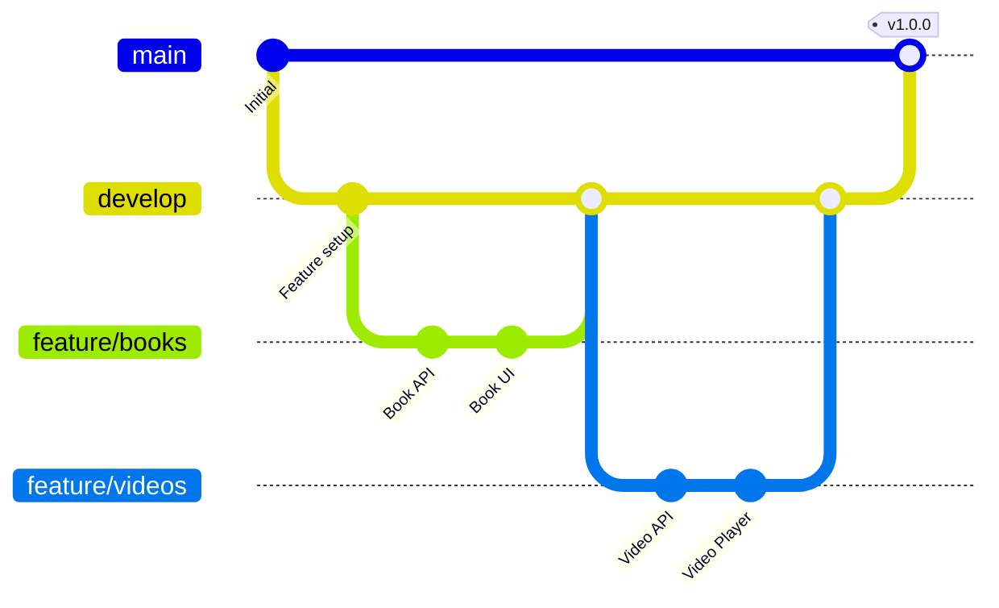

# System Architecture Overview - Feng Shui Learning Platform

## Document Information
- **Project**: Thiên Thư - Feng Shui Learning Platform
- **Version**: 1.0
- **Last Updated**: 2026-02-16
- **Status**: Design Phase

---

## Executive Summary

Thiên Thư is a comprehensive multi-platform learning management system focused on Feng Shui education, featuring:
- **Book reading** with categorized content (Kỳ Môn, Trạch Nhật, Phong Thuỷ, Mệnh Lý)
- **Video learning** with AI-generated transcripts, summaries, and quizzes
- **Practice modules** with flashcards, tests, and case studies
- **Multi-platform support**: Flutter mobile app + Vue.js web application
- **Secure content delivery** with DRM, watermarking, and device locking

---

## Technology Stack

### Frontend Applications

#### Mobile Application
```yaml
Platform: Flutter
Target: iOS 13+ / Android 8+
Language: Dart 3.0+
State Management: Riverpod
Key Packages:
  - flutter_secure_storage: Secure token storage
  - dio: HTTP client with interceptors
  - cached_network_image: Image caching
  - video_player: Video playback
  - flutter_windowmanager: Screenshot prevention
  - device_info_plus: Device fingerprinting
```

#### Web Application
```yaml
Framework: Vue.js 3
Build Tool: Vite
Language: TypeScript
State Management: Pinia
UI Framework: Vuetify 3 / Element Plus
Key Libraries:
  - axios: HTTP client
  - vue-router: Routing
  - pinia-plugin-persistedstate: State persistence
  - video.js: Video player
  - fingerprintjs: Browser fingerprinting
```

### Backend API

```yaml
Framework: Django 4.2+ / Django REST Framework
Language: Python 3.11+
Database: Managed PostgreSQL (Supabase)
Cache: Redis 7+ (Self-hosted)
Task Queue: Celery + Redis
Video Platform: Bunny Stream (Transcoding + Storage + Delivery)
File Storage: Local VPS (PDFs, Cover Images)
Monetization: Hybrid (FREE / VIP Subscription / Pay-Per-Course)
Virtual Currency: Linh Thạch (Recharged externally via Vouchers)
Authentication: JWT (djangorestframework-simplejwt)

Key Packages:
  - django-cors-headers: CORS handling
  - django-filter: Advanced filtering
  - django-jazzmin: Modern admin interface theme
  - drf-spectacular: OpenAPI schema
  - pillow: Image processing
  - celery: Async tasks
```

### Video Delivery (Bunny Stream)

To minimize costs and simplify the workflow, the system uses **Bunny Stream** instead of a manual Storage + CDN setup.

**Key Benefits:**
- **Automatic Transcoding**: Free generation of multiple resolutions.
- **Integrated Player**: Customizable web player included.
- **Security**: Built-in Video DRM and Token Authentication.
- **Low Cost**: Pay-as-you-go pricing without fixed monthly fees (except $1 minimum).

---

## Infrastructure Layer

```yaml
Web Server: Nginx
Application Server: Gunicorn
VPS Provider: Hetzner Cloud (CPX21 - 4GB RAM)
Database Provider: Supabase
Video Platform: Bunny Stream
Storage: Local VPS (PDFs, Images)
Monitoring & Logging: Sentry (Prod) / Timed Rotating Files (Dev)
CI/CD: GitHub Actions
```

---

## System Architecture Diagram



---

## High-Level Component Architecture



---

## Data Flow Architecture

### Authentication Flow



### Content Access Flow



---

## Security Architecture

### Multi-Layer Security



### Device Locking Mechanism

**Requirement**: Each user can only login on 1 device at a time.

**Implementation**:
1. **Device Fingerprinting**
   - Mobile: `device_id` from `device_info_plus` package
   - Web: Browser fingerprint using `fingerprintjs`

2. **Registration Flow**
   ```python
   # On login
   if user.device_id and user.device_id != request_device_id:
       raise DeviceLimitReached()
   
   user.device_id = request_device_id
   user.last_login_device = device_name
   user.save()
   ```

3. **Session Management**
   - Store active device in database
   - Invalidate previous tokens on new device login
   - Admin can manually reset device lock

### Content Protection

#### Watermarking Strategy

**Books**:
```javascript
// Floating watermark overlay
{
  position: 'fixed',
  top: random(10, 90) + '%',
  left: random(10, 90) + '%',
  opacity: 0.3,
  content: '{user_name}\n{phone_number}',
  rotation: random(-15, 15) + 'deg',
  fontSize: '14px',
  color: '#888',
  pointerEvents: 'none',
  userSelect: 'none'
}
```

**Videos**:
```javascript
// Periodic overlay (every 30 seconds)
setInterval(() => {
  showWatermark({
    text: `${userName}\n${phoneNumber}\n${timestamp}`,
    position: randomPosition(),
    duration: 5000 // 5 seconds
  });
}, 30000);
```

#### Video URL Security (Bunny Stream)

```python
def generate_secure_video_url(video, user):
    """Generate time-limited signed URL for Bunny Stream"""
    # Bunny Stream handle tokens automatically via their iframe/API
    # but we can generate tokens if using direct HLS.
```

---

## Scalability Considerations

### Horizontal Scaling



### Caching Strategy



**Cache Layers**:
1. **Browser Cache**: Static assets (images, CSS, JS)
2. **CDN Cache**: Videos, large media files
3. **Redis Cache**: API responses, user sessions
4. **Database Query Cache**: Frequently accessed data

**Cache TTL Strategy**:
```python
CACHE_TTL = {
    'book_list': 300,        # 5 minutes
    'book_detail': 3600,     # 1 hour
    'video_list': 300,       # 5 minutes
    'video_detail': 3600,    # 1 hour
    'user_profile': 1800,    # 30 minutes
    'practice_progress': 60, # 1 minute
}
```

---

## Performance Targets

### Response Time SLAs

| Endpoint Type | Target | Max Acceptable |
|--------------|--------|----------------|
| Authentication | < 200ms | 500ms |
| Content List | < 300ms | 800ms |
| Content Detail | < 400ms | 1000ms |
| Video Streaming | < 2s (initial) | 5s |
| Practice Submit | < 500ms | 1500ms |

### Throughput Targets

| Metric | Initial | Year 1 | Year 2 |
|--------|---------|--------|--------|
| Concurrent Users | 100 | 1,000 | 5,000 |
| Daily Active Users | 500 | 5,000 | 20,000 |
| API Requests/sec | 50 | 500 | 2,000 |
| Video Bandwidth | 100 GB/day | 1 TB/day | 5 TB/day |

---

## Deployment Architecture

### Production Environment

```mermaid
graph TB
    subgraph "Production VPS"
        NGINX[Nginx<br/>Port 80/443]
        
        subgraph "Docker Containers"
            DJANGO[Django API<br/>:8000]
            CELERY[Celery Worker]
            POSTGRES[(PostgreSQL<br/>:5432)]
            REDIS[(Redis<br/>:6379)]
        end
    end
    
    subgraph "External Services"
    subgraph "External Services"
        CDN[Bunny Stream]
        MONITORING[Sentry]
    end
    
    INTERNET[Internet] --> NGINX
    NGINX --> DJANGO
    DJANGO --> CELERY
    DJANGO --> POSTGRES
    DJANGO --> REDIS
    CELERY --> POSTGRES
    CELERY --> REDIS
    
    DJANGO --> CDN
    DJANGO --> MONITORING
```

### Docker Compose Structure

```yaml
services:
  nginx:
    - Reverse proxy
    - SSL termination
    - Static file serving
    
  django:
    - REST API
    - Admin interface (Jazzmin theme)
    - Gunicorn WSGI server
    
  celery:
    - Background tasks
    - Email sending
    - Data processing
    
  postgres:
    - Primary database
    - Persistent volume
    
  redis:
    - Cache layer
    - Celery broker
    - Session storage
```

---

## Monitoring & Observability

### Metrics Collection



### Key Metrics

**Application Metrics**:
- Request rate (req/sec)
- Response time (p50, p95, p99)
- Error rate (%)
- Active users

**Infrastructure Metrics**:
- CPU usage (%)
- Memory usage (%)
- Disk I/O
- Network throughput

**Business Metrics**:
- User registrations
- Content purchases
- Video watch time
- Practice completion rate

---

## Disaster Recovery

### Backup Strategy

```yaml
Database Backups:
  Frequency: Daily (automated)
  Retention: 30 days
  Storage: Local Backup + Offsite Mirror
  Details: |
    # Daily backup command example
    pg_dump -U postgres fengshui_db > backup_$(date +%Y%m%d).sql

Media Files:
  Strategy: Local storage + Rsync to Backup Server
  Retention: 30 days daily backups
  
Backup Strategy:
  - Database: pg_dump daily
  - Media: rsync daily to remote backup
  - Code: Git repository (GitHub)
```

### Recovery Time Objectives

| Component | RTO | RPO |
|-----------|-----|-----|
| Database | 1 hour | 24 hours |
| Application | 30 minutes | 0 (stateless) |
| Media Files | 2 hours | 24 hours |

---

## Development Workflow

### Git Branching Strategy



### CI/CD Pipeline

```yaml
Stages:
  1. Lint & Format:
     - Python: black, flake8, mypy
     - Dart: dart analyze
     - TypeScript: eslint, prettier
     
  2. Test:
     - Backend: pytest
     - Mobile: flutter test
     - Web: vitest
     
  3. Build:
     - Docker images
     - Mobile APK/IPA
     - Web bundle
     
  4. Deploy:
     - Staging: Auto-deploy on develop
     - Production: Manual approval
```

---

## Next Steps

1. **Review & Approval**: Stakeholder review of architecture
2. **Detailed Design**: Create module-specific design documents
3. **Database Schema**: Finalize ERD and migrations
4. **API Specification**: Complete OpenAPI documentation
5. **Prototype**: Build MVP for core features
6. **Testing Strategy**: Define test plans and coverage targets

---

## References

- [Django REST Framework Documentation](https://www.django-rest-framework.org/)
- [Flutter Architecture Guide](https://docs.flutter.dev/development/data-and-backend/state-mgmt)
- [Vue.js Best Practices](https://vuejs.org/guide/best-practices/)
- [Bunny Stream API Documentation](https://docs.bunny.net/)
- [PostgreSQL Performance Tuning](https://www.postgresql.org/docs/current/performance-tips.html)
