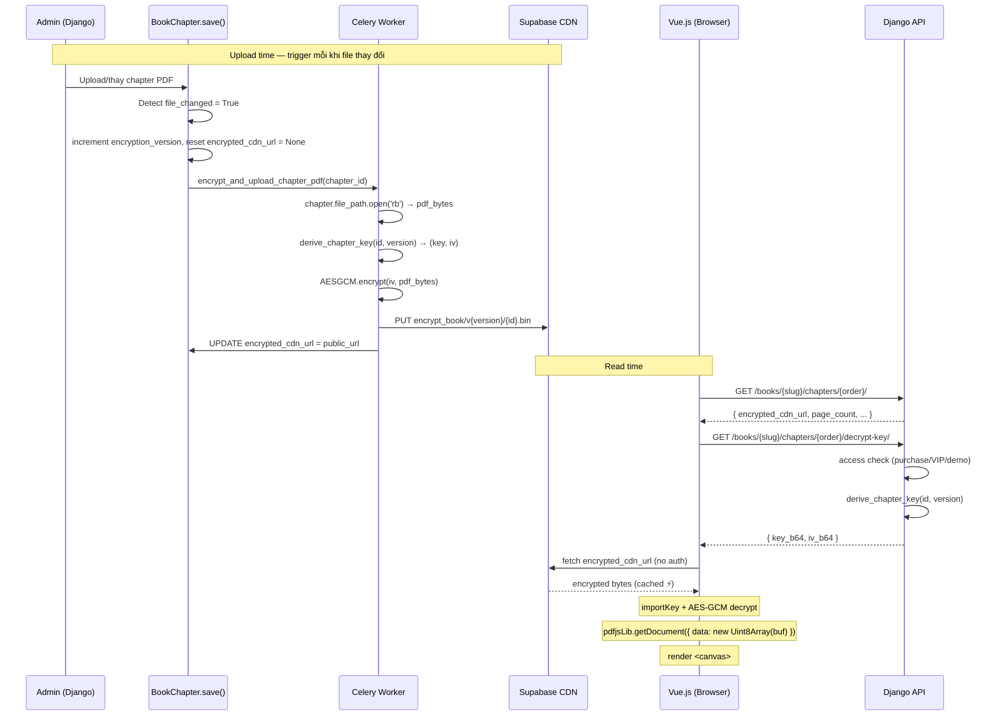

# Feature 18: Mã Hóa File PDF — Encrypt at Upload, CDN Serve, Frontend Decrypt

**Ngày tạo:** 2026-03-14
**Cập nhật:** 2026-03-14
**Status:** ✅ Confirmed
**Priority:** High
**Effort ước tính:** M (~7–9 ngày: BE 3.5 ngày + Celery/Infra 1 ngày + FE 2.5 ngày + Test 1–2 ngày)
**Stack:** Django + Celery + Supabase Storage (CDN) + Vue.js + Web Crypto API + PDF.js

---

## Mục tiêu

Bảo vệ nội dung sách PDF khỏi bị tải xuống qua Network tab của trình duyệt. File PDF nguyên vẹn không bao giờ xuất hiện trên network — chỉ tồn tại dạng ciphertext trên CDN. Backend không nằm trong luồng serve PDF ở read time.

---

## Bối cảnh & Vấn đề

Hiện tại (Feature 16), hệ thống phục vụ file PDF watermark qua `FileResponse` trả về `application/pdf` trực tiếp. Cơ chế bảo vệ hiện có:

- Watermark overlay email user trên canvas.
- Header `Cache-Control: private, no-store`.
- Blur canvas khi tab mất focus, `@contextmenu.prevent`.
- Device locking (1 tài khoản / 1 thiết bị).

**Lỗ hổng còn lại:** Dù có watermark, user vẫn mở DevTools → Network tab → lưu file PDF xuống disk. File này đọc được bằng bất kỳ PDF reader nào.

**Giải pháp:** Encrypt file PDF tại thời điểm upload, lưu bản mã hóa lên Supabase CDN. Frontend tải bản mã hóa về, giải mã trong browser bằng Web Crypto API, render qua PDF.js — không có PDF thật nào đi qua network.

---

## Scope V1

### Làm trong V1

- Celery task mã hóa PDF khi admin upload/thay chapter → đẩy lên Supabase CDN.
- API endpoint `/decrypt-key/` trả key giải mã (auth + access check, anonymous OK cho demo chapter).
- API endpoint `/encrypted-file/` serve encrypted file từ local storage (fallback khi CDN down).
- Frontend fetch bản mã hóa từ CDN, fallback về `/encrypted-file/`, giải mã bằng `crypto.subtle`, render PDF.js.
- Tất cả chapter (kể cả demo) đều encrypt — đồng nhất pipeline.
- Watermark email vẫn giữ nguyên ở lớp canvas overlay.
- Áp dụng cho Web (Vue.js). Mobile (Flutter) giữ nguyên `FLAG_SECURE` + device lock.

### Không làm trong V1

- Chunked streaming decrypt cho PDF > 50MB (defer V2).
- Re-encrypt tự động khi `PDF_MASTER_KEY` rotate (V1 dùng management command `--force`).
- Cleanup encrypted file trên Supabase khi xóa chapter (không cần thiết — orphan files không gây hại).

---

## Kiến trúc tổng quan

```
UPLOAD TIME — async, trigger mỗi khi admin upload/thay file chapter:

  Admin → Django Admin → BookChapter.save() [file_changed = True]
       → increment encryption_version
       → reset encrypted_cdn_url = None
       → Celery: encrypt_and_upload_chapter_pdf(chapter_id)
           → derive_chapter_key(chapter_id, version)          [HMAC-SHA256]
           → AES-256-GCM encrypt(pdf_bytes)
           → Supabase: {BUCKET}/encrypt_book/v{version}/{chapter_id}.bin
           → BookChapter.update(encrypted_cdn_url=public_url)


READ TIME — mỗi lần user mở chương:

  1. Frontend  →  GET /api/books/{slug}/chapters/{order}/
                  ← { encrypted_cdn_url, page_count, ... }

  2. Frontend  →  GET /api/books/{slug}/chapters/{order}/decrypt-key/
                  [JWT auth nếu non-demo; anonymous OK nếu is_demo]
                  ← { key_b64, iv_b64 }

  3. Frontend  →  fetch encrypted_cdn_url  [no auth — Supabase public policy]
                  ← encrypted bytes  (CDN cached ⚡)
                  [nếu CDN fail → fallback GET /api/.../encrypted-file/]

  4. Frontend  →  crypto.subtle.decrypt(AES-GCM) → Uint8Array
              →   pdfjsLib.getDocument({ data: Uint8Array }) → render <canvas>
```

**Nguyên lý bảo mật:** File mã hóa public trên CDN vì encrypted bytes vô nghĩa khi không có key. Bảo mật nằm ở `/decrypt-key/` (có access check). CDN path bao gồm `encryption_version` nên mỗi lần re-encrypt sinh path mới — bypass CDN immutable cache tự động.

---

## Sequence Diagram



---

## Database

### BookChapter — thêm 2 fields

```python
# books/models.py
class BookChapter(models.Model):
    # ... existing fields ...
    encrypted_cdn_url = models.URLField(
        blank=True, null=True,
        help_text="Public URL bản PDF mã hóa trên Supabase CDN. Null nếu chưa encrypt."
    )
    encryption_version = models.PositiveIntegerField(
        default=1,
        help_text="Tăng mỗi lần re-encrypt. Đưa vào IV derivation để tránh GCM nonce reuse."
    )
```

```bash
docker-compose -f docker/docker-compose.yml exec web python manage.py makemigrations books
docker-compose -f docker/docker-compose.yml exec web python manage.py migrate
```

**Tại sao cần `encryption_version`?**

AES-256-GCM yêu cầu `(key, IV)` pair không được tái sử dụng cho 2 plaintext khác nhau. Nếu admin re-upload file PDF mới cho cùng chapter_id mà IV vẫn giữ nguyên → GCM catastrophic failure: attacker XOR 2 ciphertext để lộ XOR của 2 plaintext. `encryption_version` đưa vào IV derivation đảm bảo mỗi lần re-encrypt có IV mới.

---

## Backend

### Cấu trúc file

```
src/backend/
├── books/
│   ├── models.py                        MODIFY — thêm encrypted_cdn_url, encryption_version
│   │                                             trigger Celery trong save() khi file_changed
│   ├── tasks.py                         CREATE — Celery task encrypt + upload
│   ├── views.py                         MODIFY — ChapterDecryptKeyView, ChapterEncryptedFileView
│   ├── urls.py                          MODIFY — /decrypt-key/, /encrypted-file/
│   ├── serializers.py                   MODIFY — expose encrypted_cdn_url
│   └── services/
│       └── pdf_encryption.py            CREATE — derive_chapter_key(), _s3_client()
└── config/
    └── settings.py                      MODIFY — PDF_MASTER_KEY
```

---

### `pdf_encryption.py` — Key Derivation & S3 Client

```python
# books/services/pdf_encryption.py
import hmac
import hashlib
import boto3
from django.conf import settings


def derive_chapter_key(chapter_id: int, version: int) -> tuple[bytes, bytes]:
    """
    Derive (key, iv) từ MASTER_KEY + chapter_id + version.

    Version-aware: mỗi lần re-encrypt với version mới → IV khác → không GCM nonce reuse.
    Deterministic: cùng (chapter_id, version) → cùng (key, iv) → CDN cache ổn định trong 1 version.
    Không lưu key vào DB — derive lại được bất cứ lúc nào từ MASTER_KEY.
    """
    master = settings.PDF_MASTER_KEY.encode()
    key = hmac.new(master, f"enc-key:{chapter_id}".encode(), hashlib.sha256).digest()        # 32 bytes
    iv  = hmac.new(master, f"enc-iv:{chapter_id}:v{version}".encode(), hashlib.sha256).digest()[:12]  # 12 bytes GCM
    return key, iv


def get_s3_client():
    """S3-compatible boto3 client cho Supabase Storage. Shared bởi task và management command."""
    return boto3.client(
        "s3",
        endpoint_url=f"https://{settings.SUPABASE_PROJECT_REF}.supabase.co/storage/v1/s3",
        aws_access_key_id=settings.SUPABASE_S3_ACCESS_KEY_ID,
        aws_secret_access_key=settings.SUPABASE_S3_SECRET_ACCESS_KEY,
        region_name=getattr(settings, "SUPABASE_REGION", "ap-southeast-1"),
    )


def encrypted_cdn_path(chapter_id: int, version: int) -> str:
    """S3 key cho encrypted file. Version trong path để bypass CDN immutable cache khi re-encrypt."""
    return f"encrypt_book/v{version}/{chapter_id}.bin"


def encrypted_cdn_url(chapter_id: int, version: int) -> str:
    """Public URL của encrypted file trên Supabase CDN."""
    path = encrypted_cdn_path(chapter_id, version)
    return (
        f"https://{settings.SUPABASE_PROJECT_REF}.supabase.co"
        f"/storage/v1/object/public/{settings.SUPABASE_STORAGE_BUCKET}/{path}"
    )
```

---

### `models.py` — Trigger Celery trong `save()`

Thay vì `post_save` signal (không detect file thay đổi), trigger trực tiếp trong `BookChapter.save()` tại chỗ đã có `file_changed`:

```python
# books/models.py — trong BookChapter.save(), sau block update file_size/page_count
from django.db.models import F

# ... existing file_changed detection logic ...

if file_changed:
    # Reset encrypted_cdn_url và tăng version để IV mới được derive
    # Dùng UPDATE thay vì save() để không trigger save() recursively
    BookChapter.objects.filter(pk=self.pk).update(
        encrypted_cdn_url=None,
        encryption_version=F('encryption_version') + 1,
    )
    # Trigger Celery async
    from books.tasks import encrypt_and_upload_chapter_pdf
    encrypt_and_upload_chapter_pdf.delay(self.pk)
```

> **Lý do không dùng `post_save` signal:** Signal không có `old_file_name` nên không biết file có thực sự thay đổi. `BookChapter.save()` đã có `file_changed` logic — tận dụng chỗ này là cleanest.

---

### `tasks.py` — Celery Task

```python
# books/tasks.py
from celery import shared_task
from cryptography.hazmat.primitives.ciphers.aead import AESGCM

from .models import BookChapter
from .services.pdf_encryption import derive_chapter_key, get_s3_client, encrypted_cdn_path, encrypted_cdn_url
from django.conf import settings


@shared_task(bind=True, max_retries=3, default_retry_delay=60)
def encrypt_and_upload_chapter_pdf(self, chapter_id: int):
    """
    Encrypt chapter PDF bằng AES-256-GCM và upload lên Supabase CDN.
    Trigger: BookChapter.save() khi file_path thay đổi.
    """
    try:
        chapter = BookChapter.objects.get(id=chapter_id)
    except BookChapter.DoesNotExist:
        return  # Chapter đã bị xóa trong lúc task queue — không retry

    if not chapter.file_path:
        return

    try:
        # 1. Đọc file qua Django storage API (hoạt động cả local lẫn Supabase)
        with chapter.file_path.open('rb') as f:
            pdf_bytes = f.read()

        # 2. Derive key + IV theo version hiện tại
        version = chapter.encryption_version
        key, iv = derive_chapter_key(chapter_id, version)

        # 3. AES-256-GCM encrypt (16-byte auth tag append vào cuối ciphertext)
        encrypted = AESGCM(key).encrypt(iv, pdf_bytes, associated_data=None)

        # 4. Upload lên Supabase — path chứa version để bypass CDN immutable cache
        cdn_path = encrypted_cdn_path(chapter_id, version)
        get_s3_client().put_object(
            Bucket=settings.SUPABASE_STORAGE_BUCKET,
            Key=cdn_path,
            Body=encrypted,
            ContentType="application/octet-stream",
            CacheControl="public, max-age=31536000, immutable",
        )

        # 5. Lưu public URL — dùng UPDATE để không trigger save() recursively
        BookChapter.objects.filter(pk=chapter_id).update(
            encrypted_cdn_url=encrypted_cdn_url(chapter_id, version)
        )

    except Exception as exc:
        raise self.retry(exc=exc)
```

---

### Management Command — Encrypt & Upload hàng loạt

```python
# books/management/commands/encrypt_chapters.py
from cryptography.hazmat.primitives.ciphers.aead import AESGCM
from django.conf import settings
from django.core.management.base import BaseCommand
from django.db.models import F

from books.models import BookChapter
from books.services.pdf_encryption import (
    derive_chapter_key, get_s3_client,
    encrypted_cdn_path, encrypted_cdn_url,
)


def _encrypt_and_upload(chapter: BookChapter, s3) -> str:
    """Encrypt chapter và upload. Trả về public URL."""
    with chapter.file_path.open("rb") as f:
        pdf_bytes = f.read()

    version = chapter.encryption_version
    key, iv = derive_chapter_key(chapter.id, version)
    encrypted = AESGCM(key).encrypt(iv, pdf_bytes, associated_data=None)

    cdn_path = encrypted_cdn_path(chapter.id, version)
    s3.put_object(
        Bucket=settings.SUPABASE_STORAGE_BUCKET,
        Key=cdn_path,
        Body=encrypted,
        ContentType="application/octet-stream",
        CacheControl="public, max-age=31536000, immutable",
    )
    return encrypted_cdn_url(chapter.id, version)


class Command(BaseCommand):
    help = "Encrypt chapter PDFs và upload lên Supabase CDN subfolder."

    def add_arguments(self, parser):
        parser.add_argument(
            "--force", action="store_true",
            help="Re-encrypt toàn bộ (kể cả đã có encrypted_cdn_url). Tự động tăng encryption_version.",
        )
        parser.add_argument(
            "--id", type=int, dest="chapter_id",
            help="Chỉ encrypt một chapter theo ID.",
        )

    def handle(self, *args, **options):
        force = options["force"]
        chapter_id = options.get("chapter_id")

        qs = BookChapter.objects.filter(file_path__isnull=False).exclude(file_path="")
        if chapter_id:
            qs = qs.filter(id=chapter_id)
        elif not force:
            qs = qs.filter(encrypted_cdn_url__isnull=True)

        total = qs.count()
        if total == 0:
            self.stdout.write(self.style.SUCCESS("Không có chapter nào cần encrypt."))
            return

        if force:
            # Increment version trước khi encrypt để đảm bảo IV mới
            qs.update(encryption_version=F('encryption_version') + 1, encrypted_cdn_url=None)
            qs = qs.select_related("book")  # re-query để lấy version mới

        self.stdout.write(f"Encrypting {total} chapter(s){'  [--force]' if force else ''}...")
        s3 = get_s3_client()
        ok, failed = 0, []

        for chapter in qs.select_related("book").iterator():
            label = f"[{chapter.book.title} / Chương {chapter.order} (id={chapter.id}, v{chapter.encryption_version})]"
            try:
                url = _encrypt_and_upload(chapter, s3)
                BookChapter.objects.filter(pk=chapter.id).update(encrypted_cdn_url=url)
                ok += 1
                self.stdout.write(f"  ✓ {label}")
            except Exception as exc:
                failed.append(chapter.id)
                self.stderr.write(self.style.ERROR(f"  ✗ {label}: {exc}"))

        self.stdout.write("")
        self.stdout.write(self.style.SUCCESS(f"Xong: {ok}/{total} thành công."))
        if failed:
            self.stdout.write(self.style.ERROR(f"Failed IDs: {failed}"))
```

**Cách dùng:**

```bash
# Lần đầu — sinh file cho toàn bộ chapter hiện có
docker-compose -f docker/docker-compose.yml exec web python manage.py encrypt_chapters

# Re-encrypt toàn bộ sau khi đổi PDF_MASTER_KEY
docker-compose -f docker/docker-compose.yml exec web python manage.py encrypt_chapters --force

# Debug/retry 1 chapter
docker-compose -f docker/docker-compose.yml exec web python manage.py encrypt_chapters --id 42
```

---

### `views.py` — Key Delivery & Fallback File Endpoint

```python
# books/views.py (thêm vào)
import base64
from django.http import FileResponse, StreamingHttpResponse
from rest_framework.views import APIView
from rest_framework.permissions import AllowAny, IsAuthenticated
from rest_framework.response import Response
from rest_framework.throttling import UserRateThrottle
from django.shortcuts import get_object_or_404

from .models import BookChapter
from .services.pdf_encryption import derive_chapter_key


class DecryptKeyThrottle(UserRateThrottle):
    """60 requests/giờ per user — đủ cho session đọc sách bình thường."""
    rate = '60/hour'


class ChapterDecryptKeyView(APIView):
    """
    GET /api/books/{slug}/chapters/{order}/decrypt-key/

    Trả (key, iv) để frontend giải mã encrypted PDF.
    - Demo chapters: anonymous OK (public content).
    - Non-demo: yêu cầu JWT + purchase/VIP.
    """
    permission_classes = [AllowAny]
    throttle_classes = [DecryptKeyThrottle]

    def get(self, request, slug, order):
        chapter = get_object_or_404(BookChapter, book__slug=slug, order=order)

        # Demo chapters: bất kỳ ai cũng đọc được
        if not chapter.is_demo:
            if not request.user.is_authenticated:
                return Response({'detail': 'Yêu cầu đăng nhập.'}, status=401)
            if not _can_access_chapter(request.user, chapter.book, chapter):
                return Response({'detail': 'Không có quyền truy cập.'}, status=403)

        if not chapter.encrypted_cdn_url:
            return Response({'detail': 'Chương đang được xử lý, vui lòng thử lại sau.'}, status=503)

        key, iv = derive_chapter_key(chapter.id, version=chapter.encryption_version)
        return Response({
            'key_b64': base64.b64encode(key).decode(),
            'iv_b64':  base64.b64encode(iv).decode(),
        })


class ChapterEncryptedFileView(APIView):
    """
    GET /api/books/{slug}/chapters/{order}/encrypted-file/

    Fallback: serve encrypted file từ local storage khi Supabase CDN không khả dụng.
    Cùng access check với /decrypt-key/. Trả binary stream.
    """
    permission_classes = [AllowAny]

    def get(self, request, slug, order):
        chapter = get_object_or_404(BookChapter, book__slug=slug, order=order)

        if not chapter.is_demo:
            if not request.user.is_authenticated:
                return Response({'detail': 'Yêu cầu đăng nhập.'}, status=401)
            if not _can_access_chapter(request.user, chapter.book, chapter):
                return Response({'detail': 'Không có quyền truy cập.'}, status=403)

        if not chapter.file_path:
            return Response({'detail': 'File không tồn tại.'}, status=404)

        from cryptography.hazmat.primitives.ciphers.aead import AESGCM

        with chapter.file_path.open('rb') as f:
            pdf_bytes = f.read()

        key, iv = derive_chapter_key(chapter.id, version=chapter.encryption_version)
        encrypted = AESGCM(key).encrypt(iv, pdf_bytes, associated_data=None)

        return StreamingHttpResponse(
            iter([encrypted]),
            content_type='application/octet-stream',
            headers={'Cache-Control': 'private, no-store'},
        )
```

> **Note:** `ChapterEncryptedFileView` encrypt on-the-fly từ local file — chỉ dùng khi CDN down. Không cache, không store thêm. Vì kết quả giống hệt file trên CDN (cùng key+iv+plaintext → cùng ciphertext với AES-GCM deterministic), frontend có thể dùng cùng decrypt key.

---

### `urls.py`

```python
# books/urls.py (thêm vào urlpatterns)
path('<slug:slug>/chapters/<int:order>/decrypt-key/', views.ChapterDecryptKeyView.as_view(), name='chapter_decrypt_key'),
path('<slug:slug>/chapters/<int:order>/encrypted-file/', views.ChapterEncryptedFileView.as_view(), name='chapter_encrypted_file'),
```

---

### Settings — chỉ thêm 1 var mới

```python
# config/settings.py
PDF_MASTER_KEY = env('PDF_MASTER_KEY')  # 32+ char random string
# SUPABASE_PROJECT_REF, SUPABASE_S3_ACCESS_KEY_ID, SUPABASE_S3_SECRET_ACCESS_KEY,
# SUPABASE_STORAGE_BUCKET, SUPABASE_REGION — đã có sẵn
```

```bash
# .env — generate key:
PDF_MASTER_KEY=$(openssl rand -hex 32)
```

---

### `serializers.py` — Expose `encrypted_cdn_url`

```python
# BookChapterContentSerializer — thêm field
class BookChapterContentSerializer(serializers.Serializer):
    # ... existing fields ...
    encrypted_cdn_url = serializers.URLField(allow_null=True)
```

---

### Supabase Storage Policy

Chạy 1 lần trong **Supabase Dashboard → SQL Editor**:

```sql
-- Cho phép anonymous read trên subfolder encrypt_book/ của bucket hiện tại
-- (bucket vẫn là private; chỉ prefix này được public)
CREATE POLICY "Public read for encrypted books"
ON storage.objects FOR SELECT
TO anon
USING (
    bucket_id = 'media'   -- thay bằng giá trị SUPABASE_STORAGE_BUCKET thực tế
    AND name LIKE 'encrypt_book/%'
);
```

Cũng cần cấu hình **CORS** cho bucket trên Supabase Dashboard → Storage → Bucket → CORS:

```json
[{
  "allowedOrigins": ["https://yourdomain.com"],
  "allowedMethods": ["GET"],
  "allowedHeaders": ["*"],
  "maxAgeSeconds": 3600
}]
```

---

## Frontend

### `usePdfDecryption.js`

```javascript
// src/composables/usePdfDecryption.js
import * as pdfjsLib from 'pdfjs-dist'

/**
 * Tải và giải mã PDF từ Supabase CDN (với fallback về backend).
 *
 * Flow:
 *   1. GET /decrypt-key/ → { key_b64, iv_b64 }
 *   2. fetch CDN URL → encrypted bytes (fallback: GET /encrypted-file/)
 *   3. crypto.subtle.decrypt (AES-256-GCM) → plaintext
 *   4. pdfjsLib.getDocument({ data: Uint8Array }) → PDFDocumentProxy
 */
export function usePdfDecryption() {

  async function loadEncryptedPdf(encryptedCdnUrl, decryptKeyUrl, fallbackFileUrl, apiClient) {
    // 1. Lấy key từ backend (auth check ở server)
    const { data: keyData } = await apiClient.get(decryptKeyUrl)

    const cryptoKey = await crypto.subtle.importKey(
      'raw',
      _b64ToBytes(keyData.key_b64),
      { name: 'AES-GCM' },
      false,
      ['decrypt']
    )
    const iv = _b64ToBytes(keyData.iv_b64)

    // 2. Fetch encrypted file — CDN trước, fallback về backend nếu CDN fail
    let encryptedBuffer
    try {
      const response = await fetch(encryptedCdnUrl)
      if (!response.ok) throw new Error(`CDN ${response.status}`)
      encryptedBuffer = await response.arrayBuffer()
    } catch {
      // Fallback: backend serve encrypted file từ local storage
      const fallback = await apiClient.get(fallbackFileUrl, { responseType: 'arraybuffer' })
      encryptedBuffer = fallback.data
    }

    // 3. Giải mã AES-256-GCM
    const decryptedBuffer = await crypto.subtle.decrypt(
      { name: 'AES-GCM', iv },
      cryptoKey,
      encryptedBuffer
    )

    // 4. PDF.js cần Uint8Array, không phải ArrayBuffer
    return await pdfjsLib.getDocument({ data: new Uint8Array(decryptedBuffer) }).promise
  }

  /**
   * Chuyển base64 → Uint8Array.
   * Trả Uint8Array (TypedArray) thay vì ArrayBuffer để tương thích
   * với Web Crypto API trên mọi browser (bao gồm Safari < 15).
   */
  function _b64ToBytes(b64) {
    const binary = atob(b64)
    const bytes = new Uint8Array(binary.length)
    for (let i = 0; i < binary.length; i++) bytes[i] = binary.charCodeAt(i)
    return bytes
  }

  return { loadEncryptedPdf }
}
```

---

### `BookReaderView.vue` — Tích hợp

```javascript
// <script setup>
import { usePdfDecryption } from '../composables/usePdfDecryption'

const { loadEncryptedPdf } = usePdfDecryption()

async function loadChapter(order, page = 1) {
  chapterLoading.value = true
  error.value = null

  const chapterRes = await booksService.getChapter(bookSlug, order).catch(() => null)
  if (!chapterRes) {
    error.value = 'Không có quyền truy cập chương này.'
    chapterLoading.value = false
    return
  }

  const { encrypted_cdn_url, page_count, has_training_set } = chapterRes.data

  try {
    pdfDoc.value = await loadEncryptedPdf(
      encrypted_cdn_url,
      `books/${bookSlug}/chapters/${order}/decrypt-key/`,
      `books/${bookSlug}/chapters/${order}/encrypted-file/`,
      api
    )
  } catch (err) {
    if (err.response?.status === 503) {
      error.value = 'Chương đang được xử lý, vui lòng thử lại sau vài phút.'
    } else if (err.response?.status === 401) {
      error.value = 'Phiên đăng nhập hết hạn, vui lòng đăng nhập lại.'
    } else {
      error.value = 'Không thể tải chương, vui lòng thử lại.'
    }
    chapterLoading.value = false
    return
  }

  chapterPageCount.value = page_count ?? 0
  currentChapterHasTraining.value = !!has_training_set
  await nextTick()
  await new Promise(resolve => requestAnimationFrame(resolve))
  await renderPage(page)
  chapterLoading.value = false
}
```

---

## Ưu điểm & Nhược điểm

### Ưu điểm

| # | Ưu điểm | Lý do |
|---|---------|-------|
| 1 | **PDF thật không bao giờ trên network** | Chỉ ciphertext đi qua wire. Network tab chỉ thấy `.bin` binary noise. |
| 2 | **Backend không chịu PDF bandwidth** | CDN serve file. Backend chỉ trả ~200 bytes JSON key. 100 concurrent = 100 tiny responses. |
| 3 | **CDN cache ổn định** | Encrypted file bất biến trong 1 version. Path có version → cache invalidate tự động khi re-encrypt. |
| 4 | **Không tốn RAM backend** | Không decrypt, không stream ở read time. RAM chỉ tốn ở Celery worker lúc upload. |
| 5 | **Fallback tự động** | CDN down → frontend tự fallback về `/encrypted-file/` — không mất service. |
| 6 | **GCM nonce reuse safe** | `encryption_version` trong IV derivation đảm bảo mỗi lần re-upload có IV mới. |
| 7 | **Không cần thư viện mới** | `boto3` + `cryptography` đã có. `crypto.subtle` là Web API native. |

### Nhược điểm & Trade-off (đã chấp nhận)

| # | Nhược điểm | Mức độ | Quyết định |
|---|-----------|--------|------------|
| 1 | **Key không expire** | Trung bình | ✅ Access revoke qua access check ở `/decrypt-key/` — hiệu lực tức thì. |
| 2 | **Key trong browser memory** | Cao (lý thuyết) | ✅ Giới hạn của mọi client-side approach. Key mất khi tab đóng. |
| 3 | **AES-GCM decrypt toàn bộ file** | Thấp | ✅ PDF hiện tại < 20MB — chấp nhận. Chunked V2 nếu cần. |
| 4 | **Celery task delay sau upload** | Thấp | ✅ Admin upload xong, Celery chạy nền. 503 nếu chưa xong. |
| 5 | **Orphan encrypted files** | Rất thấp | ✅ Không cleanup khi xóa chapter. File cũ không ảnh hưởng service. |
| 6 | **Key rotation manual** | Trung bình | ✅ `--force` management command. Không thường xuyên. |

---

## Tính khả thi

### Dependencies

| Dependency | Trạng thái | Ghi chú |
|-----------|-----------|---------|
| `cryptography` (Python) | Đã có | `AESGCM` class |
| `boto3` | Đã có | Shared từ `config/storage.py` |
| Supabase Storage policy | Cần tạo 1 lần | SQL: anon SELECT trên `encrypt_book/*` |
| Supabase CORS config | Cần setup 1 lần | Cho phép browser fetch từ frontend domain |
| `crypto.subtle` (Web API) | Native browser | Cần HTTPS (đã có) |
| `pdfjs-dist` | Đã có (Feature 16) | Không thay đổi |
| Celery + Redis | Đã có | Worker đã chạy |

### Risk Assessment

| Rủi ro | Xác suất | Tác động | Biện pháp |
|--------|----------|----------|-----------|
| GCM nonce reuse | Thấp | Critical | `encryption_version` trong IV derivation — đã xử lý trong design |
| Browser không support `crypto.subtle` | Thấp (<1%) | Cao | Error message rõ ràng |
| Supabase CDN down | Thấp | Trung bình | Fallback `/encrypted-file/` endpoint — tự động |
| PDF > 50MB OOM trong browser | Thấp (< 20MB hiện tại) | Cao | Giới hạn upload size, chunked V2 |
| Celery task fail → `encrypted_cdn_url` null | Thấp | Trung bình | Retry 3 lần, 503 rõ ràng cho user |
| `PDF_MASTER_KEY` leak | Rất thấp | Critical | Lưu trong env vault, không commit |
| Concurrent tasks cùng chapter (race condition) | Rất thấp | Thấp | Version increment + upsert → cuối cùng consistent |

### Effort

| Task | Estimate |
|------|----------|
| DB migration (2 fields mới) | 0.5 ngày |
| `pdf_encryption.py` (key derive + s3 + helpers) | 0.5 ngày |
| Supabase policy + CORS setup | 0.5 ngày |
| `BookChapter.save()` trigger + Celery task | 1 ngày |
| Management command `encrypt_chapters` | 0.5 ngày |
| `ChapterDecryptKeyView` (rate limit + demo auth) | 0.5 ngày |
| `ChapterEncryptedFileView` (fallback) | 0.5 ngày |
| Serializer + URL routing | 0.5 ngày |
| `usePdfDecryption.js` (CDN + fallback + decrypt) | 1 ngày |
| `BookReaderView.vue` integration + error states | 0.5 ngày |
| Testing (cross-browser, CDN fallback, re-upload) | 1–2 ngày |
| **Tổng** | **~7–9 ngày** |

---

## Files cần tạo/sửa

| File | Action | Mô tả |
|------|--------|-------|
| `src/backend/books/models.py` | MODIFY | Thêm `encrypted_cdn_url`, `encryption_version`; trigger Celery trong `save()` |
| `src/backend/books/migrations/00xx_*.py` | CREATE | Migration 2 fields mới |
| `src/backend/books/services/pdf_encryption.py` | CREATE | `derive_chapter_key()`, `get_s3_client()`, URL helpers |
| `src/backend/books/tasks.py` | CREATE | `encrypt_and_upload_chapter_pdf` Celery task |
| `src/backend/books/management/__init__.py` | CREATE | Package init |
| `src/backend/books/management/commands/__init__.py` | CREATE | Package init |
| `src/backend/books/management/commands/encrypt_chapters.py` | CREATE | Management command |
| `src/backend/books/views.py` | MODIFY | `ChapterDecryptKeyView` + `ChapterEncryptedFileView` |
| `src/backend/books/urls.py` | MODIFY | `/decrypt-key/`, `/encrypted-file/` |
| `src/backend/books/serializers.py` | MODIFY | Expose `encrypted_cdn_url` |
| `src/backend/config/settings.py` | MODIFY | Thêm `PDF_MASTER_KEY` |
| `src/backend/.env` / `.env.production` | MODIFY | `PDF_MASTER_KEY=<openssl rand -hex 32>` |
| `src/frontend/src/composables/usePdfDecryption.js` | CREATE | CDN fetch + fallback + WebCrypto decrypt |
| `src/frontend/src/views/BookReaderView.vue` | MODIFY | Dùng `usePdfDecryption`, 3 URLs, error states |

---

## Checklist Implement

### Infra (1 lần)

- [ ] Supabase SQL Editor: `CREATE POLICY "Public read for encrypted books"` cho `encrypt_book/%`
- [ ] Supabase Dashboard → Storage → Bucket → CORS: allow GET từ frontend domain
- [ ] Generate `PDF_MASTER_KEY`: `openssl rand -hex 32` → thêm vào `.env` và `.env.production`
- [ ] `settings.py`: thêm `PDF_MASTER_KEY = env('PDF_MASTER_KEY')`

### Backend

- [ ] `BookChapter` model: thêm `encrypted_cdn_url`, `encryption_version`
- [ ] Migration: `makemigrations books && migrate`
- [ ] `models.py`: trong `save()` khi `file_changed`, increment `encryption_version`, reset `encrypted_cdn_url`, trigger Celery
- [ ] `pdf_encryption.py`: `derive_chapter_key(id, version)`, `get_s3_client()`, path/url helpers
- [ ] `tasks.py`: read via `chapter.file_path.open('rb')`, handle `DoesNotExist`, use `update()` không `save()`
- [ ] Management command `encrypt_chapters`: `--force` increment version trước khi encrypt
- [ ] **Chạy ngay sau deploy:** `python manage.py encrypt_chapters`
- [ ] `ChapterDecryptKeyView`: `AllowAny` + manual auth cho non-demo, rate limit 60/hour
- [ ] `ChapterEncryptedFileView`: same access check, encrypt on-the-fly, stream binary
- [ ] URLs: `/decrypt-key/`, `/encrypted-file/`
- [ ] Serializer: expose `encrypted_cdn_url` trong chapter response

### Frontend

- [ ] `usePdfDecryption.js`: `_b64ToBytes()` trả `Uint8Array` (không phải `.buffer`)
- [ ] `usePdfDecryption.js`: CDN fetch → fallback `/encrypted-file/` → decrypt → `new Uint8Array(decryptedBuffer)` → PDF.js
- [ ] `BookReaderView.vue`: truyền 3 URLs (CDN, decrypt-key, encrypted-file), handle 503/401/generic error

### Testing

- [ ] Upload chapter mới → verify `encrypted_cdn_url` được set, `encryption_version = 1`
- [ ] Re-upload chapter → verify `encryption_version` tăng, `encrypted_cdn_url` URL path thay đổi
- [ ] Fetch CDN URL trực tiếp → binary noise, không thể open bằng PDF reader
- [ ] Đọc sách (non-demo) → render đúng
- [ ] Đọc demo chapter khi chưa login → render đúng (anonymous OK)
- [ ] User không có quyền → `/decrypt-key/` trả 403
- [ ] Chapter chưa encrypt → `/decrypt-key/` trả 503
- [ ] Giả lập CDN fail (sai CDN URL) → fallback `/encrypted-file/` → render đúng
- [ ] Network tab: không có `application/pdf` request nào
- [ ] Test Chrome, Firefox, Safari (macOS + iOS)
- [ ] Test PDF > 20MB — browser memory OK
- [ ] `encrypt_chapters --force` → version tăng, URL mới, đọc lại OK

---

## Tham khảo

- `md/design/feature-16-pdf-reader-v1.md` — DRM protection layer hiện tại
- `md/core/system-overview.md` — Hạ tầng và stack
- `md/security/security-drm.md` — Tổng quan DRM và device locking
- [Web Crypto API — MDN](https://developer.mozilla.org/en-US/docs/Web/API/Web_Crypto_API)
- [AES-GCM — NIST SP 800-38D](https://csrc.nist.gov/publications/detail/sp/800-38d/final)
