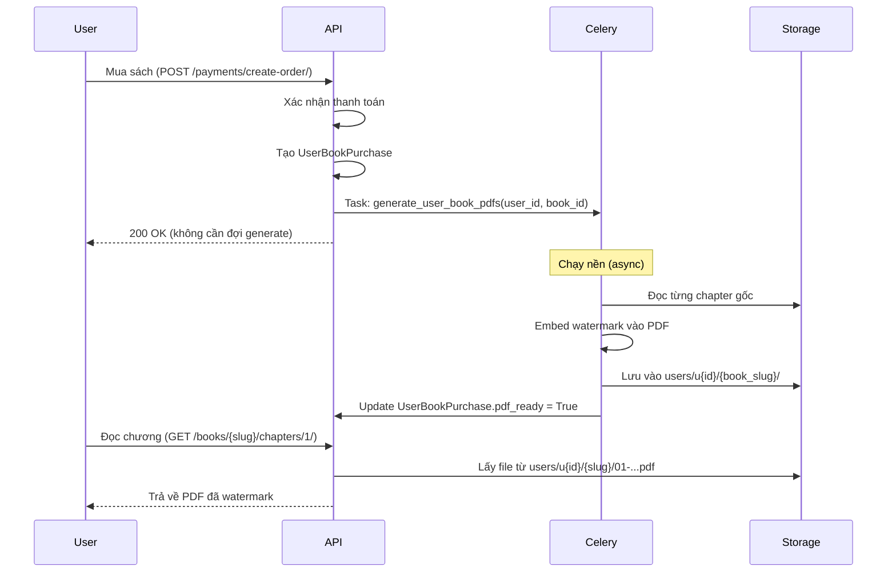

# Book PDF - Pre-Generate Per User

## Document Information
- **Updated**: 2026-02-19

---

## Tổng quan

Khi user **mua sách**, hệ thống sẽ tự động:
1. Lấy từng file PDF gốc của sách
2. Embed tên + SĐT vào từng file (watermark thật sự trong PDF)
3. Lưu vào folder của user
4. Khi user đọc → trả về file đã watermark sẵn

---

## Cấu trúc folder

```
media/books/
│
├── originals/                              # Sách gốc (không sửa)
│   ├── ky-mon-don-giap-co-ban/
│   │   ├── cover.jpg
│   │   ├── demo.pdf
│   │   └── chapters/
│   │       ├── 01-gioi-thieu.pdf
│   │       ├── 02-bat-quai.pdf
│   │       └── ...
│   └── trach-nhat-toan-tap/
│       └── chapters/
│           └── ...
│
└── users/                                  # PDF đã watermark theo user
    ├── u1001/
    │   └── ky-mon-don-giap-co-ban/
    │       ├── 01-gioi-thieu.pdf          # Embed tên: "Nguyễn Văn A - 0901234567"
    │       └── 02-bat-quai.pdf
    └── u1002/
        └── ky-mon-don-giap-co-ban/
            ├── 01-gioi-thieu.pdf          # Embed tên: "Trần Thị B - 0912345678"
            └── 02-bat-quai.pdf
```

---

## Luồng xử lý



---

## Database Schema

### Cập nhật `books_userbookpurchase`

```sql
ALTER TABLE books_userbookpurchase ADD COLUMN pdf_ready BOOLEAN DEFAULT FALSE;
ALTER TABLE books_userbookpurchase ADD COLUMN pdf_generated_at TIMESTAMP;
ALTER TABLE books_userbookpurchase ADD COLUMN pdf_folder_path VARCHAR(500);
-- pdf_folder_path ví dụ: "books/users/u1001/ky-mon-don-giap-co-ban/"
```

---

## Implementation

### Celery Task

```python
# books/tasks.py
from celery import shared_task
from django.conf import settings
import os
import io
from PyPDF2 import PdfReader, PdfWriter
from reportlab.pdfgen import canvas
from reportlab.lib.colors import Color


@shared_task(bind=True, max_retries=3)
def generate_user_book_pdfs(self, user_id: int, book_id: int):
    """
    Sau khi mua sách, generate tất cả chapter PDFs cho user.
    Chạy async qua Celery.
    """
    from books.models import Book, BookChapter, UserBookPurchase
    from django.contrib.auth import get_user_model
    User = get_user_model()

    try:
        user = User.objects.get(id=user_id)
        purchase = UserBookPurchase.objects.get(user=user, book_id=book_id)
        book = purchase.book

        # Tạo folder cho user + book
        user_folder = os.path.join(
            settings.MEDIA_ROOT,
            'books', 'users', f'u{user_id}', book.slug
        )
        os.makedirs(user_folder, exist_ok=True)

        watermark_text = f"{user.get_full_name()}  |  {user.phone_number}"

        chapters = BookChapter.objects.filter(book=book, is_demo=False)
        for chapter in chapters:
            original_path = os.path.join(settings.MEDIA_ROOT, chapter.file_path)
            output_filename = os.path.basename(chapter.file_path)
            output_path = os.path.join(user_folder, output_filename)

            _embed_watermark(original_path, output_path, watermark_text)

        # Đánh dấu đã xong
        purchase.pdf_ready = True
        purchase.pdf_folder_path = f'books/users/u{user_id}/{book.slug}/'
        purchase.pdf_generated_at = timezone.now()
        purchase.save()

    except Exception as exc:
        raise self.retry(exc=exc, countdown=60)


def _embed_watermark(src_path: str, dst_path: str, text: str):
    """Embed watermark text vào tất cả trang của PDF."""
    reader = PdfReader(src_path)
    writer = PdfWriter()

    for page in reader.pages:
        w = float(page.mediabox.width)
        h = float(page.mediabox.height)

        packet = io.BytesIO()
        c = canvas.Canvas(packet, pagesize=(w, h))

        # Diagonal center
        c.saveState()
        c.translate(w / 2, h / 2)
        c.rotate(40)
        c.setFillColor(Color(0.5, 0.5, 0.5, alpha=0.12))
        c.setFont("Helvetica", 22)
        c.drawCentredString(0, 0, text)
        c.restoreState()

        # Footer (mỗi trang)
        c.setFont("Helvetica", 7)
        c.setFillColor(Color(0.3, 0.3, 0.3, alpha=0.5))
        c.drawString(50, 18, text)

        # Top-right (corner ngược lại)
        c.drawRightString(w - 50, h - 18, text)

        c.save()
        packet.seek(0)

        wm_page = PdfReader(packet).pages[0]
        page.merge_page(wm_page)
        writer.add_page(page)

    with open(dst_path, 'wb') as f:
        writer.write(f)
```

### Trigger task sau khi thanh toán

```python
# payments/signals.py (hoặc trong payment callback view)
from books.tasks import generate_user_book_pdfs

def on_book_purchased(user_id: int, book_id: int):
    """Gọi sau khi xác nhận thanh toán thành công."""
    # Trigger async task — không block response
    generate_user_book_pdfs.delay(user_id, book_id)
```

### Serve chapter

```python
# books/views.py
class ChapterDownloadView(APIView):
    permission_classes = [IsAuthenticated]

    def get(self, request, book_slug, chapter_order):
        chapter = get_object_or_404(
            BookChapter, book__slug=book_slug, order=chapter_order
        )

        # Demo chapter: dùng bản gốc
        if chapter.is_demo:
            pdf_path = os.path.join(settings.MEDIA_ROOT, chapter.file_path)
            return self._serve_pdf(pdf_path, chapter.slug)

        # Kiểm tra purchase
        purchase = UserBookPurchase.objects.filter(
            user=request.user, book=chapter.book
        ).first()

        if not purchase and request.user.user_type != 'VIP':
            return Response({'error': 'Bạn cần mua sách để đọc'}, status=403)

        # PDF chưa ready (vẫn đang generate)
        if not purchase.pdf_ready:
            return Response({
                'error': 'PDF đang được chuẩn bị, vui lòng thử lại sau ít phút',
                'code': 'PDF_GENERATING'
            }, status=202)

        # Serve file đã watermark
        filename = os.path.basename(chapter.file_path)
        pdf_path = os.path.join(
            settings.MEDIA_ROOT,
            'books', 'users', f'u{request.user.id}',
            chapter.book.slug, filename
        )
        return self._serve_pdf(pdf_path, chapter.slug)

    @staticmethod
    def _serve_pdf(path: str, slug: str):
        response = FileResponse(
            open(path, 'rb'),
            content_type='application/pdf',
            as_attachment=False,
        )
        response['Content-Disposition'] = f'inline; filename="{slug}.pdf"'
        response['Cache-Control'] = 'private, no-store'
        return response
```

---

## Storage Estimate

**Scale thực tế:**
- 20 file PDF gốc × ~5MB = ~100MB
- 1,000 users mua sách → ~100GB tổng

**→ Lưu trên disk VPS là đủ**, không cần S3 hay object storage.

```python
# settings.py
MEDIA_ROOT = '/var/www/fengshui/media'  # Disk trên VPS
MEDIA_URL = '/media/'
```

---

## Xử lý edge cases

```python
# Khi user cập nhật tên/SĐT → regenerate toàn bộ
@receiver(post_save, sender=User)
def on_profile_updated(sender, instance, update_fields, **kwargs):
    if update_fields and (
        'first_name' in update_fields or 'phone_number' in update_fields
    ):
        # Xóa file cũ và generate lại
        for purchase in instance.userbookpurchase_set.filter(pdf_ready=True):
            purchase.pdf_ready = False
            purchase.save()
            generate_user_book_pdfs.delay(instance.id, purchase.book_id)
```

---

## API: kiểm tra trạng thái PDF

```json
GET /api/books/{slug}/pdf-status/

Response:
{
  "pdf_ready": false,
  "estimated_minutes": 2,
  "message": "PDF đang được chuẩn bị, chúng tôi sẽ thông báo khi xong"
}
```

Frontend polling mỗi 10 giây cho đến khi `pdf_ready: true`.
