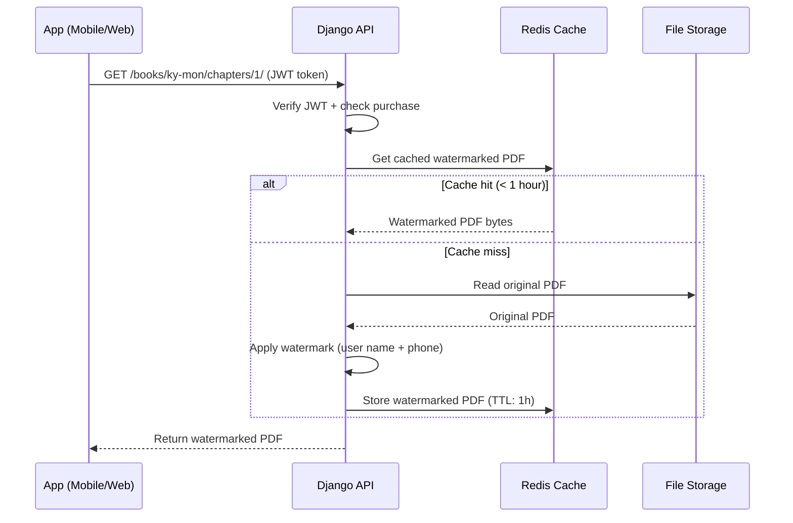

# Watermark Strategy - Books & Videos

## Summary

| Nội dung | Phương pháp | Watermark | Lưu file |
|----------|-------------|-----------|----------|
| **Sách (PDF)** | Pre-generate per user | Embed tên + SĐT vào file | ✅ Lưu file/user |
| **Video** | Client-side overlay | Float tên + SĐT trên màn hình | ❌ Không lưu thêm |

## Document Information
- **Updated**: 2026-02-19

---

## ❌ Không nên làm: Per-User Folder

```
media/books/
├── originals/                         # Sách gốc
│   └── ky-mon/chapters/01.pdf
│
├── users/
│   ├── user_1001/ky-mon/01.pdf        # ❌ Copy riêng mỗi user
│   ├── user_1002/ky-mon/01.pdf
│   ├── user_1003/ky-mon/01.pdf
│   └── ... (1000 users × 500 files = 500,000 files!)
```

**Vấn đề:**
- 💾 Storage tốn gấp N lần (N = số users)
- 🐢 Upload chậm vì phải tạo file cho mỗi lần mua
- ♻️ Khi cập nhật nội dung sách phải regenerate tất cả
- 💰 Chi phí storage/CDN rất cao

---

## ✅ Nên làm: On-the-Fly Watermarking

### Cấu trúc folder đơn giản

```
media/books/
├── ky-mon-don-giap-co-ban/
│   ├── cover.jpg
│   ├── demo.pdf
│   └── chapters/
│       ├── 01-gioi-thieu.pdf          # Chỉ 1 bản gốc
│       ├── 02-bat-quai.pdf
│       └── ...
└── trach-nhat-toan-tap/
    └── chapters/
        └── ...
```

**Khi user request → Watermark realtime → Trả về PDF đã watermark**

---

## Luồng xử lý



---

## Caching Strategy

### Không cache (mỗi request tạo mới)

- ✅ Đơn giản nhất
- ⚠️ Server CPU tốn khi nhiều users đọc cùng lúc
- ✅ Phù hợp giai đoạn đầu

### Cache theo `user_id + chapter_id` (khuyến nghị)

```python
cache_key = f"watermarked_pdf:{user_id}:{chapter_id}"
TTL = 3600  # 1 giờ
```

- ✅ Giảm CPU đáng kể
- ✅ Mỗi user có bản watermark riêng trong cache
- ✅ Cache tự expire sau 1 giờ → không lo stale data
- 💾 Redis memory: ~2MB/file × số users đang đọc

### Cache tạm trên disk (nếu file lớn)

```python
# Lưu tạm vào /tmp thay vì RAM
cache_path = f"/tmp/wm_{user_id}_{chapter_id}_{timestamp}.pdf"
```

---

## Implementation

### Backend Django

```python
# books/services/watermark_service.py
import hashlib
import io
from django.core.cache import cache
from PyPDF2 import PdfReader, PdfWriter
from reportlab.lib.colors import Color
from reportlab.pdfgen import canvas


class WatermarkService:
    CACHE_TTL = 3600  # 1 hour

    @classmethod
    def get_watermarked_pdf(cls, chapter, user) -> io.BytesIO:
        """
        Return watermarked PDF for user.
        Uses Redis cache keyed by (user_id, chapter_id).
        """
        cache_key = f"wm_pdf:{user.id}:{chapter.id}"

        # Try cache first
        cached = cache.get(cache_key)
        if cached:
            return io.BytesIO(cached)

        # Generate watermark
        watermarked = cls._apply_watermark(
            pdf_path=chapter.file.path,
            user_name=user.get_full_name(),
            phone=user.phone_number,
        )

        # Store in cache
        cache.set(cache_key, watermarked.getvalue(), cls.CACHE_TTL)

        return watermarked

    @staticmethod
    def _apply_watermark(pdf_path: str, user_name: str, phone: str) -> io.BytesIO:
        """Apply watermark to all pages of PDF."""
        text = f"{user_name}  |  {phone}"

        reader = PdfReader(pdf_path)
        writer = PdfWriter()

        for page in reader.pages:
            w = float(page.mediabox.width)
            h = float(page.mediabox.height)

            # Build watermark page
            packet = io.BytesIO()
            c = canvas.Canvas(packet, pagesize=(w, h))

            # 1. Diagonal center (semi-transparent)
            c.saveState()
            c.translate(w / 2, h / 2)
            c.rotate(40)
            c.setFillColor(Color(0.5, 0.5, 0.5, alpha=0.15))
            c.setFont("Helvetica", 20)
            c.drawCentredString(0, 0, text)
            c.restoreState()

            # 2. Footer
            c.setFont("Helvetica", 7)
            c.setFillColor(Color(0.4, 0.4, 0.4, alpha=0.6))
            c.drawString(50, 20, text)

            # 3. Header (opposite corner for stronger tracing)
            c.drawRightString(w - 50, h - 20, text)

            c.save()
            packet.seek(0)

            wm_page = PdfReader(packet).pages[0]
            page.merge_page(wm_page)
            writer.add_page(page)

        output = io.BytesIO()
        writer.write(output)
        output.seek(0)
        return output


# books/views.py
from django.http import FileResponse
from rest_framework.views import APIView
from rest_framework.permissions import IsAuthenticated


class ChapterDownloadView(APIView):
    permission_classes = [IsAuthenticated]

    def get(self, request, book_slug, chapter_order):
        # 1. Get chapter
        chapter = get_object_or_404(
            BookChapter,
            book__slug=book_slug,
            order=chapter_order
        )

        # 2. Permission check
        if not chapter.is_demo:
            has_purchase = UserBookPurchase.objects.filter(
                user=request.user,
                book=chapter.book
            ).exists()
            if not has_purchase and request.user.user_type != 'VIP':
                raise PermissionDenied()

        # 3. Get watermarked PDF (from cache or generate)
        pdf_bytes = WatermarkService.get_watermarked_pdf(chapter, request.user)

        # 4. Track reading progress
        UserChapterProgress.objects.update_or_create(
            user=request.user,
            chapter=chapter,
            defaults={'last_read': timezone.now()}
        )

        # 5. Serve with security headers
        response = FileResponse(
            pdf_bytes,
            content_type='application/pdf',
            filename=f'{chapter.slug}.pdf',
            as_attachment=False,   # inline viewer
        )
        response['Cache-Control'] = 'private, no-store'
        response['X-Frame-Options'] = 'SAMEORIGIN'
        return response
```

### Mobile (Flutter) - Hiển thị PDF

```dart
// lib/screens/book/chapter_reader_screen.dart
import 'package:pdfx/pdfx.dart';

class ChapterReaderScreen extends ConsumerStatefulWidget {
  final String bookSlug;
  final int chapterOrder;

  const ChapterReaderScreen({
    required this.bookSlug,
    required this.chapterOrder,
  });

  @override
  ConsumerState<ChapterReaderScreen> createState() =>
      _ChapterReaderScreenState();
}

class _ChapterReaderScreenState extends ConsumerState<ChapterReaderScreen> {
  PdfController? _pdfController;

  @override
  void initState() {
    super.initState();
    _loadPdf();
  }

  Future<void> _loadPdf() async {
    // Fetch watermarked PDF from API
    final url = '${ApiConfig.baseUrl}'
        '/books/${widget.bookSlug}/chapters/${widget.chapterOrder}/download/';

    final response = await ref.read(apiClientProvider).get(
      url,
      responseType: ResponseType.bytes,
    );

    final doc = await PdfDocument.openData(response.data);
    setState(() {
      _pdfController = PdfController(document: doc);
    });
  }

  @override
  Widget build(BuildContext context) {
    if (_pdfController == null) {
      return const Scaffold(body: Center(child: CircularProgressIndicator()));
    }

    return Scaffold(
      // Screenshot prevention (FLAG_SECURE set globally in main.dart)
      body: PdfView(
        controller: _pdfController!,
        scrollDirection: Axis.vertical,
        pageSnapping: false,
      ),
    );
  }
}
```

### Web (Vue.js) - Hiển thị PDF

```typescript
// src/views/books/ChapterReaderView.vue
<template>
  <div class="pdf-reader">
    <!-- Embed PDF in iframe - browser handles rendering -->
    <iframe
      v-if="pdfUrl"
      :src="pdfUrl"
      class="pdf-frame"
      type="application/pdf"
    />
    <div v-else class="loading">Đang tải chương...</div>
  </div>
</template>

<script setup lang="ts">
import { ref, onMounted } from 'vue'
import { useRoute } from 'vue-router'
import { booksApi } from '@/services/api/books'

const route = useRoute()
const pdfUrl = ref<string | null>(null)

onMounted(async () => {
  const { bookSlug, chapterOrder } = route.params

  // Get signed URL from API
  const chapter = await booksApi.getChapter(bookSlug as string, +chapterOrder)
  pdfUrl.value = chapter.file_url
})
</script>

<style scoped>
.pdf-frame {
  width: 100%;
  height: calc(100vh - 64px);
  border: none;
  /* Prevent right-click save */
  pointer-events: auto;
}
</style>
```

---

## So sánh các phương án

| Tiêu chí | Per-user folder | On-the-fly | On-the-fly + Cache |
|----------|----------------|-----------|-------------------|
| Storage | ❌ N × size | ✅ 1 × size | ✅ 1 × size + RAM |
| CPU mỗi request | ✅ Không xử lý | ⚠️ Cao | ✅ Thấp (cache hit) |
| Tốc độ phục vụ | ✅ Nhanh | ⚠️ Chậm hơn | ✅ Nhanh |
| Watermark luôn đúng | ✅ | ✅ | ✅ (1h stale OK) |
| Khi sửa nội dung | ❌ Regenerate tất cả | ✅ Tự động | ✅ Cache expire tự động |
| Phức tạp | ⚠️ | ✅ Đơn giản | ✅ Vừa phải |

**→ Khuyến nghị: On-the-fly + Redis Cache**

---

## Bảo mật bổ sung

```python
# Invalidate cache khi user thay đổi thông tin
def invalidate_user_pdf_cache(user_id):
    """Xóa cache khi user đổi tên/SĐT"""
    # Dùng pattern delete nếu Redis hỗ trợ
    keys = cache.keys(f"wm_pdf:{user_id}:*")
    cache.delete_many(keys)

# Gọi khi user update profile
@receiver(post_save, sender=User)
def on_user_updated(sender, instance, **kwargs):
    if kwargs.get('update_fields') and (
        'first_name' in kwargs['update_fields'] or
        'phone_number' in kwargs['update_fields']
    ):
        invalidate_user_pdf_cache(instance.id)
```

---

*Kết luận: Chỉ cần 1 folder sách gốc, watermark được áp dụng realtime khi user đọc.*
