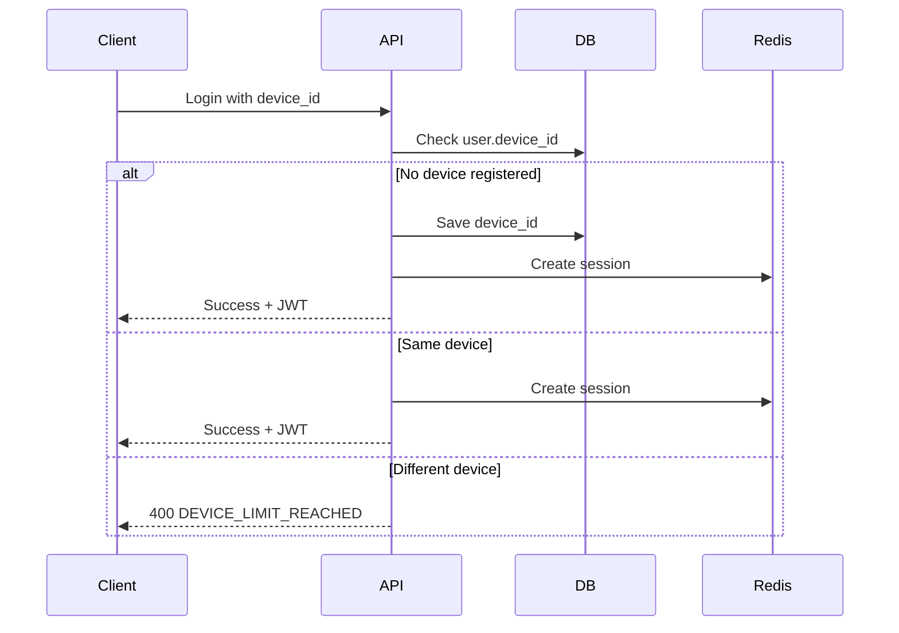

# Security & DRM Design - Feng Shui Learning Platform

## Document Information
- **Project**: Thiên Thư Security Architecture
- **Version**: 1.0
- **Last Updated**: 2026-02-17

---

## Security Requirements

### Critical Security Features
1. **Device Locking (Hard binding)**: 1 unique device per user account with **1-year (365 days)** reset cooldown.
2. **Video Protection**: Bunny Stream secure player, signed URLs, and geo-blocking.
3. **File Protection**: Local VPS storage with token-based access control for PDFs.
4. **Screenshot Prevention**: Platform-specific implementations
5. **Access Control**: Role-based permissions (FREE, VIP, ADMIN)

---

## Device Locking System

### Architecture



### Implementation

#### Backend (Django)
```python
# users/services.py
#### Device Lock Rules:
- **Persistent Binding**: Logging out DOES NOT unbind the device. The device remains locked to the account until a formal "Reset" request is granted.
- **Reset Cooldown**: Users can only reset their bound device **once every 365 days (1 year)**. This prevents users from sharing accounts by simply logging out and letting someone else log in.
- **Admin Un-link**: Administrators can manually un-link a device via the Django Admin interface at any time, bypassing the cooldown for legitimate support cases.
- **Fingerprinting**: 
    - **Mobile**: Android ID / iOS Vendor ID are used for high-reliability identification.
    - **Web**: Browser Fingerprint (Canvas + WebGL) + Visitor ID to prevent clearing cookies from bypassing the lock.

#### Backend Logic (Refined)
```python
# users/services.py
from django.utils import timezone
from datetime import timedelta

class DeviceLockService:
    @staticmethod
    def verify_device(user, device_id, device_type, device_name):
        # 1. First login: Bind the device
        if not user.bound_device_id:
            user.bound_device_id = device_id
            user.last_device_reset = timezone.now()
            user.save()
            return True
        
        # 2. Match bound device
        if user.bound_device_id == device_id:
            return True
        
        # 3. Mismatch: Reject login
        raise DeviceLockedError(
            message="Account is locked to another device.",
            next_reset_available=user.last_device_reset + timedelta(days=365)
        )

    @staticmethod
    def admin_reset_device(user):
        """Administrator override to immediately un-link a device"""
        user.bound_device_id = None
        user.save()
        # Log this action for audit
        SecurityMonitor.log_activity(user, 'ADMIN_DEVICE_RESET')

    @staticmethod
    def user_request_reset(user):
        """Allow user to reset their device binding only if 1 year has passed"""
        cooldown_period = timedelta(days=365)
        if timezone.now() < user.last_device_reset + cooldown_period:
            days_left = (user.last_device_reset + cooldown_period - timezone.now()).days
            raise ResetCooldownError(f"You can change your device in {days_left} days.")
        
        user.bound_device_id = None
        user.save()
```
```

#### Mobile (Flutter)
```dart
// lib/services/device_service.dart
class DeviceService {
  static Future<String> getDeviceId() async {
    final deviceInfo = DeviceInfoPlugin();
    
    if (Platform.isIOS) {
      final iosInfo = await deviceInfo.iosInfo;
      return iosInfo.identifierForVendor ?? '';
    } else {
      final androidInfo = await deviceInfo.androidInfo;
      return androidInfo.id;
    }
  }
  
  static Future<String> getDeviceName() async {
    final deviceInfo = DeviceInfoPlugin();
    
    if (Platform.isIOS) {
      final iosInfo = await deviceInfo.iosInfo;
      return '${iosInfo.name} (${iosInfo.systemVersion})';
    } else {
      final androidInfo = await deviceInfo.androidInfo;
      return '${androidInfo.model} (Android ${androidInfo.version.release})';
    }
  }
}
```

#### Web (Vue.js)
```typescript
// src/services/deviceService.ts
import FingerprintJS from '@fingerprintjs/fingerprintjs';

export class DeviceService {
  private static fpPromise = FingerprintJS.load();
  
  static async getDeviceId(): Promise<string> {
    const fp = await this.fpPromise;
    const result = await fp.get();
    return result.visitorId;
  }
  
  static getDeviceName(): string {
    const parser = new UAParser();
    const result = parser.getResult();
    return `${result.browser.name} on ${result.os.name}`;
  }
#### Device Management Table (`UserDevice`)
To ensure strict control, every device used to access the platform is logged in the `UserDevice` table with the following metadata:

| Field | Description |
| :--- | :--- |
| `device_id` | Unique fingerprint (Hardware UUID or Browser Fingerprint). |
| `is_primary_bound` | Boolean flag. Only **one** device can have this set to `True` per user. |
| `status` | `ACTIVE` (can log in) or `REVOKED` (blocked by Admin or replaced). |
| `audit_fields` | Tracks `last_ip`, `user_agent`, and `last_active` timestamp. |

#### Security Workflow with `UserDevice`:
1. **Identification**: On every login/request, the client sends the `device_id`.
2. **Access Control**:
   - If a device is marked `REVOKED`, access is immediately denied.
   - If a user tries to log in on a new device while another is `is_primary_bound=True`, the attempt is logged as "Unauthorized Device" and rejected.
   - Admin can see a history of all devices a user has ever used, helping identify suspicious patterns (e.g., logins from different cities).

---

## Content Watermarking

### Dynamic Watermark System

#### Backend - Watermark Configuration
```python
# content/services.py
import random
from typing import Dict

class WatermarkService:
    @staticmethod
    def generate_config(user) -> Dict:
        """Generate watermark configuration for user"""
        positions = ['top-left', 'top-right', 'bottom-left', 'bottom-right']
        
        return {
            'text': f"{user.get_full_name()}\n{user.phone_number}",
            'position': random.choice(positions),
            'rotation': random.randint(-15, 15),
            'opacity': random.uniform(0.3, 0.5),
            'font_size': 14,
            'color': '#FFFFFF',
            'timestamp': timezone.now().isoformat()
        }
    
    @staticmethod
    def generate_video_watermark(user) -> Dict:
        """Generate video watermark with periodic updates"""
        return {
            'text': f"{user.get_full_name()}\n{user.phone_number}",
            'interval': 30,  # seconds
            'duration': 5,   # seconds per display
            'positions': ['top-left', 'top-right', 'bottom-left', 'bottom-right'],
            'opacity': 0.4
        }
```

#### Mobile - Book Watermark (Flutter)
```dart
// lib/widgets/watermark_overlay.dart
class WatermarkOverlay extends StatelessWidget {
  final WatermarkConfig config;
  
  @override
  Widget build(BuildContext context) {
    return Positioned(
      top: _getTopPosition(),
      left: _getLeftPosition(),
      child: IgnorePointer(
        child: Opacity(
          opacity: config.opacity,
          child: Transform.rotate(
            angle: config.rotation * pi / 180,
            child: Container(
              padding: EdgeInsets.all(8),
              child: Text(
                config.text,
                style: TextStyle(
                  color: Colors.white.withOpacity(0.5),
                  fontSize: config.fontSize,
                  shadows: [
                    Shadow(
                      blurRadius: 2,
                      color: Colors.black.withOpacity(0.3),
                    ),
                  ],
                ),
              ),
            ),
          ),
        ),
      ),
    );
  }
  
  double? _getTopPosition() {
    if (config.position.contains('top')) {
      return 20;
    }
    return null;
  }
  
  double? _getLeftPosition() {
    if (config.position.contains('left')) {
      return 20;
    }
    return null;
  }
}
```

#### Backend - PDF Watermarking
```python
# books/services/watermark.py
from PyPDF2 import PdfReader, PdfWriter
from reportlab.pdfgen import canvas
from reportlab.lib.pagesizes import letter
from reportlab.lib.colors import Color
import io

class PDFWatermarkService:
    @staticmethod
    def apply_watermark(pdf_path, user_name, phone_number):
        """Apply dynamic watermark to PDF file"""
        
        # Read original PDF
        reader = PdfReader(pdf_path)
        writer = PdfWriter()
        
        watermark_text = f"{user_name} - {phone_number}"
        
        for page_num, page in enumerate(reader.pages):
            # Get page dimensions
            page_width = float(page.mediabox.width)
            page_height = float(page.mediabox.height)
            
            # Create watermark overlay
            packet = io.BytesIO()
            can = canvas.Canvas(packet, pagesize=(page_width, page_height))
            
            # Diagonal watermark (center)
            can.saveState()
            can.translate(page_width / 2, page_height / 2)
            can.rotate(45)
            can.setFillColor(Color(0.5, 0.5, 0.5, alpha=0.2))
            can.setFont("Helvetica", 24)
            can.drawCentredString(0, 0, watermark_text)
            can.restoreState()
            
            # Footer watermark (bottom)
            can.setFont("Helvetica", 8)
            can.setFillColor(Color(0.3, 0.3, 0.3, alpha=0.5))
            can.drawString(50, 30, watermark_text)
            
            # Header watermark (top-right)
            can.drawRightString(page_width - 50, page_height - 30, watermark_text)
            
            can.save()
            
            # Merge watermark with page
            packet.seek(0)
            watermark_pdf = PdfReader(packet)
            page.merge_page(watermark_pdf.pages[0])
            writer.add_page(page)
        
        # Return watermarked PDF as bytes
        output = io.BytesIO()
        writer.write(output)
        output.seek(0)
        return output
```

#### Backend - Serving Watermarked PDFs
```python
# books/views.py
from django.http import FileResponse
from .services.watermark import PDFWatermarkService
from .services.security import generate_signed_url
import time

class ChapterDetailView(APIView):
    permission_classes = [IsAuthenticated, HasPurchasedContent]
    
    def get(self, request, book_slug, chapter_order):
        chapter = get_object_or_404(
            BookChapter,
            book__slug=book_slug,
            order=chapter_order
        )
        
        # Check permissions
        self.check_object_permissions(request, chapter)
        
        # Generate signed URL for PDF
        signed_url = generate_signed_url(
            chapter.file.path,
            request.user,
            expiry_hours=1
        )
        
        return Response({
            'id': chapter.id,
            'title': chapter.title,
            'file_url': signed_url,
            'file_size': chapter.file_size,
            'page_count': chapter.page_count,
            'watermark': {
                'user_name': request.user.get_full_name(),
                'phone_number': request.user.phone_number,
                'applied': True
            }
        })

class ChapterDownloadView(APIView):
    """Serve watermarked PDF file"""
    permission_classes = [IsAuthenticated]
    
    def get(self, request, book_slug, chapter_order):
        # Verify signature
        signature = request.GET.get('sig')
        expires = request.GET.get('expires')
        
        if not self.verify_signature(signature, expires):
            raise PermissionDenied('Invalid or expired signature')
        
        chapter = get_object_or_404(
            BookChapter,
            book__slug=book_slug,
            order=chapter_order
        )
        
        # Apply watermark on-the-fly
        watermarked_pdf = PDFWatermarkService.apply_watermark(
            chapter.file.path,
            request.user.get_full_name(),
            request.user.phone_number
        )
        
        # Return PDF with watermark
        response = FileResponse(
            watermarked_pdf,
            content_type='application/pdf'
        )
        response['Content-Disposition'] = f'inline; filename="{chapter.slug}.pdf"'
        response['Cache-Control'] = 'private, no-cache, no-store, must-revalidate'
        
        return response
```

#### Mobile - Video Watermark (Flutter)
```dart
// lib/widgets/video_watermark.dart
class VideoWatermark extends StatefulWidget {
  final WatermarkConfig config;
  
  @override
  _VideoWatermarkState createState() => _VideoWatermarkState();
}

class _VideoWatermarkState extends State<VideoWatermark> {
  Timer? _timer;
  bool _isVisible = false;
  String _currentPosition = 'top-left';
  
  @override
  void initState() {
    super.initState();
    _startWatermarkTimer();
  }
  
  void _startWatermarkTimer() {
    _timer = Timer.periodic(
      Duration(seconds: widget.config.interval),
      (timer) {
        setState(() {
          _isVisible = true;
          _currentPosition = _getRandomPosition();
        });
        
        Future.delayed(Duration(seconds: widget.config.duration), () {
          if (mounted) {
            setState(() => _isVisible = false);
          }
        });
      },
    );
  }
  
  String _getRandomPosition() {
    final positions = widget.config.positions;
    return positions[Random().nextInt(positions.length)];
  }
  
  @override
  Widget build(BuildContext context) {
    if (!_isVisible) return SizedBox.shrink();
    
    return Positioned(
      top: _currentPosition.contains('top') ? 20 : null,
      bottom: _currentPosition.contains('bottom') ? 20 : null,
      left: _currentPosition.contains('left') ? 20 : null,
      right: _currentPosition.contains('right') ? 20 : null,
      child: IgnorePointer(
        child: Opacity(
          opacity: widget.config.opacity,
          child: Container(
            padding: EdgeInsets.all(8),
            decoration: BoxDecoration(
              color: Colors.black.withOpacity(0.3),
              borderRadius: BorderRadius.circular(4),
            ),
            child: Text(
              widget.config.text,
              style: TextStyle(
                color: Colors.white,
                fontSize: 12,
              ),
            ),
          ),
        ),
      ),
    );
  }
  
  @override
  void dispose() {
    _timer?.cancel();
    super.dispose();
  }
}
```

---

## Video Security (Bunny Stream)

### Signed URL Generation

```python
# videos/services.py
import hmac
import hashlib
import time
from django.conf import settings

class VideoSecurityService:
    @staticmethod
    def generate_signed_url(video, user, expiry_hours=1):
        """Generate time-limited signed video URL"""
        
        expiry = int(time.time()) + (expiry_hours * 3600)
        
        # Create signature
        token_data = f"{video.video_id}:{user.id}:{expiry}"
        signature = hmac.new(
            settings.BUNNY_CDN_SECRET.encode(),
            token_data.encode(),
            hashlib.sha256
        ).hexdigest()
        
        # Build URL with security parameters
        base_url = video.video_url
        params = f"token={signature}&expires={expiry}&user={user.id}"
        
        return f"{base_url}?{params}"
    
    @staticmethod
    def verify_signature(video_id, user_id, expiry, signature):
        """Verify video URL signature"""
        
        # Check expiry
        if int(time.time()) > int(expiry):
            return False
        
        # Verify signature
        token_data = f"{video_id}:{user_id}:{expiry}"
        expected_signature = hmac.new(
            settings.BUNNY_CDN_SECRET.encode(),
            token_data.encode(),
            hashlib.sha256
        ).hexdigest()
        
        return hmac.compare_digest(signature, expected_signature)
```

### Bunny Stream Configuration

```python
# settings.py
BUNNY_CDN_CONFIG = {
    'api_key': env('BUNNY_CDN_API_KEY'),
    'library_id': env('BUNNY_CDN_LIBRARY_ID'),
    'hostname': env('BUNNY_CDN_HOSTNAME'),
    'secret': env('BUNNY_CDN_SECRET'),
    
    # Security settings
    'token_authentication': True,
    'geo_blocking': ['VN'],  # Vietnam only
    'hotlink_protection': True,
    'allowed_referrers': [
        'fengshui-trainer.com',
        'app.fengshui-trainer.com'
    ],
    
    # DRM (optional)
    'drm_enabled': False,  # Enable for production
    'widevine': True,
    'fairplay': True,
}
```

---

## Screenshot Prevention

### Mobile (Flutter)

```dart
// lib/main.dart
import 'package:flutter_windowmanager/flutter_windowmanager.dart';

class MyApp extends StatefulWidget {
  @override
  _MyAppState createState() => _MyAppState();
}

class _MyAppState extends State<MyApp> {
  @override
  void initState() {
    super.initState();
    _enableScreenshotProtection();
  }
  
  Future<void> _enableScreenshotProtection() async {
    // Prevent screenshots and screen recording
    await FlutterWindowManager.addFlags(
      FlutterWindowManager.FLAG_SECURE
    );
  }
  
  @override
  Widget build(BuildContext context) {
    return MaterialApp(
      // ... app configuration
    );
  }
}
```

### Web (Limited Protection)

```css
/* src/assets/styles/security.css */
.protected-content {
  -webkit-user-select: none;
  -moz-user-select: none;
  -ms-user-select: none;
  user-select: none;
  
  -webkit-touch-callout: none;
  pointer-events: auto;
}

.protected-content::before {
  content: '';
  position: absolute;
  top: 0;
  left: 0;
  right: 0;
  bottom: 0;
  background: transparent;
  z-index: 1;
}
```

```javascript
// src/utils/security.ts
export function preventScreenCapture() {
  // Detect screenshot attempts (limited effectiveness)
  document.addEventListener('keyup', (e) => {
    // Detect Print Screen key
    if (e.key === 'PrintScreen') {
      navigator.clipboard.writeText('');
      alert('Screenshots are not allowed');
    }
  });
  
  // Prevent right-click
  document.addEventListener('contextmenu', (e) => {
    if (e.target.classList.contains('protected-content')) {
      e.preventDefault();
    }
  });
}
```

---

## Access Control

### Permission System

```python
# permissions.py
from rest_framework.permissions import BasePermission

class HasPurchasedContent(BasePermission):
    """Check if user has purchased the content"""
    
    def has_object_permission(self, request, view, obj):
        # VIP users have access to everything
        if request.user.user_type == 'VIP':
            return True
        
        # Free content is accessible to all
        if hasattr(obj, 'is_free') and obj.is_free:
            return True
        
        # Demo content is accessible
        if hasattr(obj, 'is_demo') and obj.is_demo:
            return True
        
        # Check purchase
        content_type = ContentType.objects.get_for_model(obj.__class__)
        
        if content_type.model == 'book':
            return UserBookPurchase.objects.filter(
                user=request.user,
                book=obj if isinstance(obj, Book) else obj.book
            ).exists()
        
        elif content_type.model == 'video':
            return UserVideoPurchase.objects.filter(
                user=request.user,
                video=obj if isinstance(obj, Video) else obj.video
            ).exists()
        
        return False


class CanComment(BasePermission):
    """Only users who purchased content can comment"""
    
    def has_permission(self, request, view):
        if request.method != 'POST':
            return True
        
        content_type = request.data.get('content_type')
        object_id = request.data.get('object_id')
        
        if content_type == 'book':
            return UserBookPurchase.objects.filter(
                user=request.user,
                book_id=object_id
            ).exists()
        
        elif content_type == 'video':
            return UserVideoPurchase.objects.filter(
                user=request.user,
                video_id=object_id
            ).exists()
        
        return False
```

---

## Rate Limiting

```python
# throttling.py
from rest_framework.throttling import UserRateThrottle

class LoginRateThrottle(UserRateThrottle):
    rate = '5/hour'

class VIPRateThrottle(UserRateThrottle):
    def get_rate(self):
        if self.request.user.user_type == 'VIP':
            return '5000/hour'
        return '1000/hour'

# settings.py
REST_FRAMEWORK = {
    'DEFAULT_THROTTLE_CLASSES': [
        'api.throttling.VIPRateThrottle',
    ],
    'DEFAULT_THROTTLE_RATES': {
        'anon': '100/hour',
        'user': '1000/hour',
        'login': '5/hour',
    }
}
```

---

## Security Monitoring

### Suspicious Activity Detection

```python
# security/services.py
class SecurityMonitor:
    @staticmethod
    def log_suspicious_activity(user, activity_type, metadata):
        """Log suspicious user activity"""
        
        SuspiciousActivity.objects.create(
            user=user,
            activity_type=activity_type,
            metadata=metadata,
            ip_address=metadata.get('ip'),
            user_agent=metadata.get('user_agent')
        )
        
        # Alert admin if critical
        if activity_type in ['MULTIPLE_DEVICE_ATTEMPTS', 'RAPID_DOWNLOADS']:
            send_admin_alert(user, activity_type)
    
    @staticmethod
    def check_device_switching(user):
        """Detect frequent device switching"""
        
        recent_devices = UserDevice.objects.filter(
            user=user,
            registered_at__gte=timezone.now() - timedelta(days=7)
        ).count()
        
        if recent_devices > 3:
            SecurityMonitor.log_suspicious_activity(
                user,
                'MULTIPLE_DEVICE_ATTEMPTS',
                {'device_count': recent_devices}
            )
```

---

## Data Encryption

### Sensitive Data at Rest

```python
# models.py
from django_cryptography.fields import encrypt

class User(AbstractUser):
    phone_number = encrypt(models.CharField(max_length=15))
    
    class Meta:
        db_table = 'users_user'
```

### HTTPS/TLS Configuration

```nginx
# nginx.conf
server {
    listen 443 ssl http2;
    server_name api.fengshui-trainer.com;
    
    ssl_certificate /etc/nginx/ssl/cert.pem;
    ssl_certificate_key /etc/nginx/ssl/key.pem;
    
    ssl_protocols TLSv1.2 TLSv1.3;
    ssl_ciphers HIGH:!aNULL:!MD5;
    ssl_prefer_server_ciphers on;
    
    # HSTS
    add_header Strict-Transport-Security "max-age=31536000" always;
    
    # Security headers
    add_header X-Frame-Options "SAMEORIGIN" always;
    add_header X-Content-Type-Options "nosniff" always;
    add_header X-XSS-Protection "1; mode=block" always;
}
```

---

## Compliance & Privacy

### GDPR/Data Protection

```python
# users/services.py
class DataPrivacyService:
    @staticmethod
    def export_user_data(user):
        """Export all user data (GDPR compliance)"""
        
        return {
            'profile': UserSerializer(user).data,
            'purchases': {
                'books': UserBookPurchaseSerializer(
                    user.userbookpurchase_set.all(), many=True
                ).data,
                'videos': UserVideoPurchaseSerializer(
                    user.uservideопurchase_set.all(), many=True
                ).data,
            },
            'progress': {
                'videos': UserVideoProgressSerializer(
                    user.uservideoprogress_set.all(), many=True
                ).data,
                'practice': UserPracticeProgressSerializer(
                    user.userpracticeprogress_set.all(), many=True
                ).data,
            },
            'comments': CommentSerializer(
                user.comment_set.all(), many=True
            ).data,
        }
    
    @staticmethod
    def delete_user_data(user):
        """Delete all user data (right to be forgotten)"""
        
        # Anonymize instead of hard delete for audit trail
        user.username = f"deleted_{user.id}"
        user.email = f"deleted_{user.id}@deleted.com"
        user.phone_number = ""
        user.is_active = False
        user.save()
        
        # Delete personal content
        user.comment_set.all().delete()
        user.userdevice_set.all().delete()
```

---

## Security Checklist

- [x] Device locking (1 device per user)
- [x] Dynamic watermarking (books & videos)
- [x] Signed video URLs with expiration
- [x] Screenshot prevention (mobile)
- [x] Role-based access control
- [x] Rate limiting
- [x] HTTPS/TLS encryption
- [x] Security monitoring
- [x] Data privacy compliance
- [ ] DRM implementation (Phase 2)
- [ ] Penetration testing
- [ ] Security audit
